## Major arguments against climate/global change

 

* **Myth 1: 'The climate has always been changing, this is no different'** 

 

* **Myth 2: 'It’s freezing outside – so much for global warming!'**

 

* **Myth 3: 'Carbon dioxide can’t be responsible for climate change – plants, crops and trees need CO~2~ to grow'**

 

* **Myth 4: 'There’s no way humans are responsible for climate change**

 

* **Myth 5: 'It’s solar changes that are causing the earth to warm, not us'**

 

* **Myth 6: 'There’s no point doing anything – it’s all too late'**

## Myth 1 = NO: Current atmospheric change at unrivaled rates

## Evidence for RAPID change (https://climate.nasa.gov/evidence/)

 

* **Global temperature rise**
    + The planet's average surface temperature has risen about 1.1 degrees Celsius (°C) – since the late 19th century. Mostly in the past 40 years.

 

* **Warming oceans**
    + Rising temperatures are causing glaciers and ice sheets to melt, adding more water to the oceans and causing the sea level to rise. Oceans absorb 90% of the extra heat from global warming with the top 100 meters of ocean showing warming of more than 0.33°C (0.6°F) since 1969. Buoys of the coast of Key West are now reaching 100°F in the summer. 
  
 

* **Sea level rise**
    + Warmer water expands and so our oceans are taking up more space. Global sea levels rose about 8 inches (20 centimetres) in the last century. The rate in the last two decades, however, is nearly double that of the last century and accelerating slightly every year.

    
## Evidence for rapid change (https://climate.nasa.gov/evidence/)

* **Shrinking ice sheets and glaciers**
    + Greenland lost an average of 279 billion tons of ice per year between 1993 and 2019, while Antarctica lost about 148 billion tons of ice per year.
    + Glaciers are retreating almost everywhere around the world, including in the Alps, Himalayas, Andes, Rockies, Alaska and Africa

 

* **Decreased snow cover**
    + Satellite observations reveal that spring snow cover in the Northern Hemisphere has decreased over the past five decades and the snow is melting earlier.

 

* **Extreme weather events**
    + Since 1950, the number of record high temperature events worldwide has been increasing, while the number of record low temperature events has been decreasing. 
    + Many extreme weather events are more intense and frequent, such as heatwaves, droughts, forest fires and floods.

## Unprecedented warming and the 'Hockey Stick' controversy

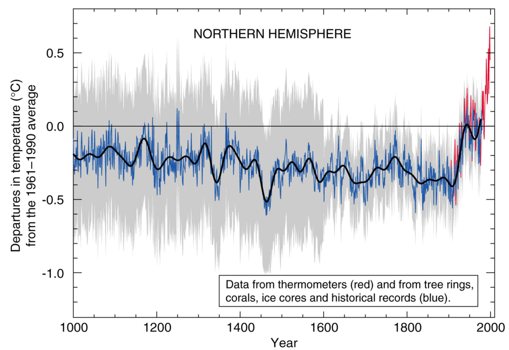

## How warm has is gotten?

https://ed-hawkins.github.io/climate-visuals/SPIRALS/global_temperature_spiral_2024_large.gif

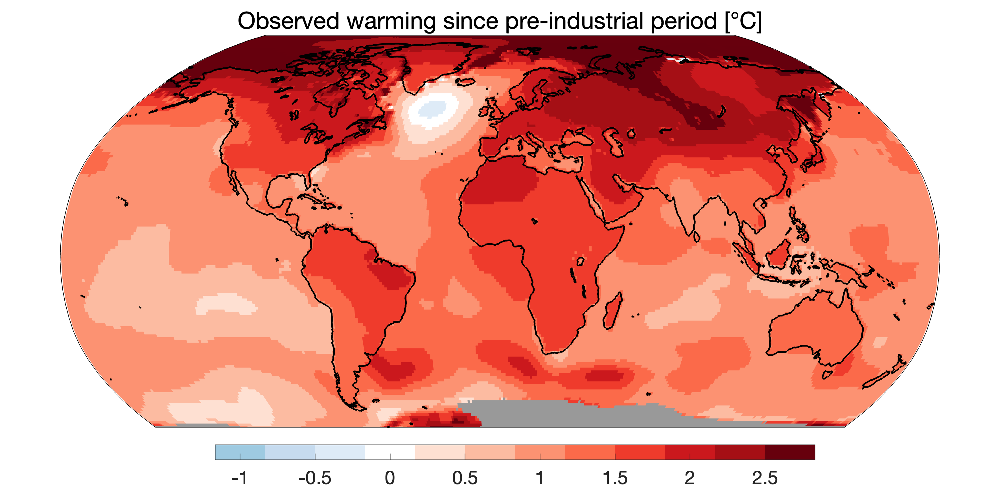

## Myth 2 = NO: Climate and weather are not the same thing

 

* **A cold spell in winter is definitely not a valid reason to dismiss global warming.**
    + we all love to talk about the weather because it’s always changing

 

* **Climate is the average pattern of weather for a particular region and time period, using scientific data collected over decades. The terms global warming and climate change refer to a broad temperature shift across the entire earth's surface over the course of years and decades.**

 

* **Regardless, scientists predict global warming will also cause more volatile weather**

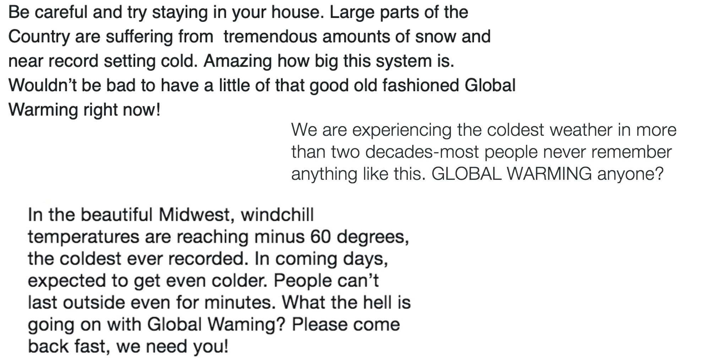

## Issue: Words matter - What's in a name...

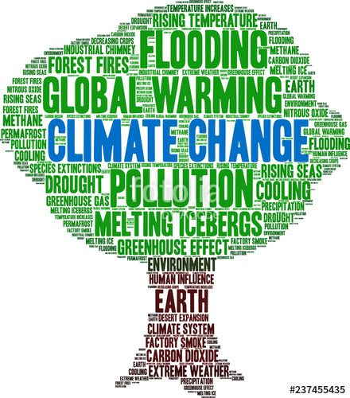

## Myth 3 = NO: CO~2~ emissions far outpace natural carbon sinks

 

* **Plants do need carbon dioxide (CO~2~), that’s true. But there’s a limit to the amount they can absorb and   with deforestation increasing, this limit is getting lower.** 

 

* **It’s widely recognized that climate change is triggered by ↑ levels of greenhouse gases in the atmosphere.**
    + The name derives from the 'greenhouse effect' these gases create by trapping heat from the sun and so warming the earth’s surface and the air above it.

 

* **CO~2~ is the most abundant of the greenhouse gases, and the biggest contributor to global warming**
    + It’s not the nature of CO~2~ that causes problems, it’s the quantity the world is pumping out into the atmosphere.

## 

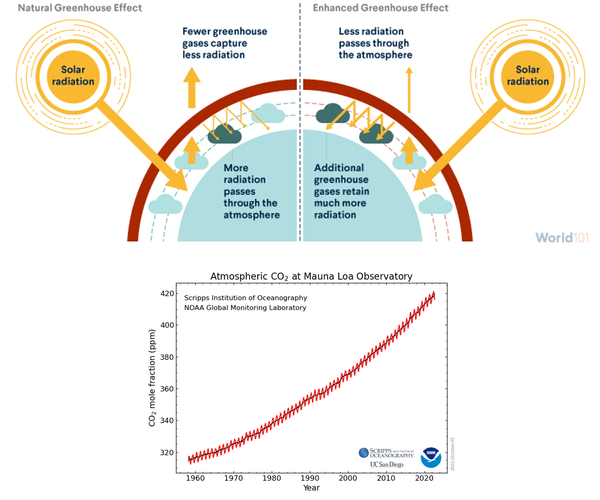

## Greenhouse gases (ice cores) correlate to warming trends

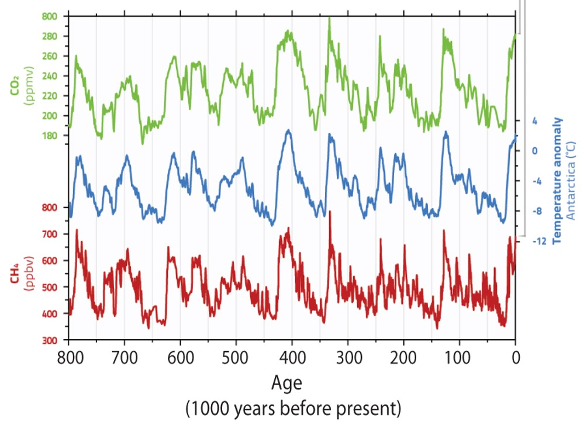

## Lessons learned on the power of trees

## Lessons learned on the power of trees

**Green points on graph are sweetgum forests fumigated with extra CO~2~**

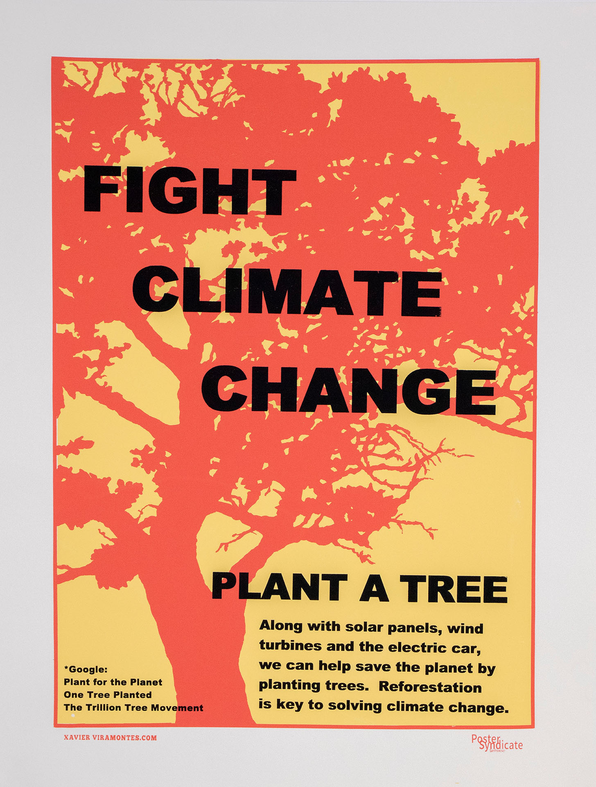

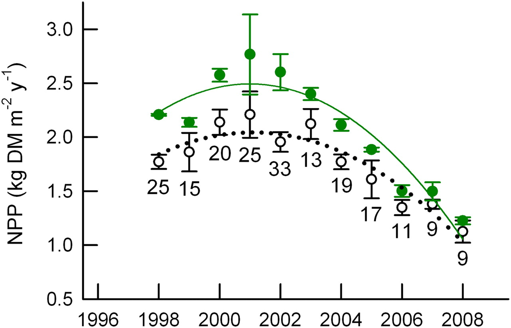

## Myth 4 = NO: Natural factors cannot explain change alone

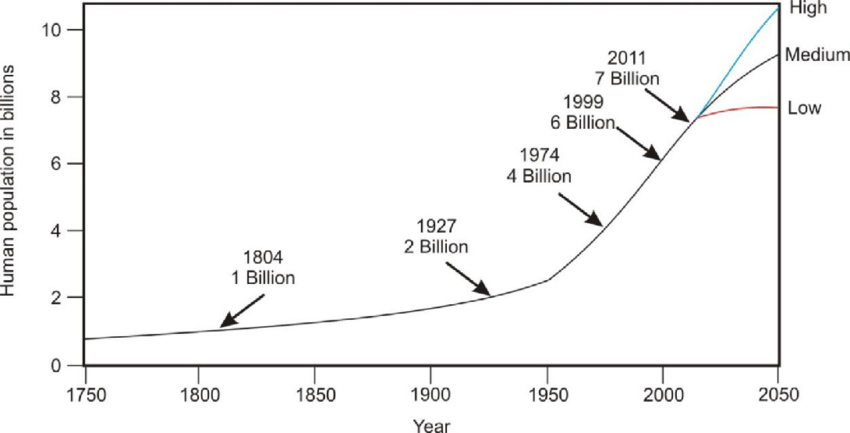

## Human population trends align with rapid change

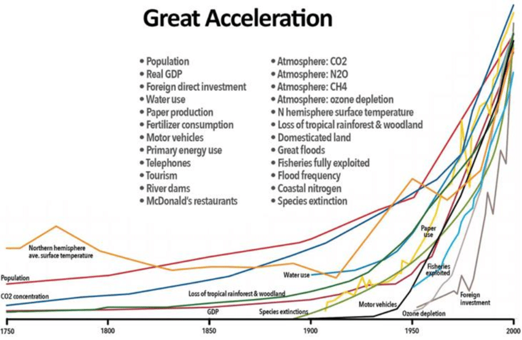

## 

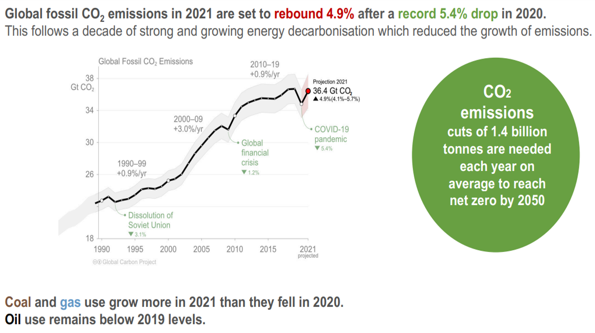

## Defining the Anthropocene...epoch or event?

**Denoting the current geological age, as the period during which human activity has been the dominant influence on climate and the environment**

 

* **One of those rare scientific terms that has entered the public consciousness, which is ironic, given that geologists have not yet fully defined it**

 

* **Various phenomena associated with this new epoch** 
    + an increase in erosion and the movement of sediments associated with urbanization and agriculture
    + unprecedented new materials, such as concrete, fly ash (a coal combustion product) and plastics, are now part of the sedimentary record
    + impact extends to ecosystem changes such as rampant deforestation and the biodiversity losses

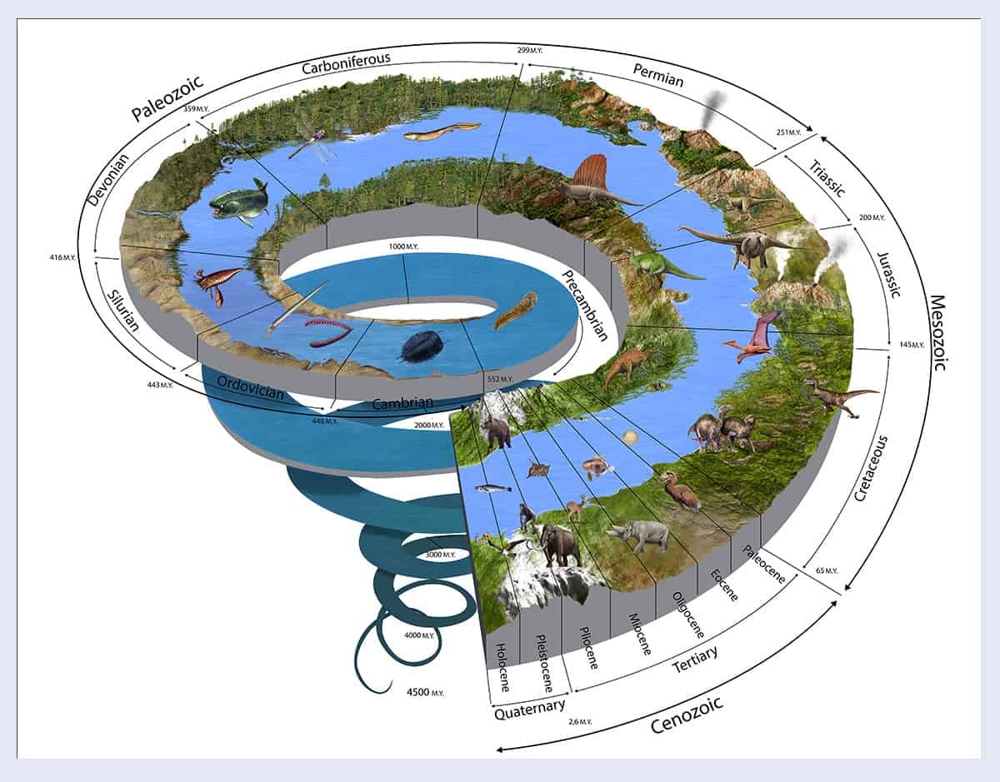

## Myth 5 = NO: Sun's energy output minimally changed

 

* **The sun powers life on earth, keeping the planet warm enough for us all to survive.**
    + the sun also influences earth’s climate
    + subtle changes in earth’s orbit around the sun were responsible for past ice ages

 

* **For more than 40 years, satellites have observed the sun's energy output, which has gone up or down by less than 0.1 percent during that period, while global warming has increased**
    + global warming over the last few decades is too rapid and dramatic to be linked to changes in earth’s orbit, and too large to be caused by solar activity

 

* **NASA’s concludes that since 1750, the warming driven by greenhouse gases from our burning of fossil fuels is over 50 times greater than the slight extra warming coming from the sun itself**

## Myth 6 = NO: IT IS NOT TOO LATE!

 
 

* **The Intergovernmental Panel on Climate Change (IPCC) have made it clear that we’re running out of time, but there is still a window of opportunity to implement policies and take action**

 

* **It’s still possible for the world to reach net zero and to limit warming to 1.5°C, but much more action is needed this decade, from governments, businesses and others, to make that happen.**

 

* **We already have the technology and systems to achieve net zero carbon emissions by 2050!**
    + progress will depend on behaviors and decisions of people
    
## We need more frequency holders...

  
    
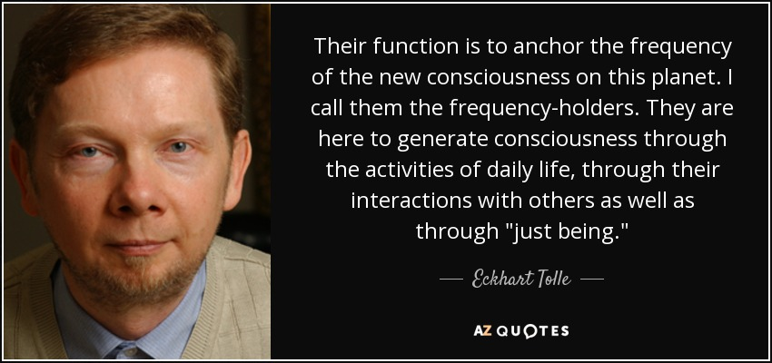

## Climate doom and gloom should scare AND encourage people

 

* **We know that there are still important choices to make, and we don't have to wait for  politicians to act.**

 

* **We know individual actions matter, but in order to have effective change it will take mass action from people everywhere.**

 

* **We know the difference between the best and worst case scenarios matters.**
    + we know that the future is being decided in the present. 

 

* **We know that people are overwhelmed by doom and gloom.**
    + at the same time, we are not here to avoid the worst news.

