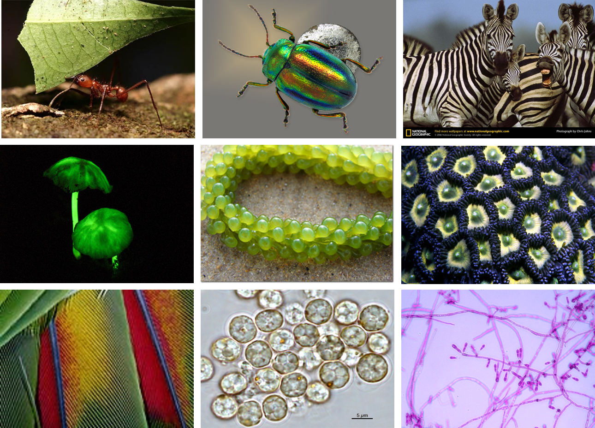
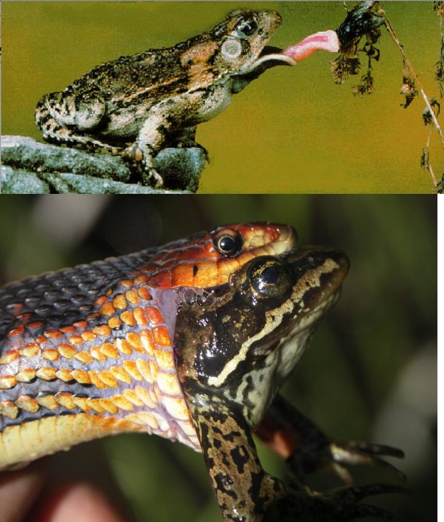
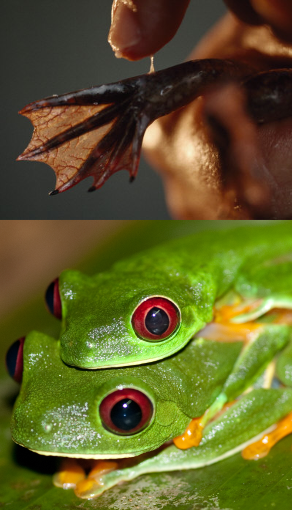
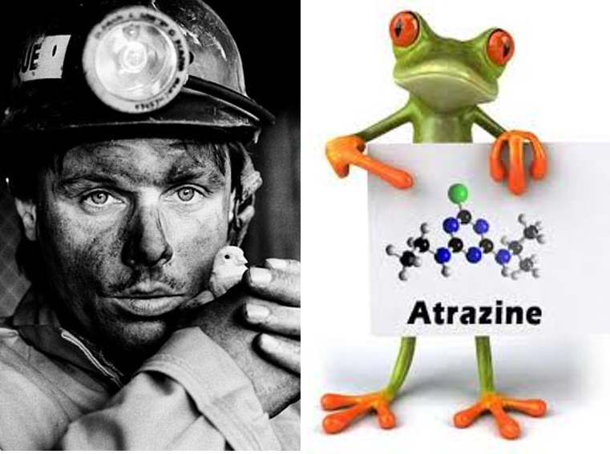
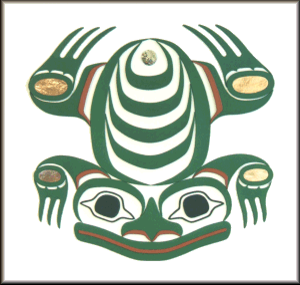
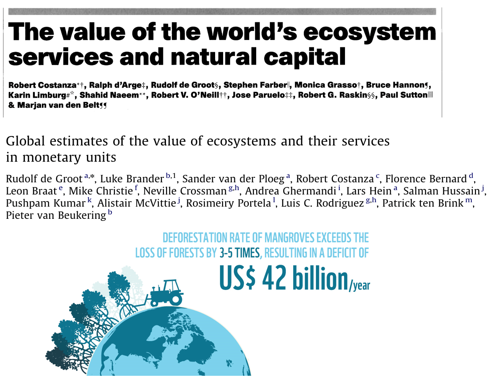
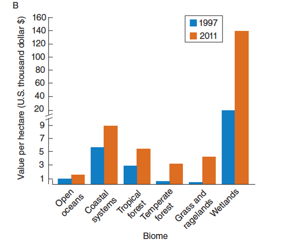
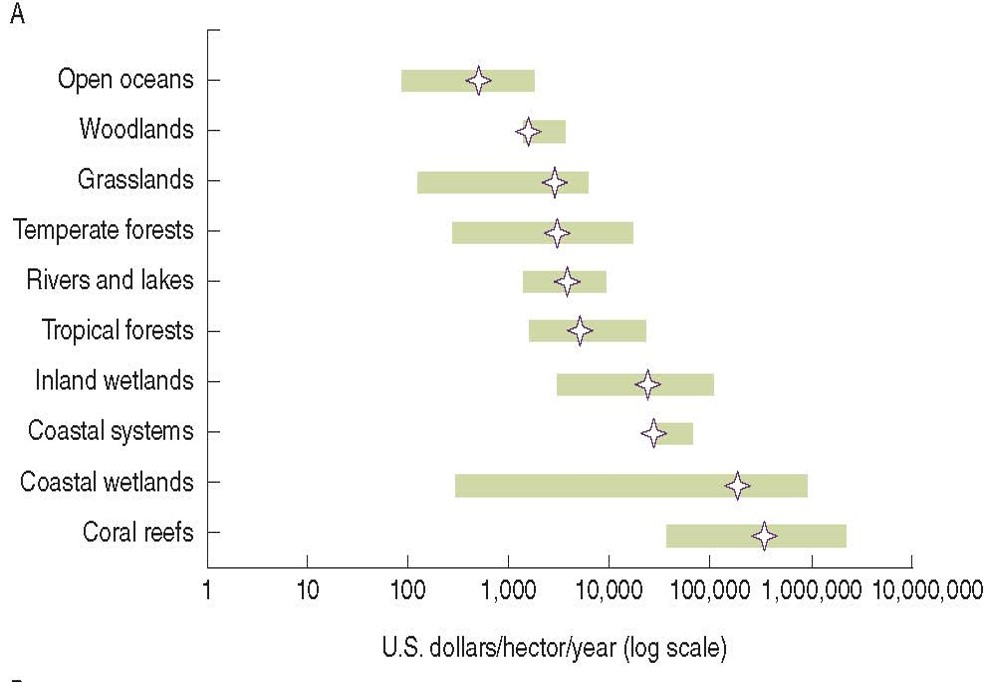
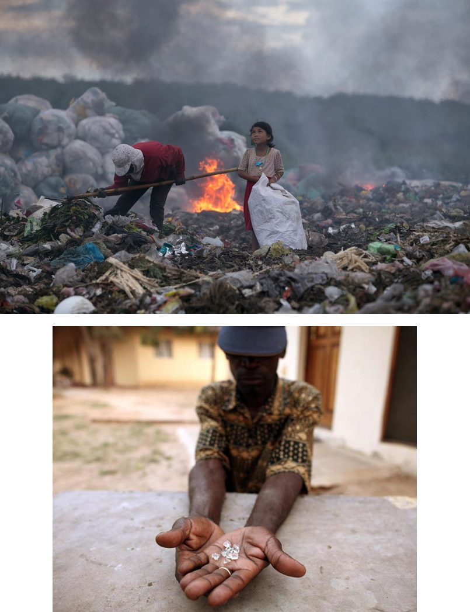

## Why should we value nature

 
 
 
 
 
 
 
 
 
 
 
 
 
 
 
 
 
 

**What are some big picture reasons humans might care about biological diversity in the first place? **

## Chapter 1: The value of biological diversity

 
 

- **Scientific Value**: 
<!-- Factors that lead to gain or loss of species -->

 

- **Value to Human Health**: 
<!-- We rely on natural systems -->

 

- **Economic Value**: 
<!-- Biodiversity has infinite commercial value -->

 

- **Cultural Value**: 
<!-- Natural world anchors human culture -->

 

- **Ethical Value**: 
<!-- Moral role in conservation and stewardship -->

 

- **Intrinsic Value**: 
<!-- Value of life -->

## The value of biological diversity: frogs case study

 

- **Support ecosystem functions**
    + *scientific value*
    
 

- **Amphibians are critical in food webs as both predators and prey and keep invertebrate populations in check**

 

- **Provide value as pest control**

## The value of biological diversity: frogs case study

 

- **Provide health/economic value as nutrition**

 

- **French eat 4,000 tones of frog legs per year**

 

- **Part of diet for Asia, Africa, Europe, and Americas**

 

- **20 species are known to be edible to humans**

## The value of biological diversity: frogs case study

 

- **Provide human health services as biomedicines**

 

- **Amphibians skin secretions can be used for developing new antimicrobial and antiviral drugs**
    - easy to obtain!
    
 

- **Australian red-eyed tree-frog (*Litoria chloris*) and relatives give us a compound capable of preventing HIV infection, the cause of AIDS**

 

- **Over 5,000 species to explore....**

## The value of biological diversity: frogs case study

 

- **Environmental sentinels **
    + skin used to drink and breath makes then susceptible to chemicals
    
 

- **Amphibians are indicators of environmental contaminants that can harm humans and other animals**

    
 

- **Widely used pesticide Atrazine can turn male frogs into females**
    + known to cause cancer in humans
    + sterilizes frogs at levels below EPA drink water guidelines
    + currently above EPA levels in drinking water for >1 million humans

    
## The Value of Biological Diversity: frogs case study

 

- **Aesthic/Cultural value**

 

- **Amphibians are revered around the world, they are viewed as agents of rain, fertility, and luck**
    + Kermit is a protagonist for American children
    
 

- **In other cultures frogs and toads have been despised and regarded as evils**
    + https://museumsvictoria.com.au/childrens-week/look-and-listen/tiddalik-the-frog/

## Value of Nature = assigning importance

## The value of biological diversity

 
 
 

- *Ecosystem services* = varied benefits to humans provided by the natural environment from healthy ecosystems

 

- Healthy ecosystems provide benefits for all life on earth, but valuing them for what the provide humans is a key management and policy tool (*especially for global change*)
    + which ones are the most vulnerable?
    + which ones are the most essential to humans?
    + globally? regionally? locally? culturally?
    
 

**What’s your best guess as to the annual value in US dollars per year of global ecosystem services?**

## The value of biological diversity

 
 
 

- **Two studies - Nature paper in 1997 and a re-evaluation and update in 2011**
    
 

- **Used lots in individual studies to synthesis values of measured ecosystem services globally**
    - 33 trillion (1997) - 125 trillion (2011)
    
 

- **1997 paper predicted that economic value could only increase**

## The value of biological diversity

 
 
 

- **Why is value going up? **

 

- **How many reasons can we list?**

 

- **Total monetary or market value of all the finished goods and services produced (GDP) in 2020 was $85 trillion.**
    - What does this comparison mean to you?
    - Look up the GDP of major countries
    - What is the worth of the largest companies?
    

## The value of biological diversity: Where is the $ at?

 

- **All biomes do not appear to be created equal..in terms of $ **

 

- **What is the connection between biodiversity and biome value**

 

- **Which biomes are most abundant**
    - What does this mean for the future?

 

- **A recent study predicts that values can shift by trillions every year based on global change and decision making**

## The value of biological diversity

 
 
 

**There is a false dichotomy between “the environment” and “the economy”.**

 

- **Without the environment there would be no economy.**

 

**Are there potential down-sides of valuing ecosystem services monetarily?**

 

- **Commodification and privatization of natural resources**

## Valuing nature: Lots of complex & conflicting benefits

 
 
 

**Economic value of endangered species can lead to further declines**

 

**Devastating armed conflicts over natural resources**

 

**Abysmal working conditions in resource extraction**

 

**Bioprospecting and biopiracy**

## Ecosystem services now have the white house's attention...

**https://www.whitehouse.gov/omb/briefing-room/2023/08/01/accounting-for-ecosystem-services-in-benefit-cost-analysis/**

 

* **America the beautiful initiative**
    - locally led and voluntary nationwide effort to conserve 30% of US lands and waters by 2023
    
  
 
* **USDA expand and renews Conservation Reserve Program**
    - goal is to enroll up to 4 million new acres to preserving topsoil, sequestering carbon, and reducing nitrogen runoff, as well providing healthy habitat for wildlife
    

    
## Next up: Friday open-discussion on the 'value of nature'

 

- **Which value resonates most with you personally? **

 

- **Make a persuasive argument for which value aspect of biodiversity is the most important?**

 

- **Prepare a 'legal brief' to present to a small group**
    + summarize your argument into a few key points
    + provide real tangible evidence
    + submit your brief on Brightspace (can be rough)
    
 
 
- **Feel free to argue the path less traveled**

 

- **Your small group will need to come to a decision based on everyone's briefs**
