## The Geologic Time Scale

- **Humans subdivide time into useable units such as our calendar year, months, weeks, and days** 

 

- **Geologists also subdivide time- breaking it into useable, understandable segments**
    + based on major geologic events
    + based on appearance (and disappearance) of significant life-forms
    + starts with formation of Earth’s crust followed by the appearance of ever-changing forms of life

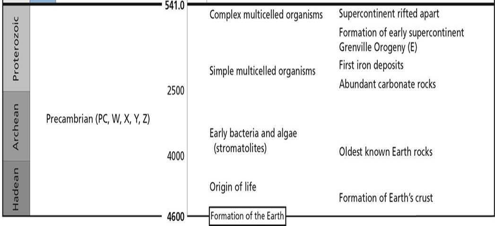

##

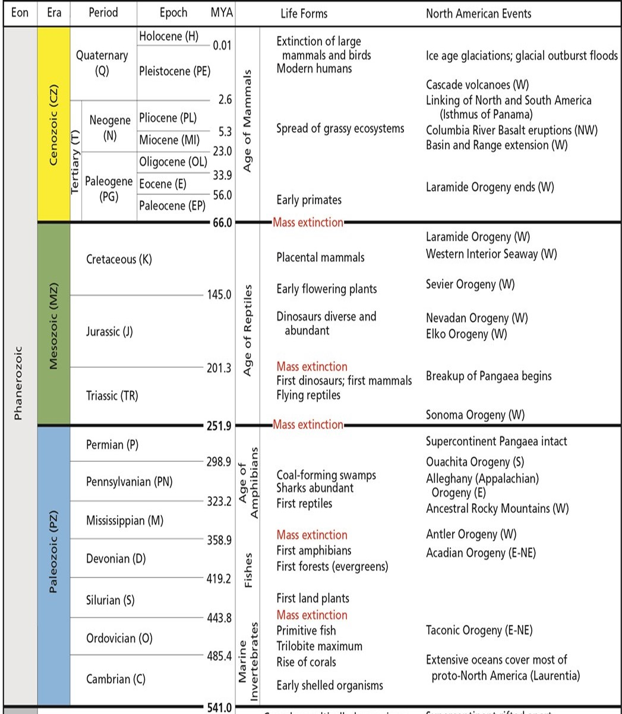

## Key Periods of Human History

 

- **We know that humans influence the biosphere - just by being humans**
    + local vs regional vs global

 

- **On geologic times scales humans have existed in the Cenozoic era**
    + our evolutionary trajectory takes us through the Pleistocene and Holocene
    + we are unofficially in a new epoch: *Anthropocene*

 

- **Understanding human impacts requires historical knowledge of each time period**
    + what we tried to do on Friday!
    

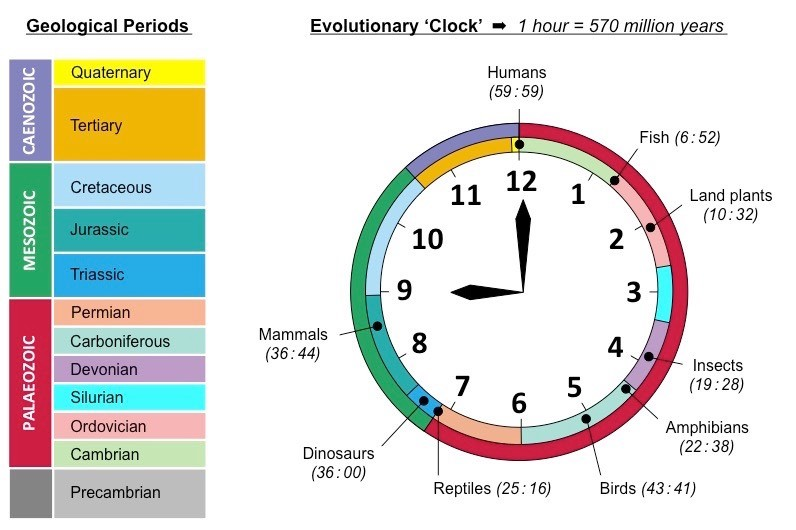

## Pleistocene Ice Age (1.8-0.1 mya)

- **Glaciers repeatedly advance from the Arctic over Europe and North America**
    + ice up to a mile thick
    + temperatures ahead of the flow drop significantly.
    
 

- **Animal life evolved (or not) to handle temperature change**
    + new species, range shifts, population declines
    
 

- **Hominid line continues to evolve during the Pleistocene**
    + anatomically modern humans first appear during late stages

 

- **More than 200 genera of very large herbivores go extinct**
    + 95% in North America
    + humans and climate

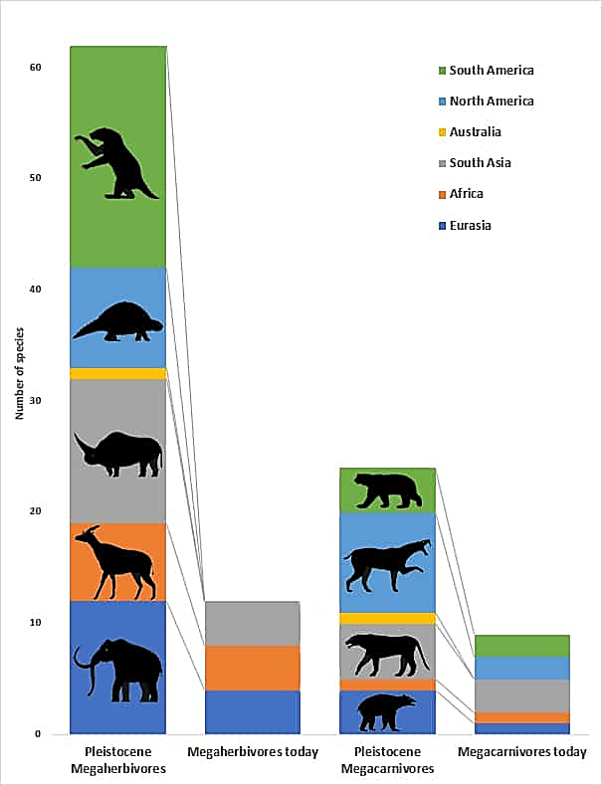

## Holocene (12,000 -)

 

- **H. sapien the only member of our genus to enter this period**

 

- **Begins after last glacial period, including glacial retreat**
    + Earth experienced a warming trend
    + Perhaps why biodiversity is comparably high
    
 

- **Climate change and megafauna extinction drive massive change in human behaviors**
    
 

- **Rapid proliferation, growth and impacts of the human species worldwide**

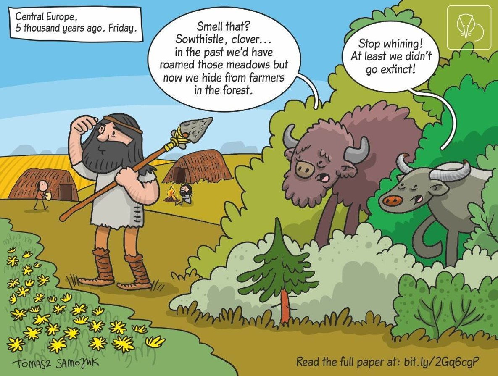

## Holocene (12,000 -)

- **Significant advancements in technology and 'urbanization'**
    + resultant increases in human impacts (>local?)
    

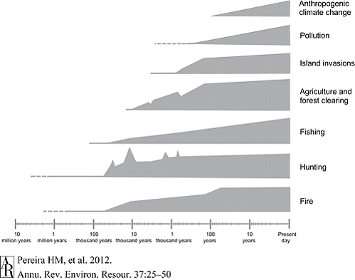

## Holocene (12,000 -) Were humans lucky?

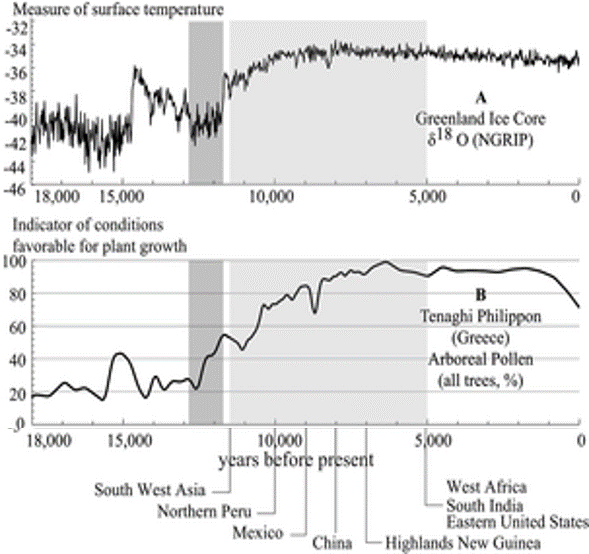

## Neolithic period (12,000-6,000ya)

 

- **Set of developments that appeared in several places independently!**

 

- **Development of agricultural crucial human landmark**
    + plant cultivation and animal domestication
    + irrigation in areas with insufficient rainfall
    + spread from several centers of origin
    
 

- **Origin of agriculture... necessity or opportunity?**

 

- **Whether from migrating farmers or indigenous development, most continents were transformed**

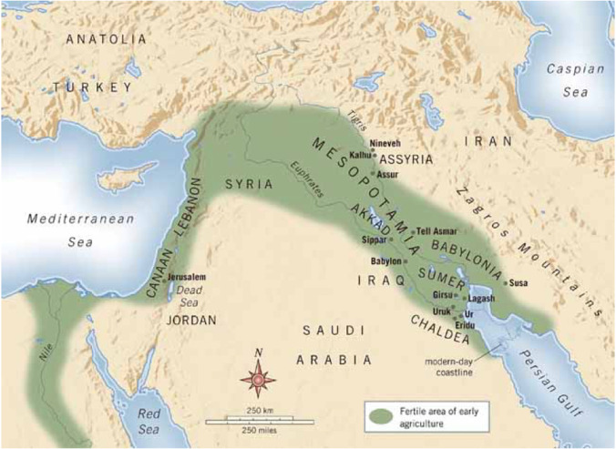

## Neolithic period: Humans transitioned to permanent settlements

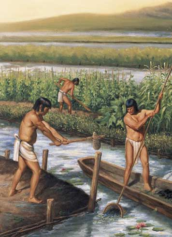

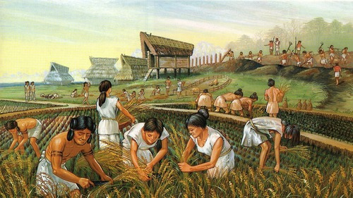

## Neolithic period: Urbanization and Population growth 

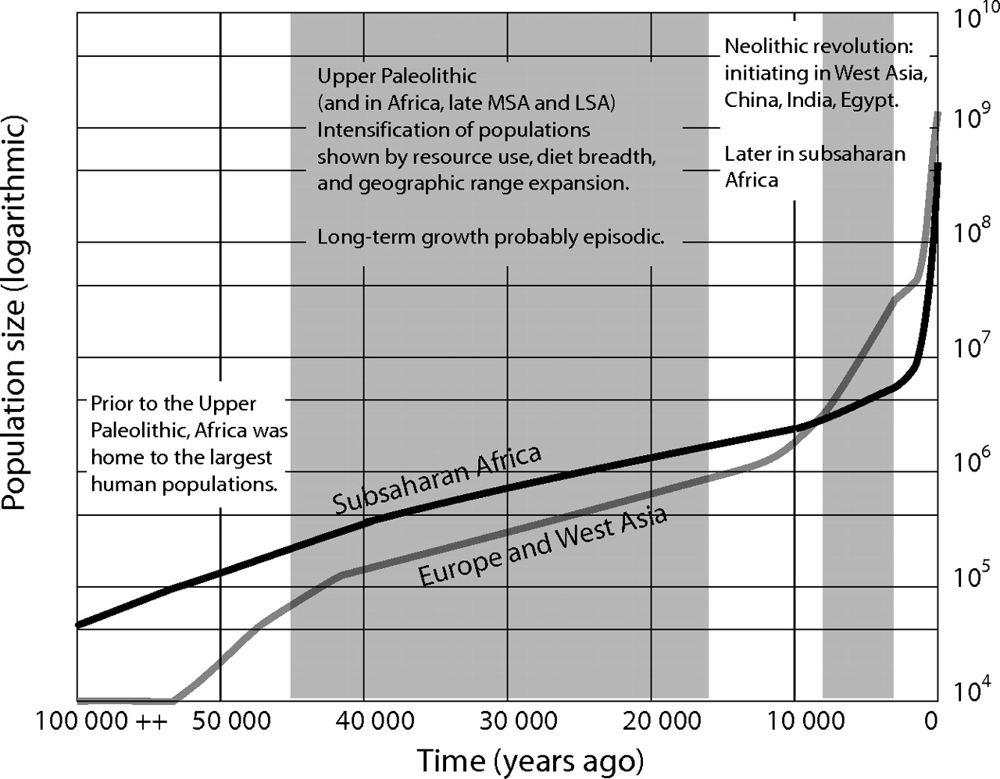

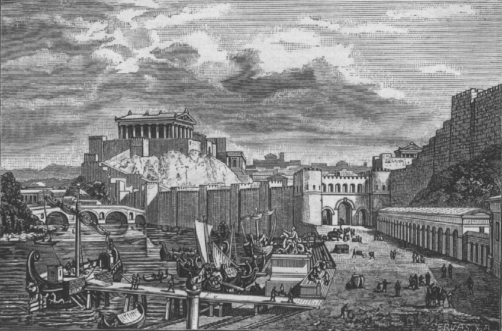

## Neolithic period: Consequences of Urbanization

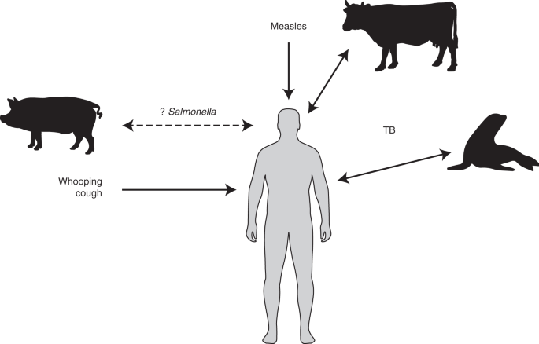

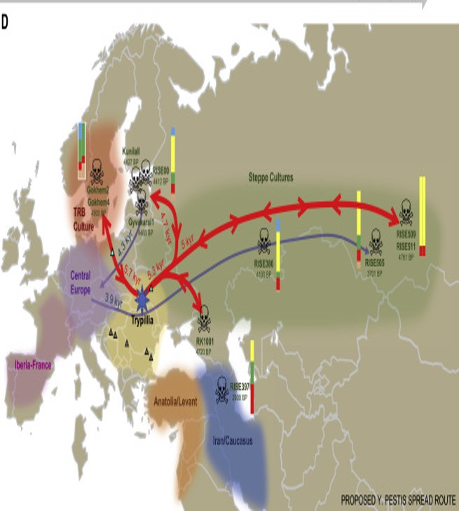

## Neolithic period: Consequences of Urbanization

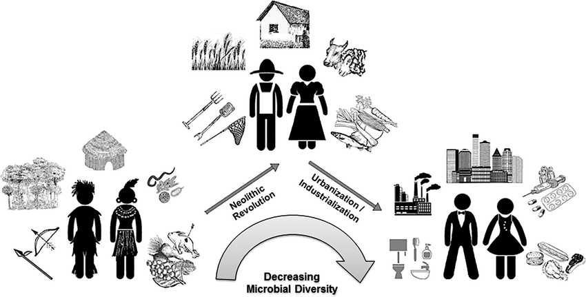

## Industrial Age (1760 -)

 

- **Economic and social organization that began around 1760 in Great Britain** 
    + factors of production (trade, farming, natural resources) allowed it to happen
    
 

- **Replacement of hand tools with power-driven machines**
    + power loom, steam engine, iron making

 

- **Concentration of industry in large establishments**
    + fueled by coal mining
    + creation of 'factories'
 
 

 
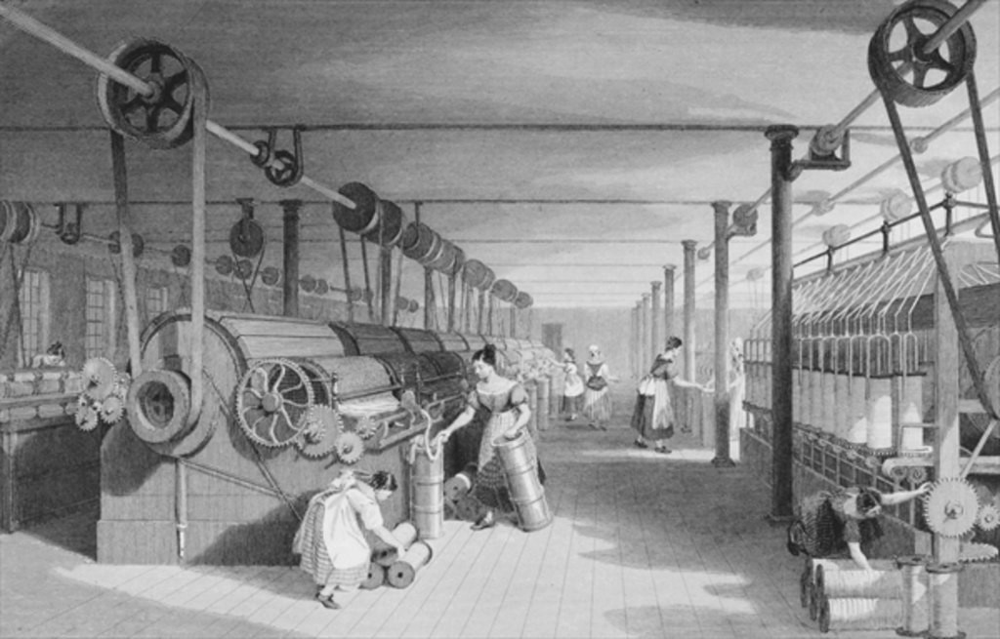

## Industrial Revolution marks a major turning point in history

 
 

- **Every aspect of daily life was influenced in some way**

 

- **Average income and population began to exhibit unprecedented sustained growth**
    + creation of middle class
    
 

- **Represents the starting point for serious atmospheric change**
    + based on fossil fuel emissions
    + https://www.youtube.com/watch?v=kCmwKbVFbWg (bar chart race)
    
 

 
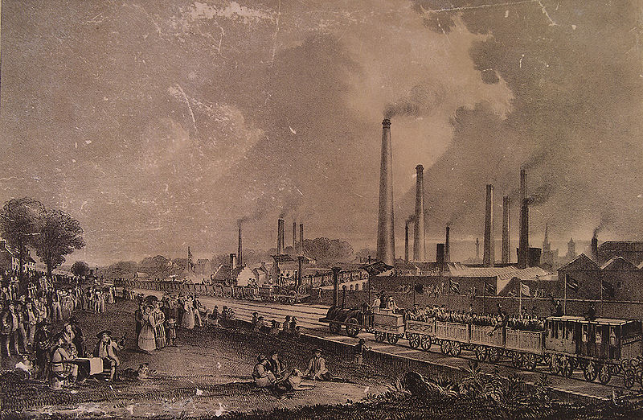

## Key Periods of Human History: The Anthropocene Epoch

- **New geologic era?**
    + proposal submitted
    + would mark end of the Holocene
    
 

- **Many geologist criticize the idea**
    + hard to define a period when you are in it
    

- **Interval of time where humans dominate key processes on Earth**
    + anthropo, for “man,” and cene, for “new”

 

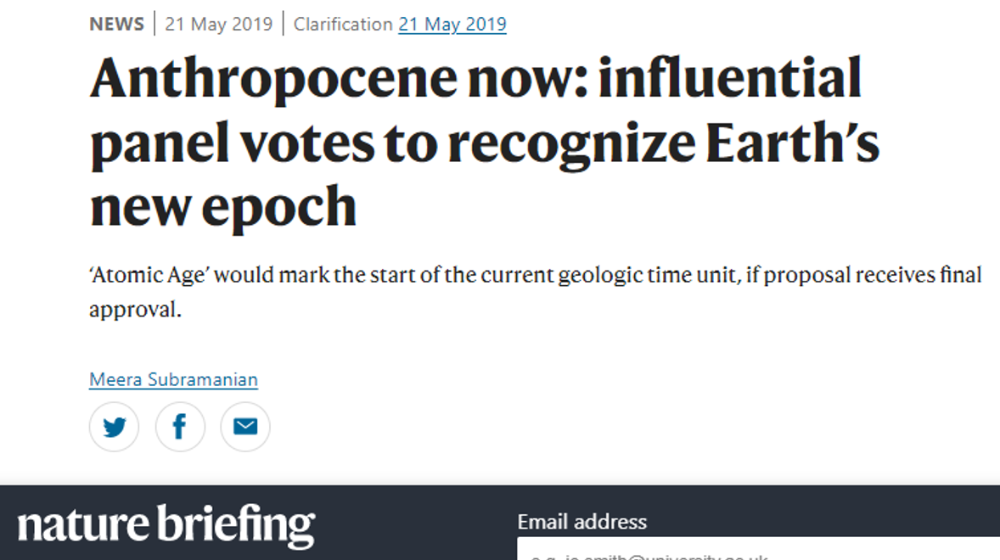

## Does the Anthropocene begin in the Industrial Age?

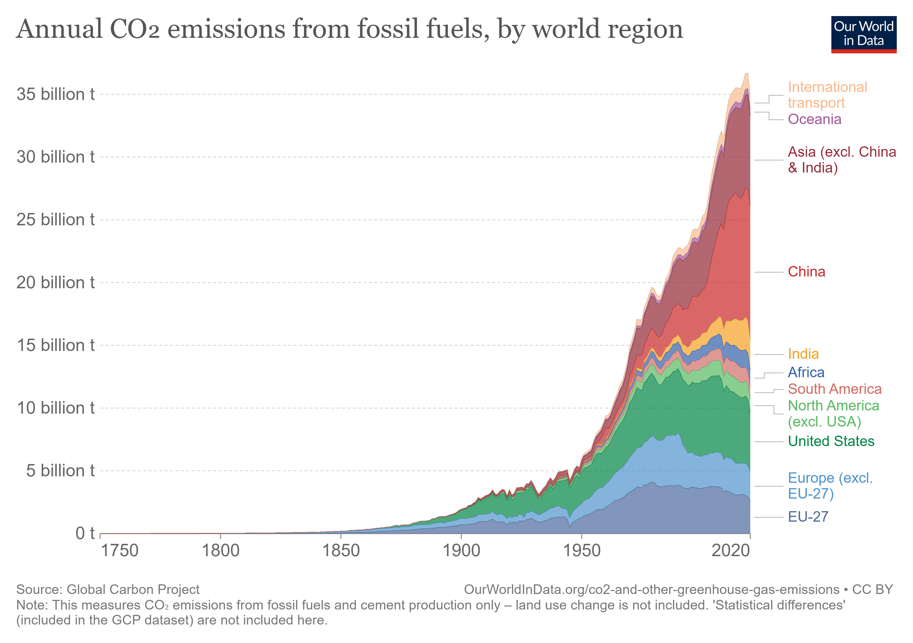

## Does the Anthropocene begin in the Industrial Age?

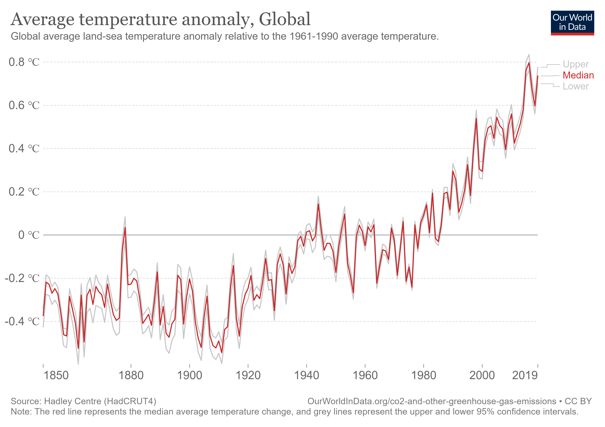

## Does the Anthropocene begin in the Industrial Age?

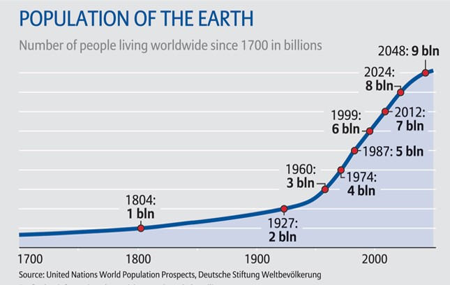

## The Great Acceleration: Post 1950

 

- **Dramatic, continuous surge in growth rate across a large range of measures of human activity**

 

- **Socioeconomic parameters:  population, economics, water usage, food production, transportation, technology**

 

- **Earth system parameters: green house gases, surface temperature, and natural resource usage**

 

- **Post-war revival age**
    + fossil energy and new technology flooding the markets

 

 
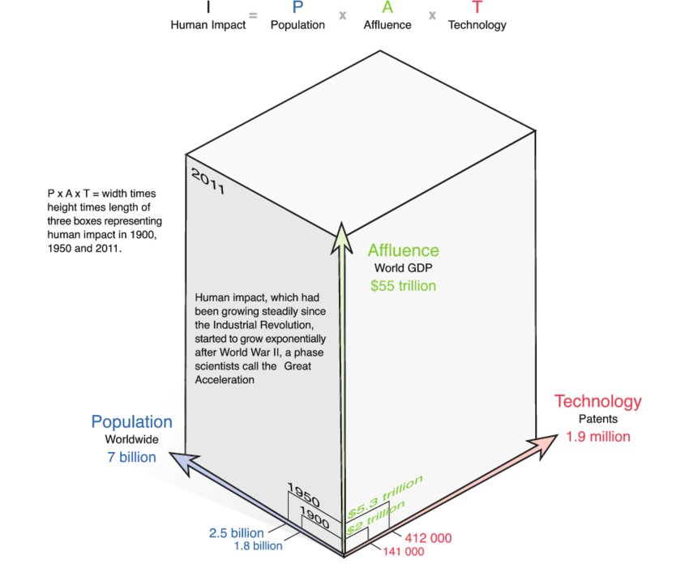

## 

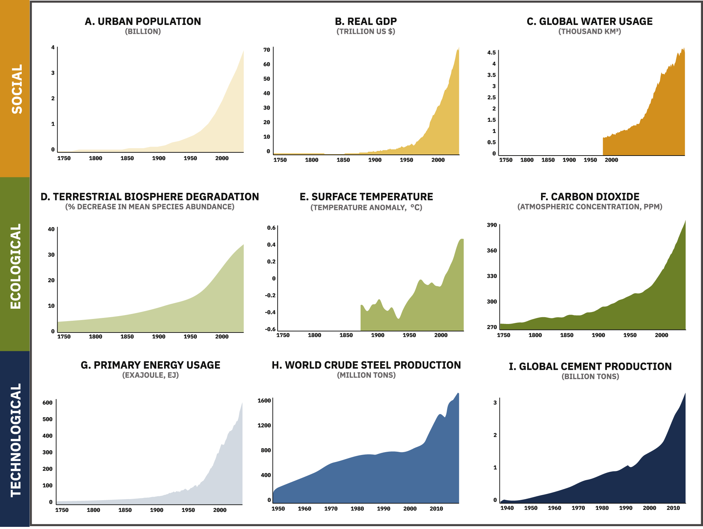

## What happended? Haber Bosch happened!

 

    
## Exponential human growth puts pressures on Earth's systems

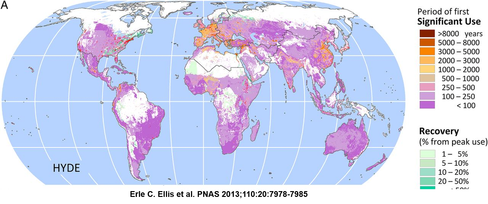