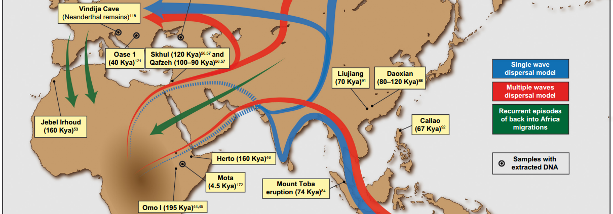
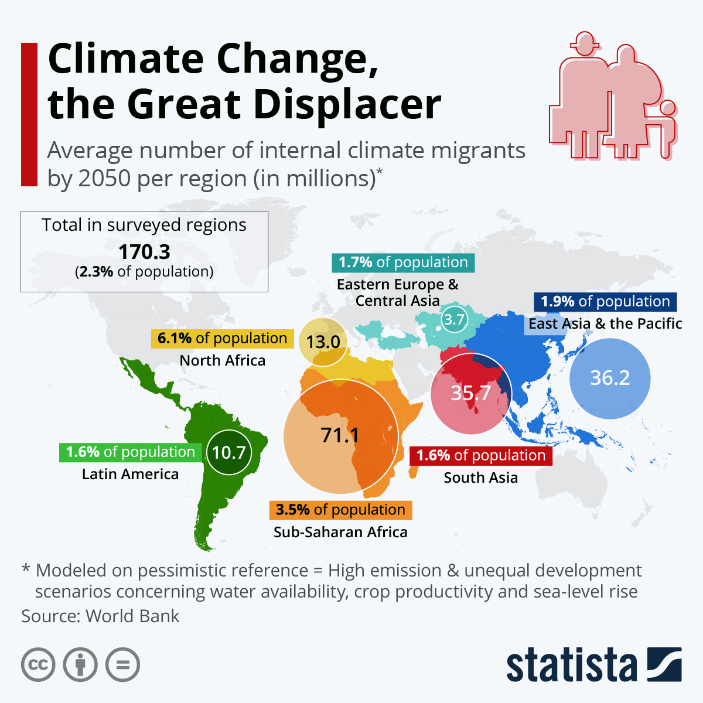
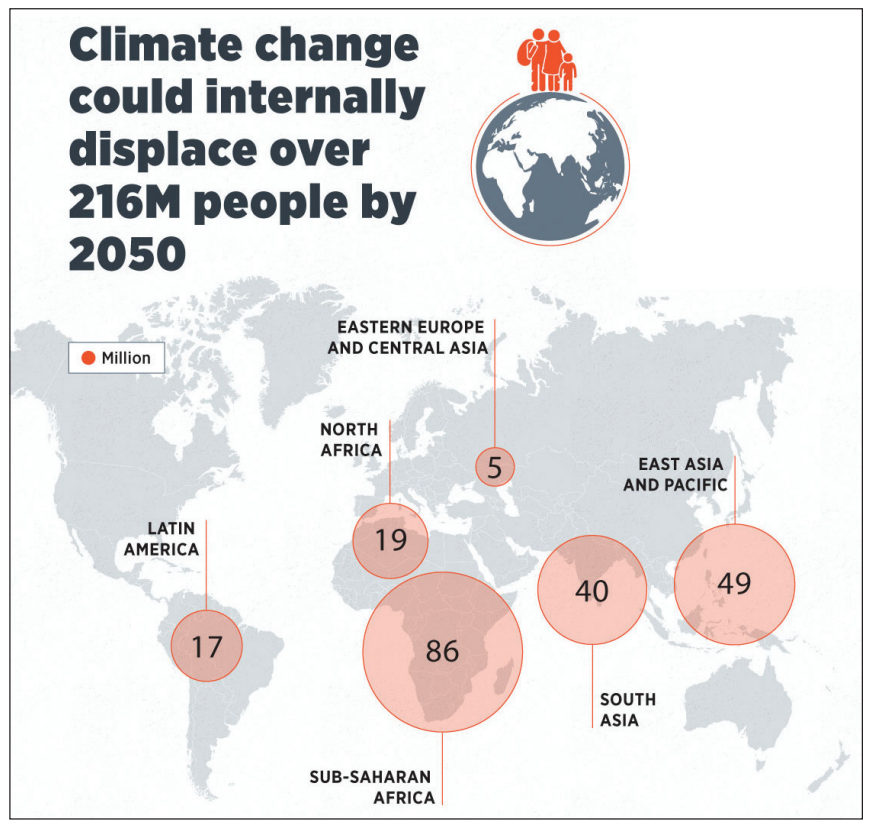
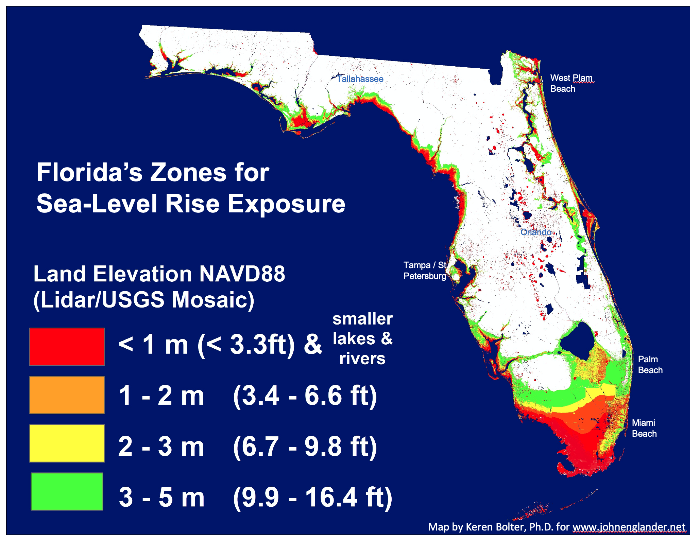
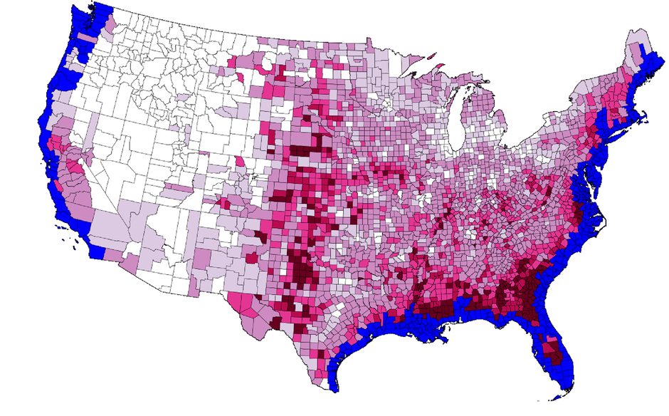

## Then: Was 'Out of Africa' climate related?

## Then: Was hunter-gather movement climate related?

## What is the adjacent possible 'Move' response for humans?

## Sea level rise may force a move response

 

**Pacific Islands threatened by sea level rise caused by climate change**

 

**Water availability and overcrowding may become an issue in the next 50 years**

 

**29% of US population lives on the coast**

 

**40% of world populations live within 100km of coast**

 

**1 in 10 people live in low-elevation coastal risk zone (<30 ft above sea level)**

## Where will Americans move with sea level rise?

## Are climate refugess in the near future?

 

**New Zealand is one of the first countries to propose program for climate refugees**
    
 

**Pacific Islanders only want refugee visas as a last resort **

 

**Instead, island communities advocate for climate adaptation, emission reduction, and pathways for legal migration beforehand**

