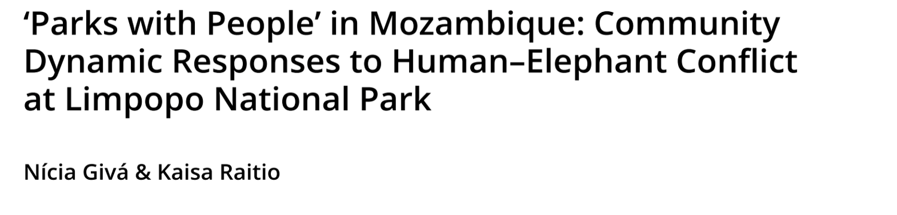
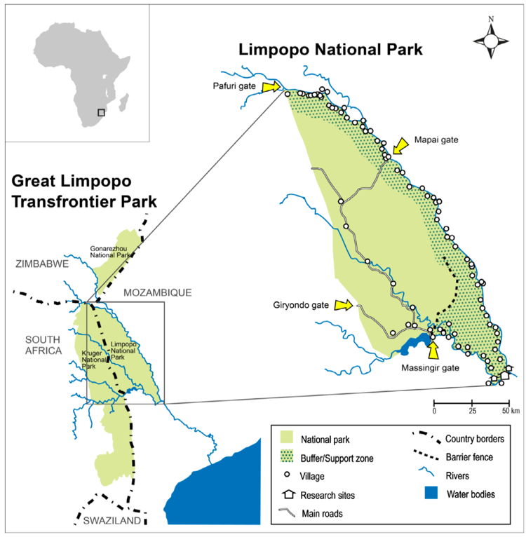
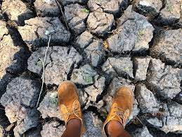
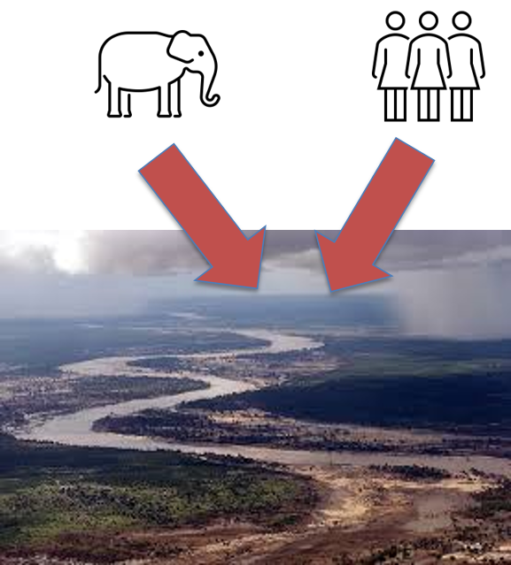
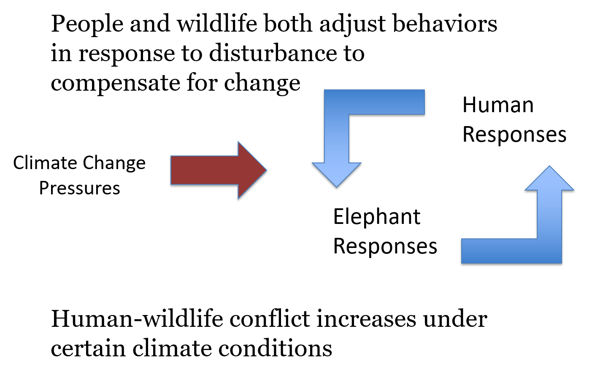

## Case Study: Limpopo National Park

 
 
 
 
 
 
 
 
 

**Village communities used the region before the establishment of Limpopo National Park **

 

**After the park’s establishment, village communities live within the park buffer zone**

 

**The buffer zone is an important area for wildlife **

## People, Parks, and Climate Change

 

**Strategies Dealing with Drought before the National Park**

 
 

* **Small plots in multiple areas**
 
* **Sharing plots**
 
* **Seeding at every rainfall**
 
* **Temporary migration**
 
* **Crop mixing**

## People, Parks, and Climate Change

 

**Strategies Dealing with Drought before the National Park**

 
 

**WILDLIFE: As drought intensifies, elephants compensate by increasing usage of areas nearest the river, including crop fields**

 

**HUMAN: Village communities respond by using fencing and altering cropping practices **

## People, Parks, and Climate Change

