## You’ve been told about plagiarism for a long time…

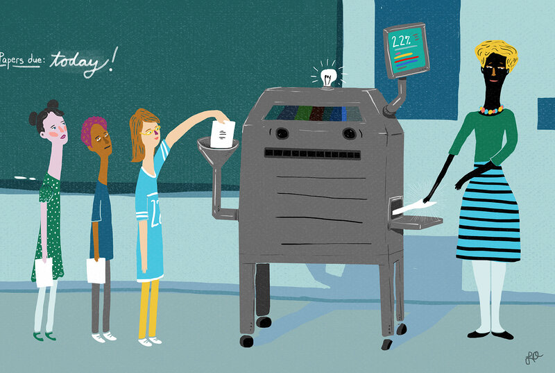

## Brainstorm: What does it actually mean to plagarize?

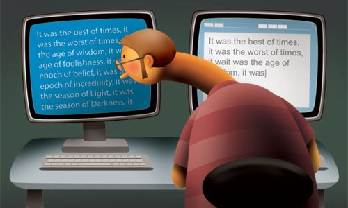

## Definition of plagiarism

 
 

* **plagiarism:  (pla·gia·rism | \ˈplā-jə-ˌri-zəm\)**:
    + To steal and pass off the words and ideas of another as one’s own
    + Use another’s production without crediting the source
    + To commit literary theft
    + Present as new or original an idea or product derived from an existing source

 

* **There are two types of plagiarism:**
    + Intentional
    + Unintentional

## What are some common examples of student plagiarism?

 

* **Copy pasting from a source**

 

* **Copy sentence structure or words from a source**

 

* **Not citing a source**

 

* **Using a citation inappropriately**

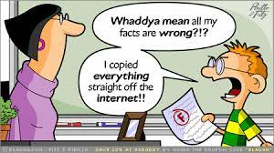

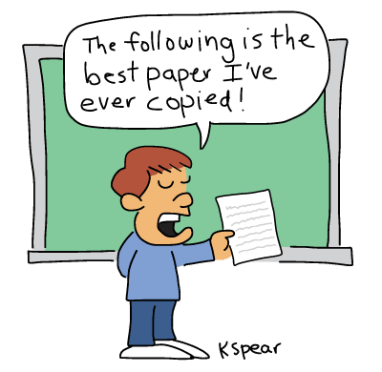

## Intentional plagiarism

 
 
 

* **Submitting pre-written papers downloaded or purchased from the Internet.**

 

* **Cutting and pasting from more than one source without quoting or citing the sources.**

 

* **Borrowing words or ideas from others without giving credit.**

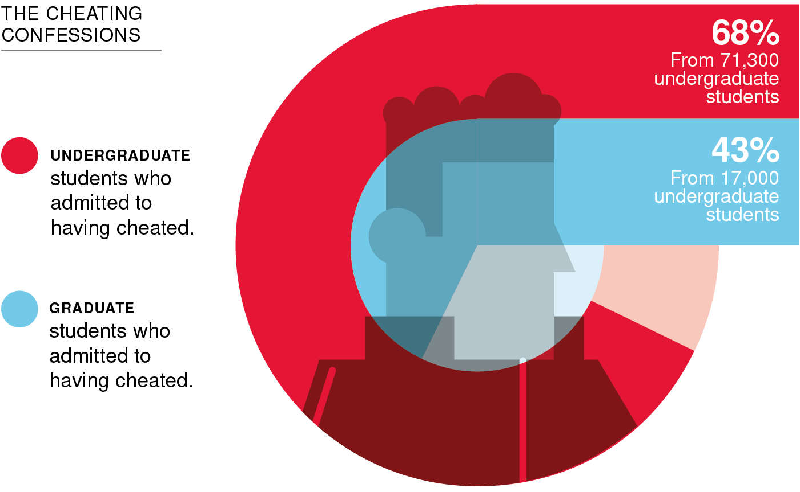

## Unintentional plagiarism = Misuse of sources

 

* **Accidental appropriation of the ideas and materials of others due to a lack of understanding of the conventions of citation and documentation**
    + More common than intentional plagiarism
    + Is NOT a defense! 

 

* **Factors that contribute to unintentional plagiarism:**
    + Lazy paraphrasing and quoting
    + Haphazard citations
    + Lack of understanding of the research process
    + Disengagement from the research process

## Is plagiarism really a problem?  

 

* **A survey of over 63,700 US undergraduate students over the course of three years (2002-2005) revealed: (McCabe, 2005)**
    + 36% admit to “paraphrasing/copying few sentences from Internet source without citing it.”
    + 38% admit to “paraphrasing/copying few sentences from written source without citing it.”
    + 14% of students admit to “fabricating/falsifying a bibliography”
    + 7% self report copying materials “almost word for word from a written source without citation.”

 
 
 
 

* **These trends have increased with growth of the internet!**

 

## What are the consequences of plagiarism?

 

* **At Shepherd, plagiarism is handled at the discretion of the professor**
    + The penalty can be anything up to and including assigning the student a failing grade for the class 
    + Examples: requiring work to be rewritten and resubmitted; lowering a grade; reducing the grade on the assignment; advising the withdrawal of a student from a class

 

* **Cases are reported to the Student Affairs office—at the second offense**
    + Suspension or expulsion is likely

 
 

* **In the “real world:”**
    + Loss of employment
    + Destruction of reputation

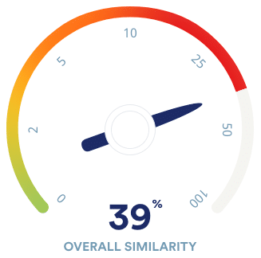

## Intentional plagiarism is easy to catch

 
 

* **Professor’s core knowledge**

 

* **Familiarity with student abilities**

 

* **Search engines**

 

* **Plagiarism-preventive websites (like Turnitin used at Shepherd)**

 

* **Internet paper mills**

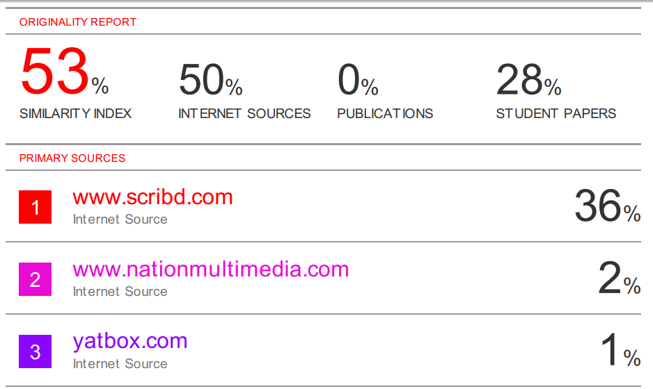

## Avoiding unintentional plagiarism requires effort on your part

 
 

* **Good research involves:**
    + Finding an answer to a question by first looking at what others have written in various sources
    + THEN the researcher asserts himself into the project and creates a conversation between the different sources

 

* **The more you read, strive to understand, and integrate your sources, the less likely to plagiarize you are**

 

* **SURFACE RESEARCHING encourages unintentional plagiarism.**

## Key Skills: Citing appropriately

**We  always strive to produce publication quality papers, so try to emulate their use of references**

 
 
 
 
 
 
 
 
 
 
 
 
 
 
 
 

* **Do not directly quote from other papers except under rare circumstances**
    + very different from non-science academic writing

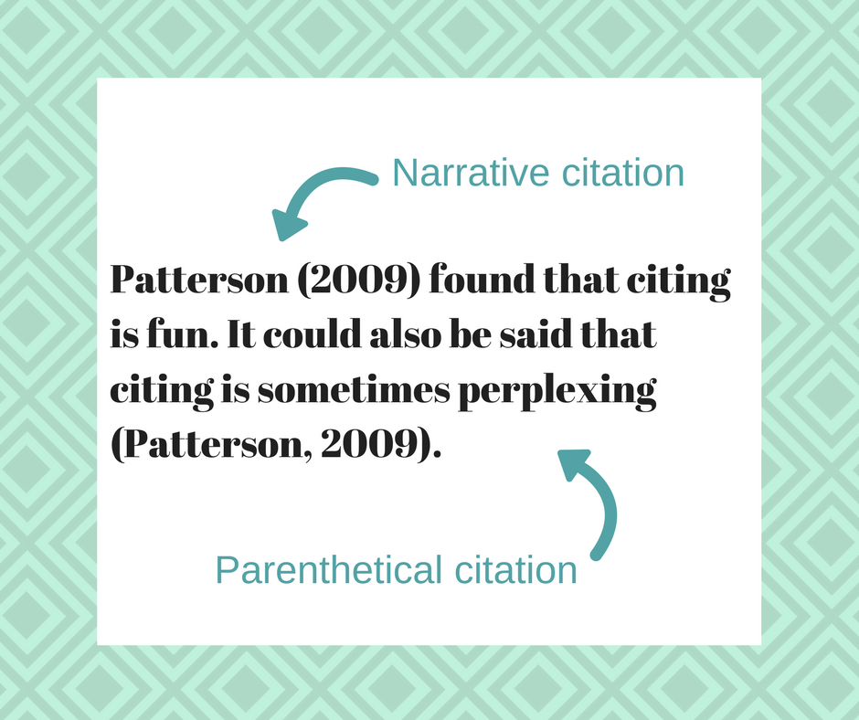

## Citing appropriately: Let's try

 
 
 
 
 
 
 
 
 

**Source:** “Our results provide the first estimate of population size for invasive blue catfish in the Chesapeake Bay region. In July–August 2013, tidal habitats along a 12-km stretch of the James River near Claremont, VA, supported about 1.6 million invasive blue catfish (95% CI 0.9 to 2.9 million), or about 544 blue catfish/ha.The population size estimate applies to the portion of the blue catfish population that ranges in size from 240 to 460 mm FL and which is vulnerable to capture by the commercial hoop-net fishery.”

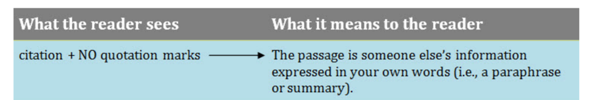

## Citing appropriately: Let's try

 
 

**Source:** “Our results provide the first estimate of population size for invasive blue catfish in the Chesapeake Bay region. In July–August 2013, tidal habitats along a 12-km stretch of the James River near Claremont, VA, supported about 1.6 million invasive blue catfish (95% CI 0.9 to 2.9 million), or about 544 blue catfish/ha.The population size estimate applies to the portion of the blue catfish population that ranges in size from 240 to 460 mm FL and which is vulnerable to capture by the commercial hoop-net fishery.”

 
 

**Dr. C:** In the summer of 2013, the population size of invasive blue catfish in the James River (Virginia) large enough to be caught in commercial fishery nets was >500 fish/ha.

## Key Skills: Effective paraphrasing / summarizing in your notes

 

* **Put the article away when writing!!**
    + Use your notes and outline 

 

1. Reread the original passage until you understand its full meaning.
 
2. Set the original aside.
 
3. Write your paraphrase. The goal is to express the same meaning but introduce fresh words and sentence structure.  
 
4. Check your rendition with the original to make sure that your version accurately expresses all the essential information in a new form.
 
5. Cite the reference at the end of your sentence.

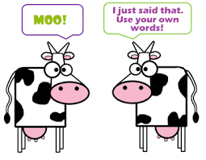

## Paraphrazing Example

**ORIGINAL PASSAGE:**  Students frequently overuse direct quotation in taking notes, and as a result they overuse quotations in the final [research] paper. Probably only about 10% of your final manuscript should appear as directly quoted matter. Therefore, you should strive to limit the amount of exact transcribing of source materials while taking notes. Lester, James D. Writing Research Papers. 2nd ed., 1976, pp. 46-47.

 

**LEGITIMATE PARAPHRASE**:  In research papers, students often quote excessively, failing to keep quoted material down to a desirable level. Since the problem usually originates during note taking, it is essential to minimize the material recorded verbatim (Lester 46-47).

 

**ACCEPTABLE SUMMARY:**  Students should take just a few notes in direct quotation from sources to help minimize the amount of quoted material in a research paper (Lester 46-47).

 

**PLAGIARIZED VERSION:**  Students often use too many direct quotations when they take notes, resulting in too many of them in the final research paper. In fact, probably only about 10% of the final copy should consist of directly quoted material. So it is important to limit the amount of source material copied while taking notes.

## Citing vs Common Knowledge

 

* **Citations are not needed when information can be considered 'common knowledge"**

 

* **What is common knowledge ?? == Can be tricky:**
    + Depends on your intended audience
    + Not everyone knows the same things

 

* **For the capstone, we are going to assume that common knowledge is information most biology majors would know:**
    + Neurons conduct electrical activity
    + DNA replication occurs before mitosis
    + A population is a group of individuals from the same species
    + Cancer is caused by misregulation of cell growth and division

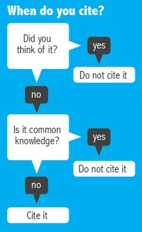
    
## Examples: What is not common knowledge?

 

**Inhibition of glutamatergic neurons causes a decrease in hippocampal neuronal activity**

 

**The checkpoint kinase ATM1 phosphorylates cyclin B**

 

**Dutch elm disease has drastically changed the community structure in eastern forests**

 

**A majority of intestinal cancers are caused by a disruption in the Wnt pathway**

 

**ANY references to studies done by another scientist**

## Key Skills: The Source Formula

 

* **Use this flow when introducing paraphrased or summarized material into the text of your paper:**
    + Intro &rightarrow; Source Material &rightarrow; Citation &rightarrow;Interpretation

 

* **Introducing the source material allows you to create transition between ideas.**

 

*  **Interpretation of the material certifies that your own ideas develop and take center stage in your research writing.**

 

* **Thinking through the formula engages you in the research process.**

## Key Skills: Anti-plagiarism checklist

 

* **When paraphrasing, translate the original into your own words using your own sentence structure & correctly cite the source**

 

* **Understand that if you’ve summarized a section of material, you still need to provide a citation.**

 

* **Ensure that you haven’t mistaken material that should be documented for “common knowledge.”**

 

* **Make sure your paper isn’t a patchwork of other people’s ideas strung together with a few transitions.**

 

* **Proofread your paper for plagiarism errors.**

 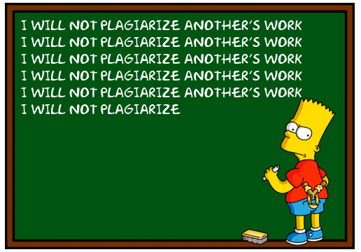
 
##
 
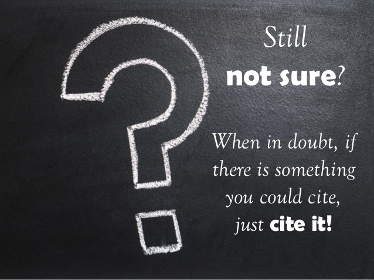

