## Coupled human-natural systems

 
 

**Ecological and social domains are truly one integrated system with complex interactions and feedbacks**

 

**Human survival depends on thriving ecosysytems and ecosystem health now depends on the choice humans make**

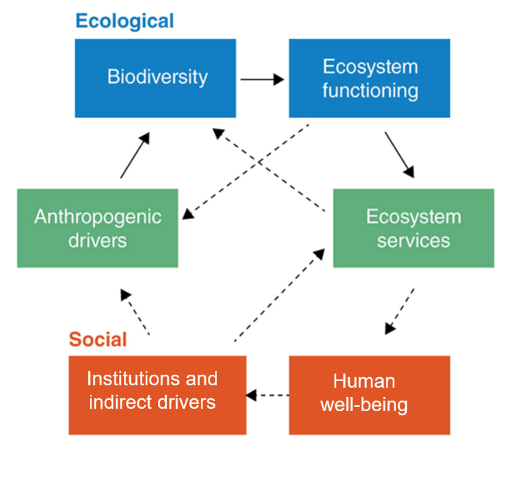

## Coupled human-natural systems

 
 

**Ecological and social domains are truly one integrated system with complex interactions and feedbacks**

 

**Successful biodiversity conservation will require addressing needs and inequities in human societies**

## Coupled human-natural systems

 
 

**Ecological and social domains are truly one integrated system with complex interactions and feedbacks**

 

**Successful biodiversity conservation will require addressing needs and inequities in human societies**

 

**And successful social reform and sustainable futures for humans will require biodiversity conservation**

## Coupled human-natural systems

**So many creative solutions are possible**
 

## Coupled human-natural systems

**So many creative solutions are possible but they require commitment from, interaction between, and honoring of...**

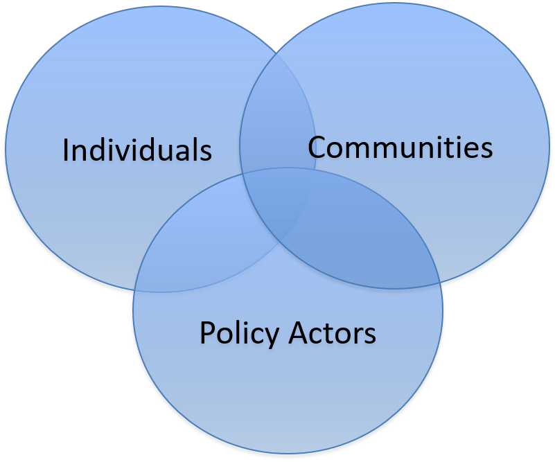

## How can people support biodiversity conservation?**

 

* **Individuals, as:**
    + consumers
    + funders
    + practitioners
    + activists
    + frequency holders

 

* **Policy actors, through:**
    + fisheries governance
    + endangered species legislation
    + international climate treaties
    + international debt-for-nature swaps

* **Collectives, through:**
    + ecotourism
    + sustainable food production
    + cradle-to-cradle manufacturing

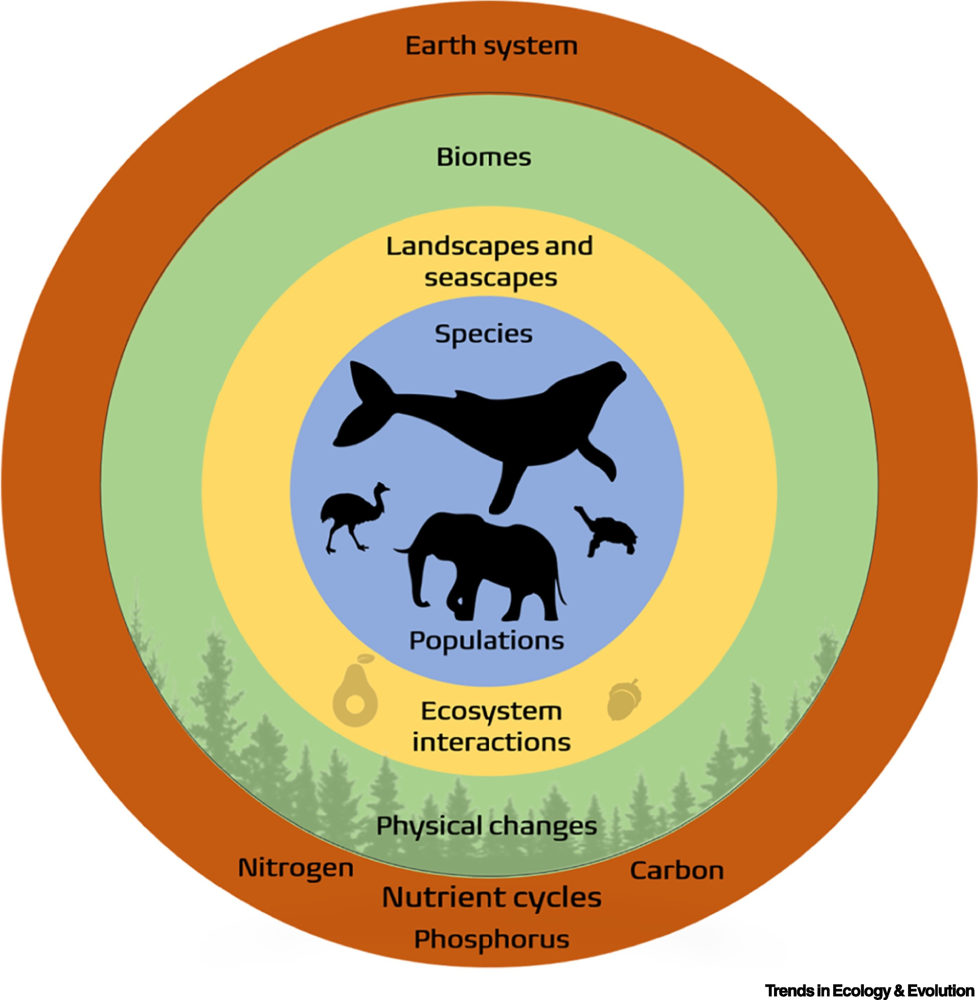

##

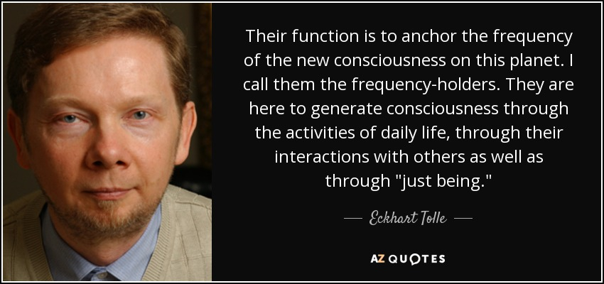

## How can people support biodiversity conservation?

 

**Through …**
 

**the things we do**
 

**and**
 

**the ways we be**

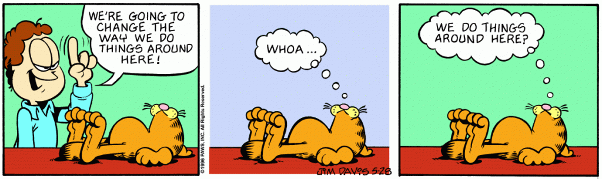

## Flash-back to extinction class sessions

 

* **What are some of the root causes of extinction?**
    + Exploitation
    + Capitalism
    + Economic inequality

 

 
* **What are the root causes of these behaviors and social structures?**
    + Keep going until can’t go any further…

## Extinction class sessions

 

* **What are some of the root causes of extinction?**
    + Exploitation
    + Capitalism
    + Economic inequality

 

 
* **What are the root causes of these behaviors and social structures?**
    + Greed
    + Fear
    + Feeling of lack
    + Feeling of separation

## Extinction class sessions

 
 
 
 
 
 
 

**What other effects do these root causes have?**

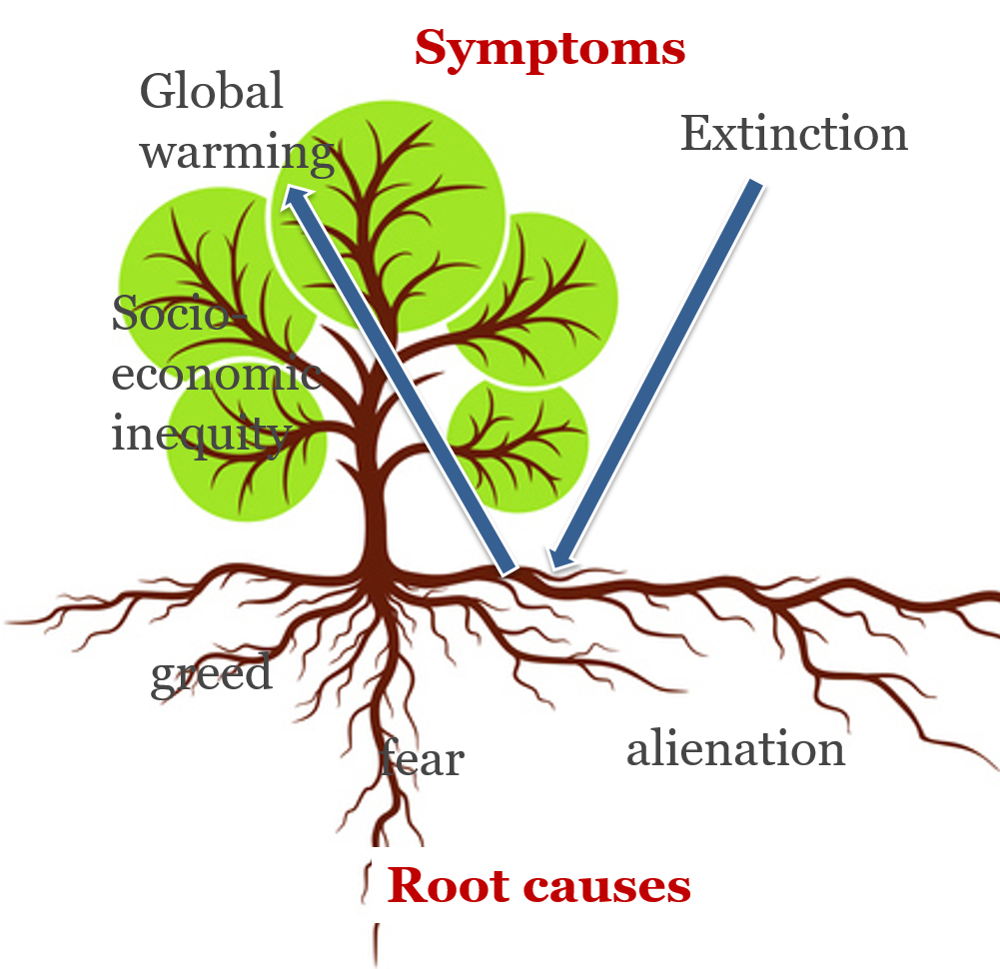

## Root causes affect everything

 

**The same extract and deplete mentality is impacting our planet, biosphere, social, emotional, and educational systems…**

## Root causes affect everything

 

**The same extract and deplete mentality is impacting our planet, biosphere, social, emotional, and educational systems…**

 
 
 
 
 
 
 
 
 
 
 
 
 
 

**This is painful....every one of us has a direct personal relationship to at least one of these issues**

## The world feels like it’s ablaze

 

**Like it’s been in the oven too long and the edges are all burnt and taste like charcoal**

 
 
 

**How do we manage our mental fire?**
 

**How do manage aspects of our society that are to hot to touch?**
 

**How do prevent nature from turning into ash?**

 
 
 
 

**We don’t have 10,000 problems, we have a foundational problem with 10,000 faces**

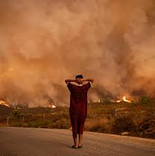

## Root causes affect everything

 
 
 

**So what is the medicine?**

 
 

**THOUGHTS?**

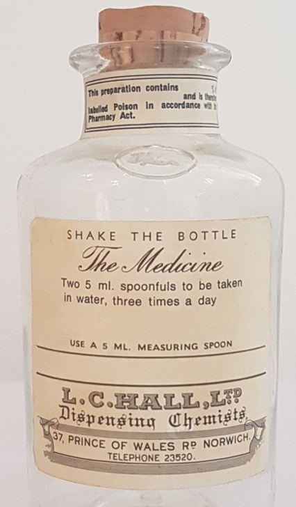

## Connect to the pain

 
 
 

**Don’t bypass pain**

 

**It doesn’t need to be avoided or indulged but it needs to be felt and acknowledged**

 

**Even in college classes**

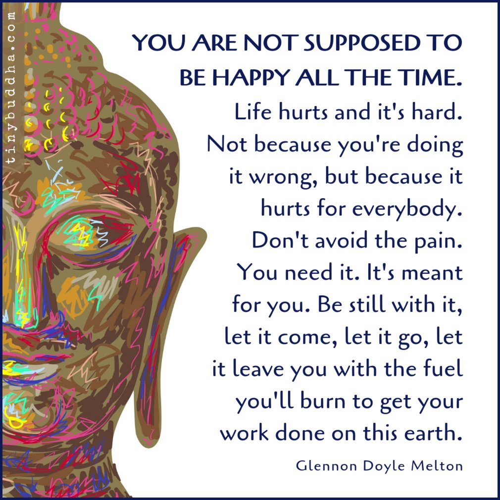

## The underlying deep caring

 
 
 

**Reinforce the truth: that things wouldn’t be depressing if we didn’t care deeply**

 
 

**Connecting to deep caring is totally different than a false “finding the silver lining”**

## The action that wants to emerge from the caring

 
 
 
 
 

**Support actions that come organically from caring rather than guilt**

 

**We are desperate for solutions but we keep being fed the same external ideas**

## Root causes affect everything

 
 

**But now constantly have real-time opportunities to practice this paradigm**

 

**Pain &#8594; Caring &#8594; Action**

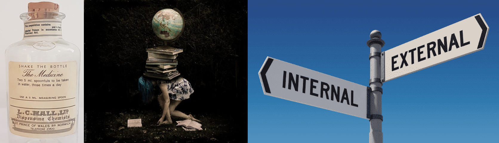

## But can be addressed anywhere

 
 
 

**We can explore personal or collective action anywhere   **

 

**And this action doesn’t have to be a fight against something**

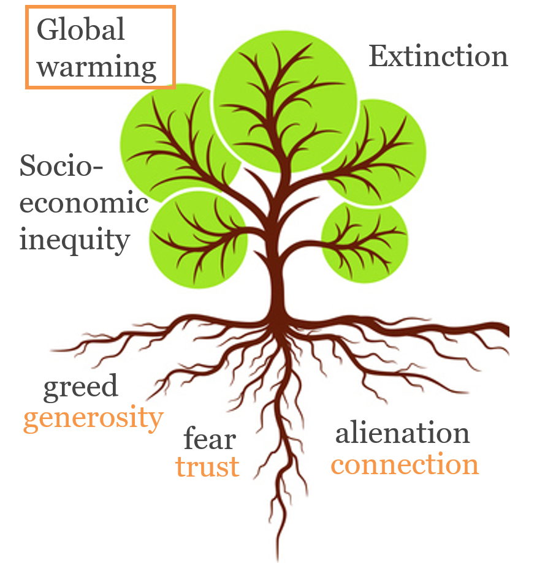

## Linking internal and external solutions

 

**And we can address root causes in small daily ways:**

 

**Let's list some....**

##

## Linking internal and external solutions

 

**And we can address root causes in small daily ways:**

 

**What could we ask Shepherd to do better everyday?**

## Linking internal and external solutions

 

**And we can address root causes in small daily ways:**

 

**We can take problems that seem huge, complex, and “out there” and makes them something we can work with together, through connection, “in here”.**

 

**An empowering way of taking responsibility**

## But can be addressed anywhere

 

**On a particular branch?**

 

**On a particular level?**
 
**individual**
 
**collective**
 
**policy actor**

 

**In a particular way?**
 
**internal**
 
**external**

 

**On a particular root?**

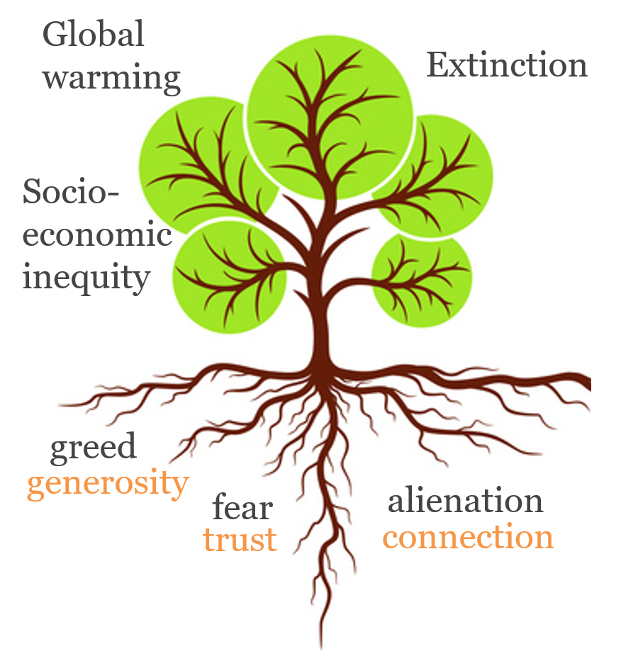

## Where do you feel drawn to contribute?

 

**Is individual action pointless in the face of climate change? Let's not beat around the bush...**

 
 
 
 
 
 
 
 
 
 
 
 
 
 

**"I think this is one of the great moral challenges of the 21st Century, perhaps the greatest moral challenge", he says. "If we are not acting, we are endangering everyone who is alive now and also future generations." Peter Singer of Princeton University**

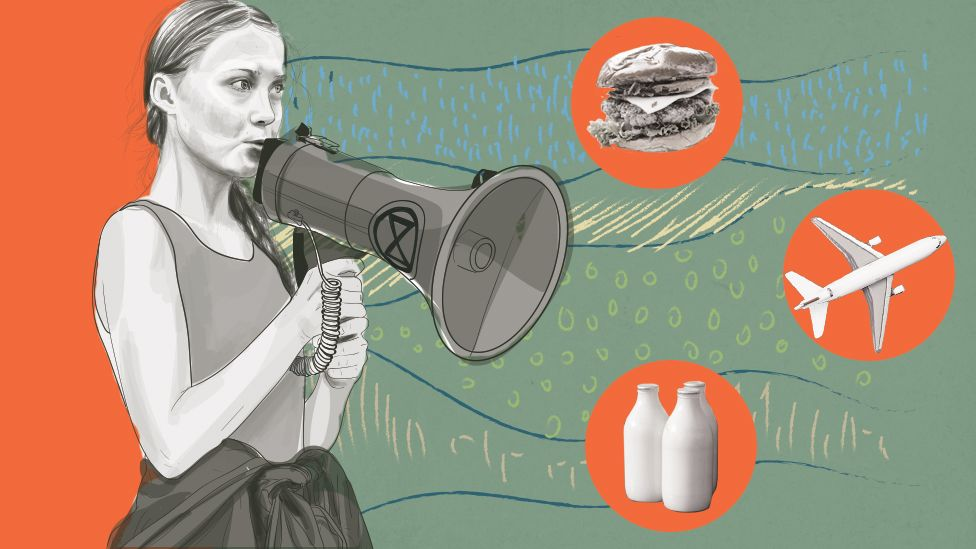

