## What is policy?

 

**“A course or method of action selected among alternatives that guides present and future decisions”**

 
 
 
 
 
 
 
 
 
 
 
 
 

**“A decision coupled with the authority to act on it”**

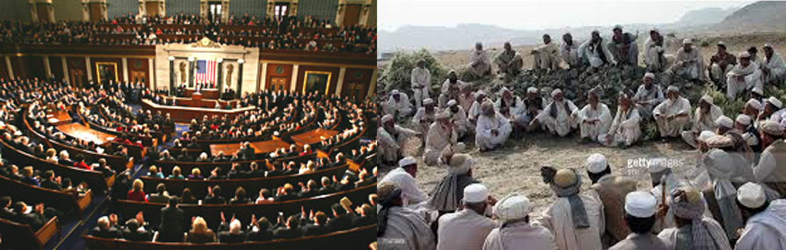

## What is policy?

 
 
 
 

**Policy actions can include: legislation, regulation, coordination, motivation.**

 
 

**Ultimately, policies can provide incentives to align the interests of biodiversity and human societies**

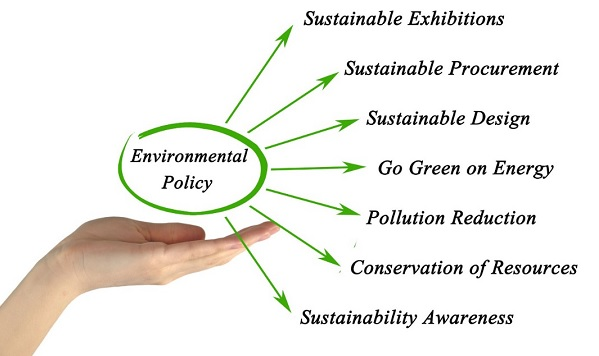

## What is policy?

 
 
 
 

**Incentive: something that motivates or encourages particular behavior**

 
 

**Perverse incentive: unintended or undesirable results contrary to initial motivation**

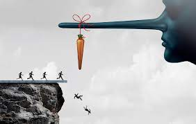

## Classic examples of perverse incentives:

 

**French colonial government in Honoi paying locals to exterminate rats &#8594;led to the farming of rats and increased rat problem**

 
 
 
 
 
 
 
 

**Carbon credits grant nations the right to emit gases that contribute to global warming. Developed nations are able to earn carbon credits by investing in emissions-reduction projects &#8594; For greenhouse gases trifluoromethane and sulfur hexafluoride, the value of the credits obtained can exceed the cost of destroying these gases in the production process, creating a 'perverse' incentive to increase production so that credits can be claimed.**

## What is policy?

 

**Let’s examine a couple of examples of policy to protect biodiversity and their incentive structures**

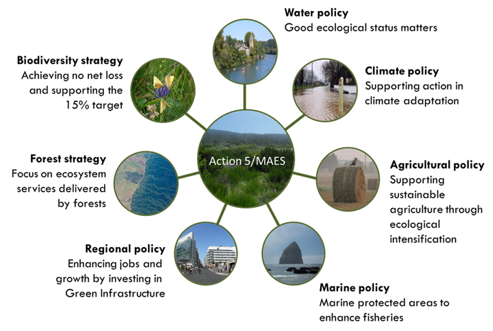 

## Endangered Species Act

 

**One of the most important pieces of legislation on biodiversity in the US**

 

**The Endangered Species Act (1973): “The purpose of the ESA is to protect and recover imperiled species and the ecosystems upon which they depend”**

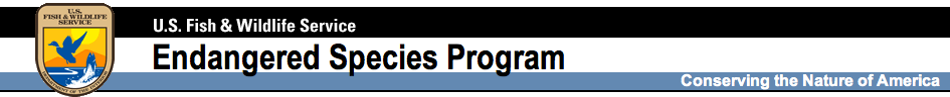 

## Endangered Species Act

 

**One of the most important pieces of legislation on biodiversity in the US**

 

**The ESA also interfaces with the 175-nation agreement to prevent species extinctions due to international trade **

 

**CITES:**
 
**C.onvention on **
**I.nternational T.rade **
 
**in E.ndangered S.pecies**
 
**of Wild Fauna and Flora**

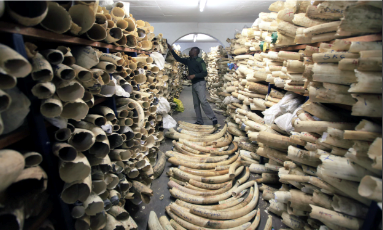

## Endangered Species Act

 

**One of the most important pieces of legislation on biodiversity in the US**

 

**There are > 2,200 species listed as endangered or threatened in the US **

 

**In total there have been 94 species de-listed**
 
**62 due to recovery**
 
**11 due to extinction**
 
**21 due to “original data in error”**

 

## Endangered Species Act is powerful but complicated

 

**What incentive structure does the ESA establish?**
 

**What are some perverse incentives that the ESA might unintentionally establish?**

## Endangered Species Act is powerful but complicated

 

**What incentive structure does the ESA establish?**
 

**What are some perverse incentives that the ESA might unintentionally establish?**
 

* **Pre-emptive habitat destruction (to prevent endangered species from establishing, e.g., harvesting trees early so they don’t become old enough to become suitable habitat)**

 

* **Direct removal of endangered species (to prevent government from imposing restrictions on the land, e.g., “shoot, shovel and shut up”)**

 

* **Increased harvest of endangered species to make money off their rarity**

 

* **Focus on individual species instead of ecosystem**

## Beyond the Endangered Species Act

 

**There are perverse incentives structure implicit in much of our economic system**

 

**In the extreme… perverse business ideas like:**

 
 
 
 
 
 
 
 
 
 
 

**Even in less extreme examples, there is a perverse incentive simply because we do not pay for the actual value of the ecosystem services we use.**

## Motivation

 

**How can we motivate individuals, collectives, and policy makers to make more sustainable choices? **

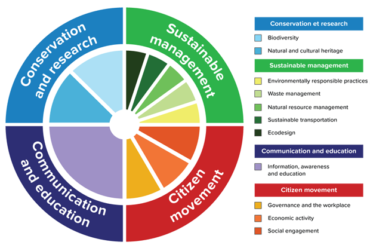

## Motivation - Policies are more than $$$

 

**Externality: A consequence (positive or negative) of an industrial or commercial activity that affects other parties without this being reflected in the cost of the goods or services involved.**

 
 
 

**Often discussed in financial terms, but also deep humanitarian and environmental justice concerns **

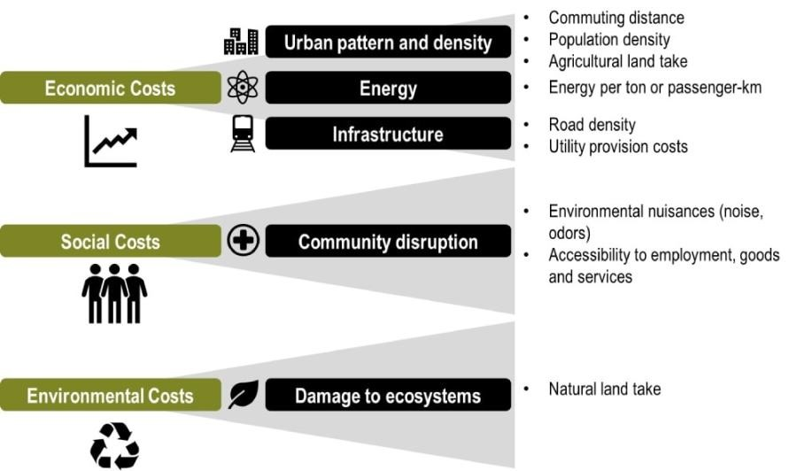

## Motivation - Policies are more than $$$

 

**Externality: A consequence (positive or negative) of an industrial or commercial activity that affects other parties without this being reflected in the cost of the goods or services involved.**

 
 
 
 

**Examples: Fossil fuel production, mining, water use, chemical contamination, etc.**

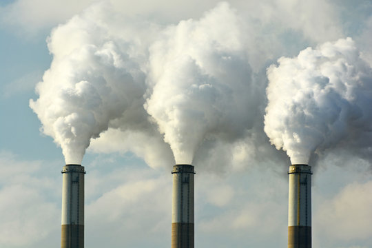

## Motivation - Increase community buy-in

 

**Example, large West Virginia landowners get a monetary incentive for planning adjacent conservation easements**

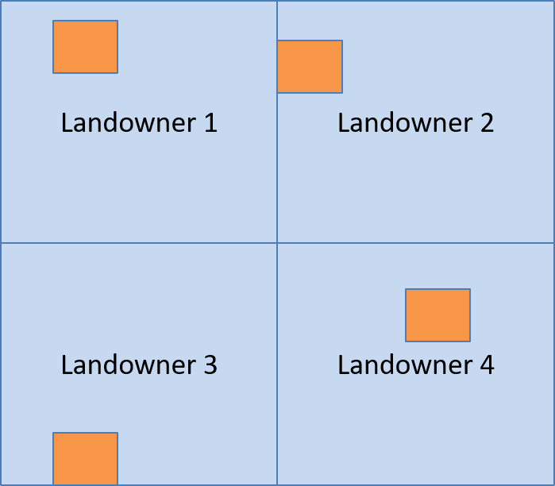

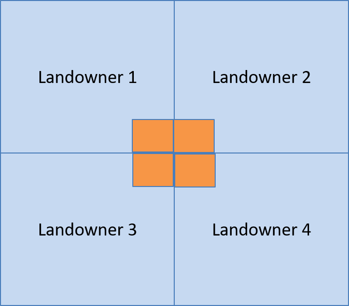

## Motivation - Increase community buy-in

 

**Another example: conservationists, scientists, rice farmers, and the public joining together to protect migratory shorebirds**

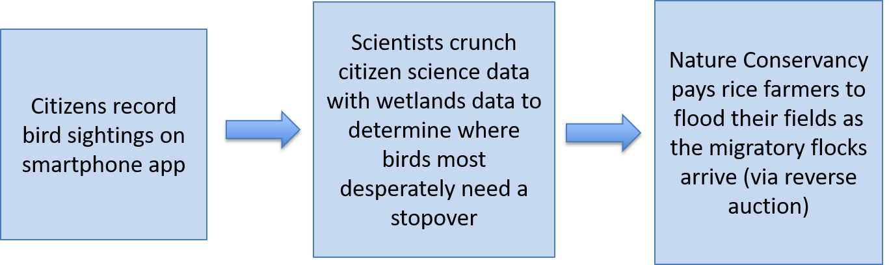

## Bigger picture change

 

**Many of the examples we have discussed so far assume a political-social-economic system that is similar to what we have today.**

 

**But what if we (as individuals and societies) shifted some of the underlying assumptions?**

 

**What might be possible then?**

## Bigger picture change: **Financial wealth**

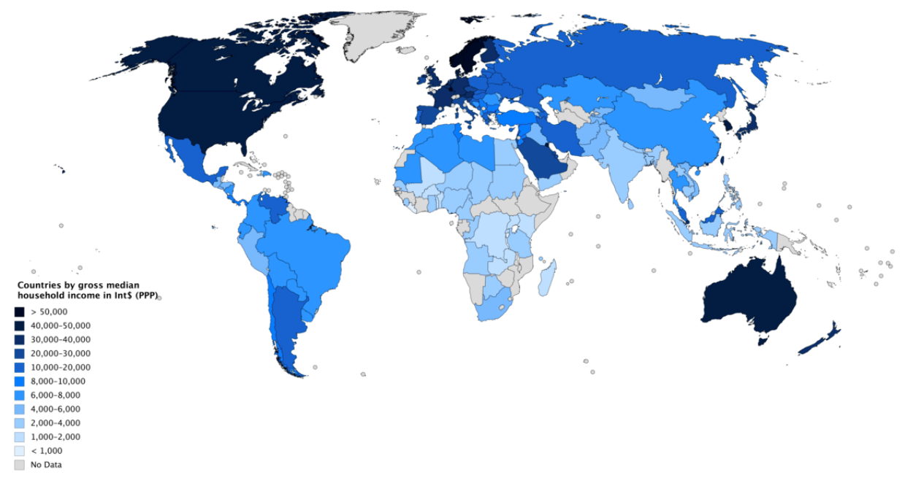

## Bigger picture change: **Financial wealth, wealth inequity**

## Financial wealth, wealth inequity, and impacts

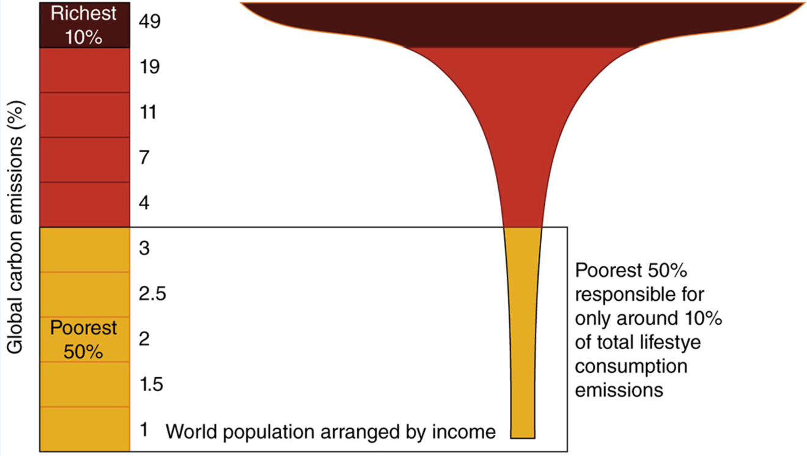

## Bigger picture change

**Systemic commitment to ecological health…carbon neutrality**

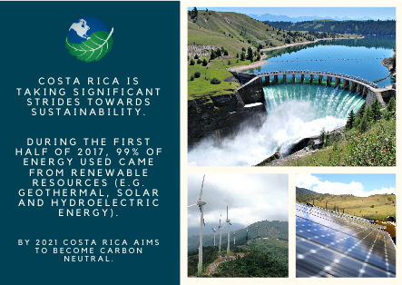

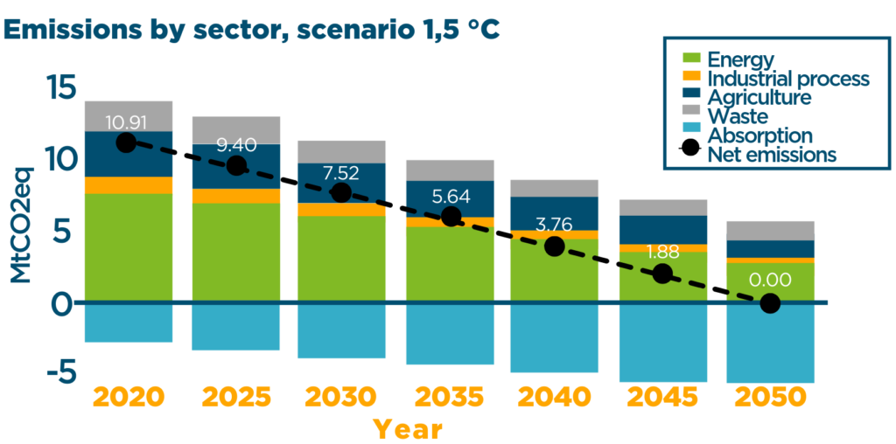

## Bigger picture change

**Systemic commitment to ecological health… reconciliation ecology**

 
 
 
 
 
 
 
 
 
 
 
 
 
 
 
 
 

**Designing new habitats for other species in the midst of where people live and work...
 
in the age of the Anthropocene**

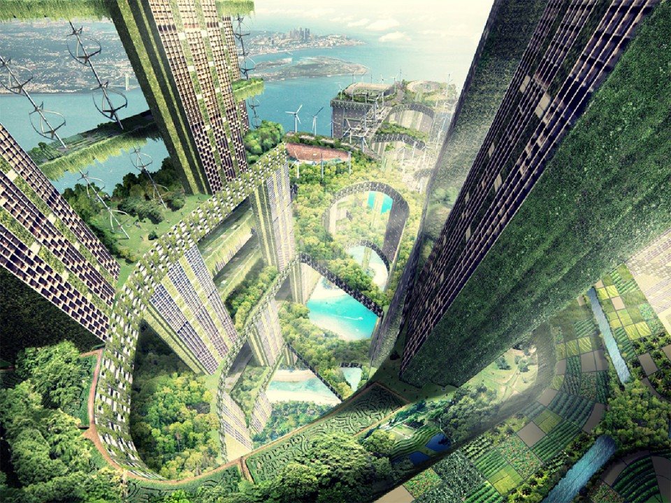

## Bigger picture change

**Systemic commitment to ecological health… alternate measures of prosperity**

 

**1972 king of Bhutan: “Gross National Happiness is more important than Gross National Product”**

 

**GNH instituted as the goal in the Constitution of Bhutan in 2008**

 
 

**The concept implies that sustainable development should take a holistic approach towards notions of progress and give equal importance to non-economic aspects of wellbeing**

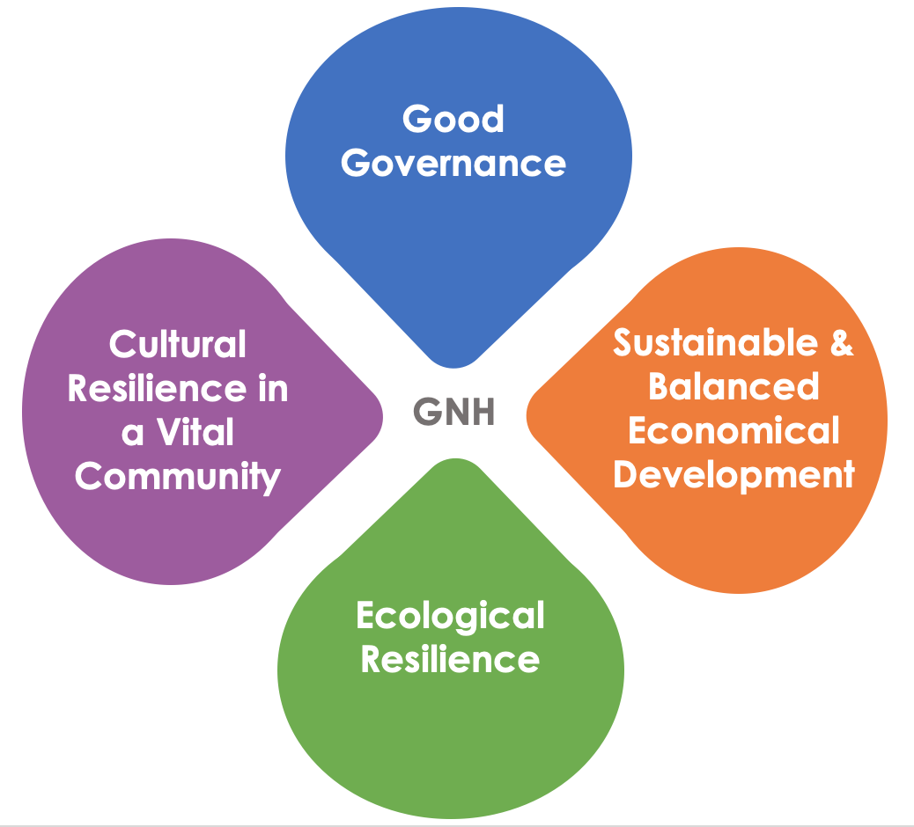

## Closing: Environmental worldviews

 

**What if it’s not your job to save the world?**
 
 
 
 
 
 
 
 
 
 
 
 
 
 
 
 
 
**We live inside of – and become - the stories we tell ourselves**

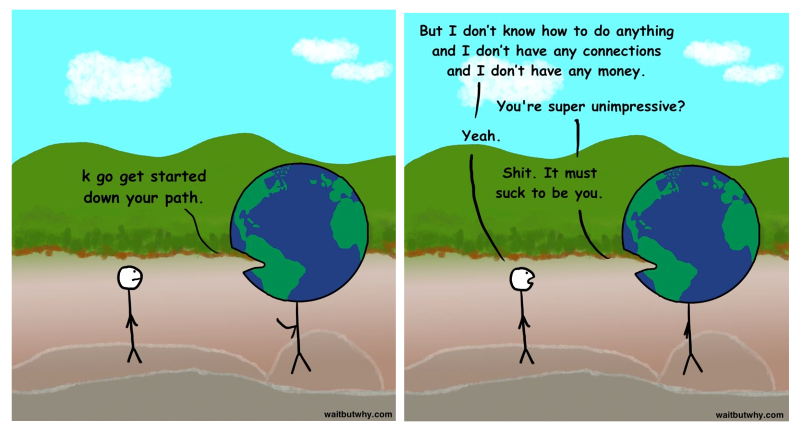

## Closing: Let's avoid tired stories

 

**The environment is there to use for human gain...(sigh)**

 

**Growth is good...(sigh)**

 

**We can fix problems primarily with technology...(sigh)**

 
 
 
 
 
 
 
 
 
 
 
 
 
 

**New and creative responses are needed to promote a Life-Sustaining Society &#8594; action must come from a deeper cultural shift**

 

**We are not separate or separable from each other, other life forms, and the Earth**

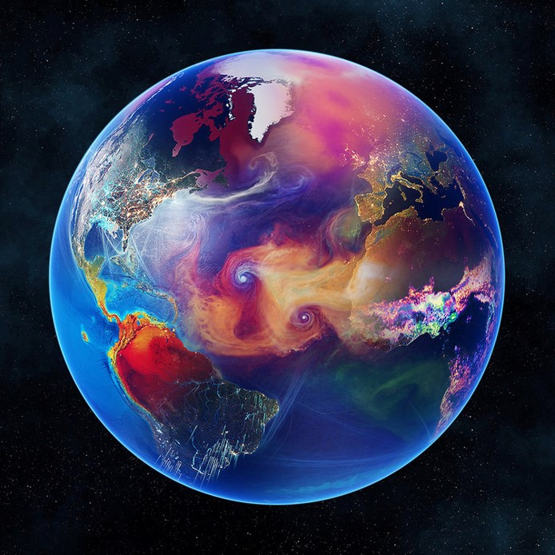
