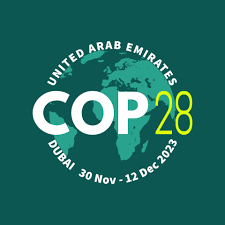
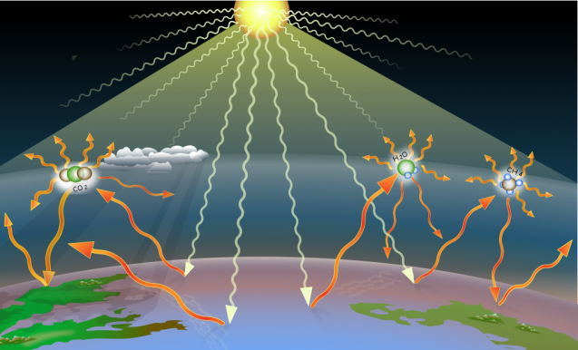

## Course Overview

 
 
 

**HNRS 389 and BIOL 399A**
 
**Global Change Biology**

 

**MWF, 12:10 - 1pm, In-person**
 
**SN 332**

 

**Professor: Dr. Campany**
 
**Byrd 215**
 
**Office Hours: see syllabus**

## Dr. C's connection to Global Change Biology

## Today's Objective 

**Understand course goals**
 
&emsp;&emsp;&emsp;&emsp;**Begin getting to know each other**
 
&emsp;&emsp;&emsp;&emsp;&emsp;&emsp;&emsp;**See if this class is a good fit for you**
 
&emsp;&emsp;&emsp;&emsp;&emsp;&emsp;&emsp;&emsp;&emsp;&emsp;&emsp;**Begin our story**

## Course Goals

 

* **Open to the story of biodiversity on our planet.** 
    + Contrast past and present patterns, evaluate how life responds to global change stressors, envision the path forward

 

* **Be a scientist 'science-ing' or a informed citizen 'activist-ing'** 
    + Explore your interests, interpret other people’s studies, design your own studies, communicate your knowledge and wisdom

 

* **Explore your place in the story.**
    + Open to different worldviews, relate course content to your own life, envision your path forward

## What is this course about?

 

**The natural world around us is changing at unprecedented rates**

 

**Humans have a major role in the past, present and future of this change**

 

**Organisms must face consequences of this change**

 

**Systems are also under pressure**

 

**Divisiveness surrounds this topic**

  
## What is this course about?

 
 
 

**Unit I: Setting the stage**
 

*Approaches in GCB (CH1)*
 
*Brief history of life on earth (CH2)*
 
*Rise of the Humans (CH3)*
 
*The Anthropocene (CH4)*

## What is this course about?

 
 
 

**Unit II: Core Responses**
 

*Move (CH5)*
 
*Adjust (CH6)*
 
*Adapt (CH7)*
 
*Die (CH8)*

 

**Unit III: Complex Responses**
 

*Communities (CH9)*
 
*Ecosystems (CH10)*

## What is this course about?

 
 
 

**Unit IV: New Horizons**
 

*Conservation in the era of global change (CH11)*
 

*Aligning the interests of biodiversity and humans society (CH12)*

## This class is way more than just CO~2~ and warming!!

## Course Format

 

* **This is a *synchronous* and participatory partially *flipped* in-person class**

 

* **What does that actually mean?**
    + Reading matters and is expected
    + Your presence is honored and valued
    + Your verbal participation is required
    + All opinions matter

 

* **Each week will work on a spectrum of learning from Monday &#8594; Friday**
    + Lecture &#8594; Open-ended discussions
    
## Grading: Lots of assessment opportunites

 
 

**Participation:** in lecture + snap assignments submitted for participation points

 

**Courses chapter reflections:** 3-2-1 reading assignments due Mondays by noon

 

**Exams:** approx. one per unit (4 chapters each)
    
 

**Term Project:** with lots of intermediate benchmarks

## Term project (Details next week)

 

* **GCB discovery grant proposal (5 pages) meant to inspire your own independent, creative direction.**

 

* **Submission windows:**
    + Project topic selection: week of February 2
    + Term project first drafts: week of March 22
    + Term project peer reviews: week of March 28
    + Final term project: week of April 12

 

* **Start thinking about what sparks your interest!**

 

* **Writing resources are available on Brightspace**
    + Ask me for help!
    
## Textbook and reading load

 
 
 

* **eBook should already be purchased through Follet**
    + check email for Brytewave access codes

 

* **One chapter per week for lecture**
    + starts week 3
    + read and reflect due before Monday's lecture
    
 

* **Possible additional readings for open-discussions**
    + these may be self-directed
    

## 3-2-1 reading assignments

 

* **Dive deep on everything you read in this class!**
    + Track what excites you, bores you, and confuses you!

 

* **Beginning of chapter features - Pre-assess what you think you know**
    + Learning Outcomes
    + Core chapter content

 

* **Middle chapter features - Wednesday topics**
    + Meet the Data & Take a Closer Look

 

* **End of chapter features - Organize your studying**
    + Key Concepts and Consolidate your Knowledge
    + Test questions will be drawn from these, as well as lecture content

## 3-2-1 reading assignments

 
 
 

* **3-2-1 reading assignments submitted before class on Brightspace (essence of a flipped class)**
    + **3** take home messages from the chapter (in your own words)
    + **2** things you did not understand or would like more information on
    + **1** way something in the chapter relates to your personal experience.

 

* **If you are not interesting in reading - QUIT NOW**

## Brightspace will be your go to for all course info

 

* **Announcements = updates, changes, important things in the news**

 

* **Syllabus = refer to the syllabus, them email Dr. C**

 

* **Grades = gradebook will be updated as fast as possible**
    + always double check 

 

* **Assignments = always submit through Brightspace**

 

* **Reminders = turn notifications on**
    + due dates, content created, announcements, etc. 
    
<!-- ## Brightspace course page -->
<!-- 
 -->
<!--   -->
<!--   -->

<!-- **Lets take a look** -->

<!--   -->
<!--   -->

<!-- **https://brightspace.shepherd.edu/d2l/home** -->
    
## Next up: Why are we here?

 

* **Make a decision if this class is right for you**
    + Are you willing to play along?

 

* **No book chapter reading this week!**

 

* **For class on Wednesday: Write a few sentences about the concept "Why are we here"**
    + think like a scientist, concerned citizen or just a human!
    + you may be asked to read it aloud!
    + Haiku will be greatly appreciated

 

* **Submit on Brightspace for participation**

<!-- ## BIOL 414: Seminar in Biology (GCB Journal Club) -->
<!-- 
 -->
<!--   -->

<!-- **If you are in the seminar course there is a reading and participation assignment due before class** -->

<!--  -->
