## Death is an inevitable part of life

 
 

**Die: loss of individuals, populations (*extirpation*), or species (*extinction*)**

 

**Is extinction actually a response?**

 

**The die 'response' is more a a failure to move, adjust or adapt**

 

**But patterns of extinction are so important that we need to treat it as a core category**

## Shaping the tree of life

 
 
 

**Modern day biodiversity reflects billions of years of speciation**

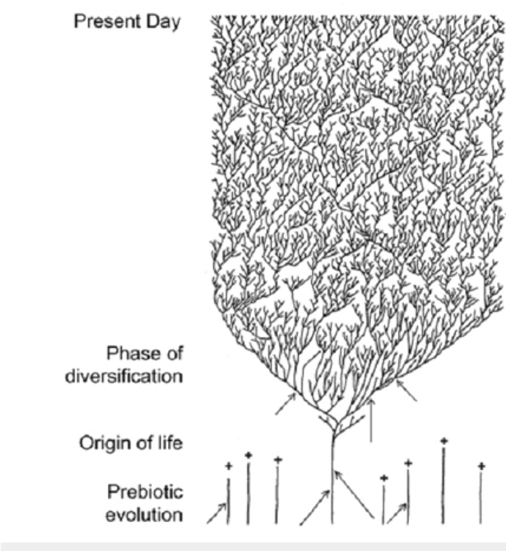

## Is the tree of life being pruned?

 
 
 

**Modern day biodiversity reflects billions of years of speciation**

 

**Balanced by billions of years of extinction**

 

**What is different about today?**

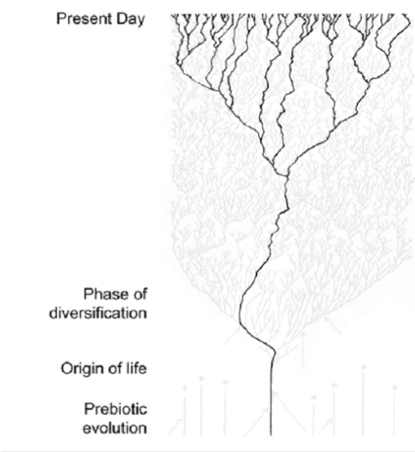

## Extinction during our time

 
 
 
 
 
 
 
 
 
 
 
 
 
 
 

**2011, cited 3964 times**

 

**Never before has an extinction spasm been caused by a single species at such high velocity**

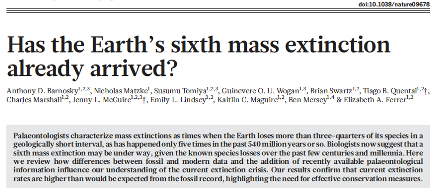

## Extinction during our time

 
 
 
 
 
 
 
 
 
 
 

**“The analysis we present here avoids using assumptions … which can suggest very high extinction rates, and which have raised the possibility that scientists are “alarmists” seeking to exaggerate the impact of humans on the biosphere”.**

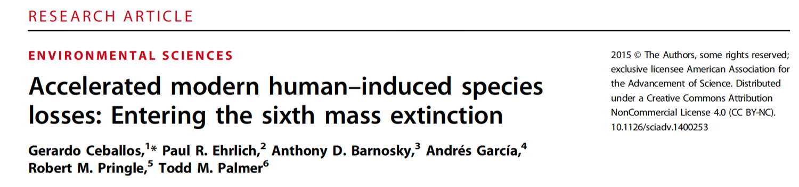

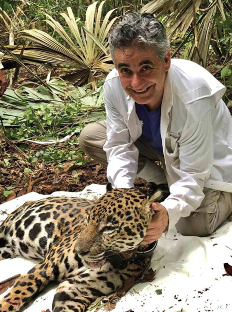

## Extinction during our time

 
 
 
 
 
 
 
 
 
 
 
 
 
 
 
 
 
 
 

**Cumulative percentage of extinct species for vertebrates. Dashed line is number of extinctions expected under a background extinction rate of 2 E/MSY**

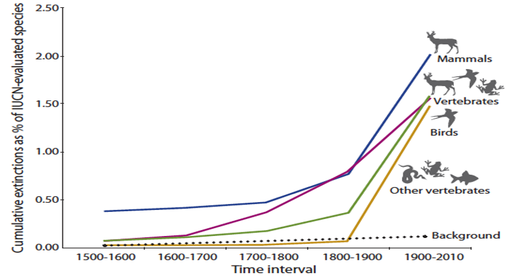

## Extinction during our time

 
 
 
 
 
 
 
 
 
 
 
 
 
 
 
 
 
 
 

**Number of years it would take for the vertebrate extinctions since 1900 to occur under the background extinction rate of 2 E/MSY**

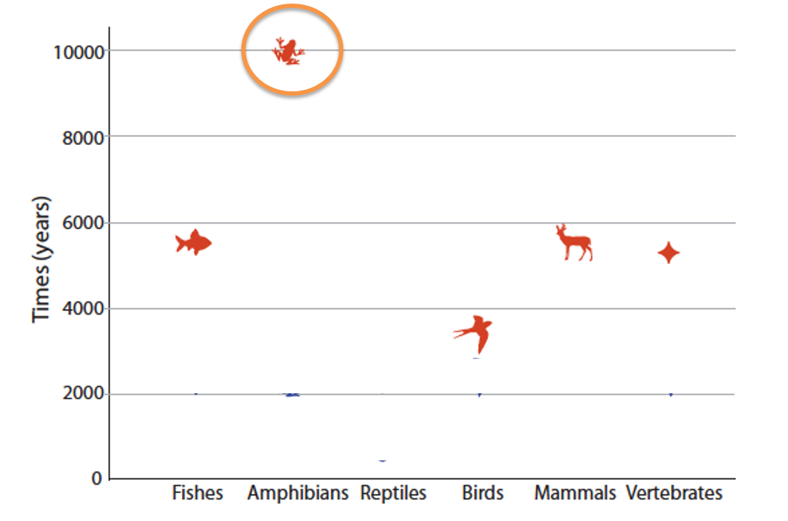

## Imperiled amphibians

**Current amphibian extinction rates are 100 times higher than historical background rates**

 

* **Caused by: **
    + Climate change
    + Habitat alteration
    + Overexploitation
    + Introduced predators and competitors 
    + Contaminants
    + Emerging infectious disease

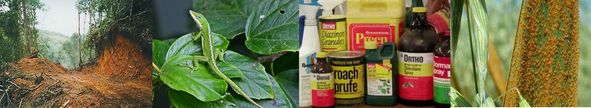

## Imperiled amphibians

**Current amphibian extinction rates are 100 times higher than historical background rates**

 

* **Caused by: **
    + Climate change
    + Habitat alteration
    + Overexploitation
    + Introduced predators and competitors 
    + Contaminants
    + Emerging infectious disease
    
 

- **What makes an emerging disease emerging?**
    + recently discovered
    + recently expanded in geography or host range
    + recently evolved in virulence

## Emerging Infectious Diseases

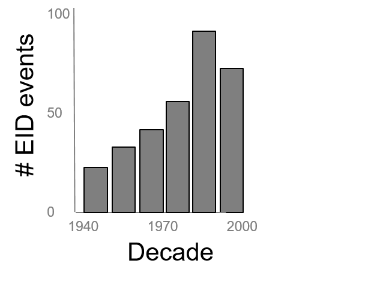

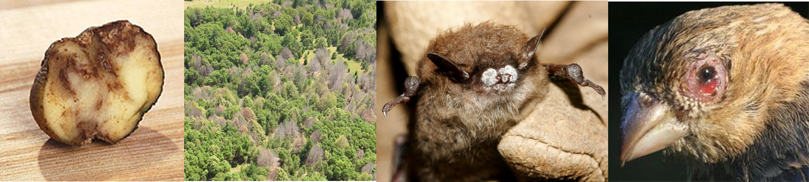

## Frog Apocalypse via *Batrachochytrium dendrobatidis*

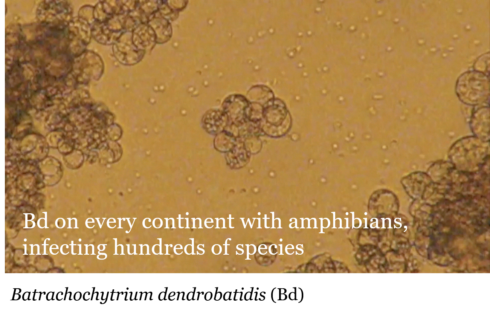

## Frog Apocalypse via *Batrachochytrium dendrobatidis*

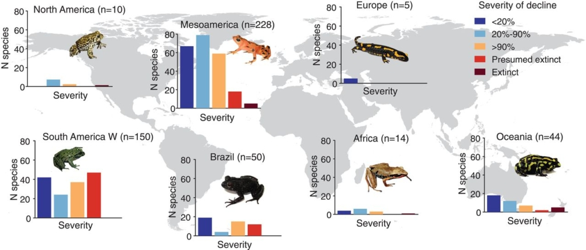

## Imperiled amphibians

 

**Emerging infectious disease**

 

**Where did the chytrid fungus come from?**

 

**How has it spread?**

 

**How does it kill frogs?**

 

**Are all chytrid strains equally deadly?**

 

**Why are some frog species more susceptible than others?**

 

**What can we do to protect amphibian biodiversity?**

 

**And on…**

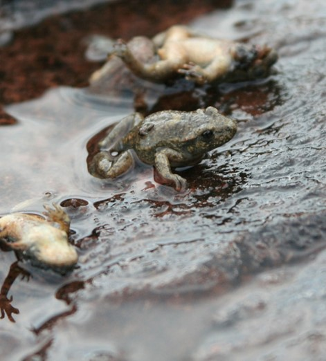

## Ways of studying population declines

 

**Emerging infectious disease**

 

**Where did the chytrid fungus come from?**

 

**How has it spread?**

 

**How does it kill frogs?**

 

**Are all chytrid strains equally deadly?**

 

**Why are some frog species more susceptible than others?**

 

**What can we do to protect amphibian biodiversity?**

 

**And on…**

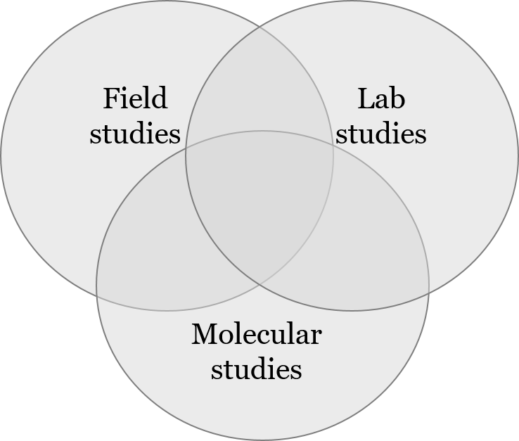

## Chytrid story

 

**How does *Bd* kills frogs**
 
 
 
 
 
 
 
 
 
 
 
 

**Amphibians are infected with Bd by contact with other animals or by spores floating in the water** 
 

**Eats away at their skin and triggering fatal heart attacks**
 

**Before it dies, a frog may manage to hop its way to a new stream or pond, spreading the fungus further.**

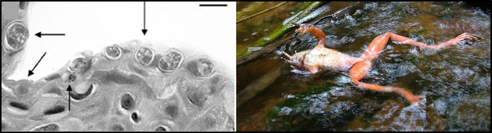

## 
 
 
 

**Where did *Bd* come from?**

 

**How much genetic diversity does it contain?**

 
 

**Museum specimens point to the oldest known instance from South Africa in the 1930’s.**

 

**?Spread around the world in African clawed frogs used for human pregnancy tests?**

<!-- ##  -->
<!--   -->
<!--   -->
<!--   -->
<!--   -->
<!--   -->
<!--   -->
<!--   -->
<!--   -->

<!-- 
 -->

<!-- **When did *Bd* invade different places around the world?** -->

<!-- 
 -->

<!-- 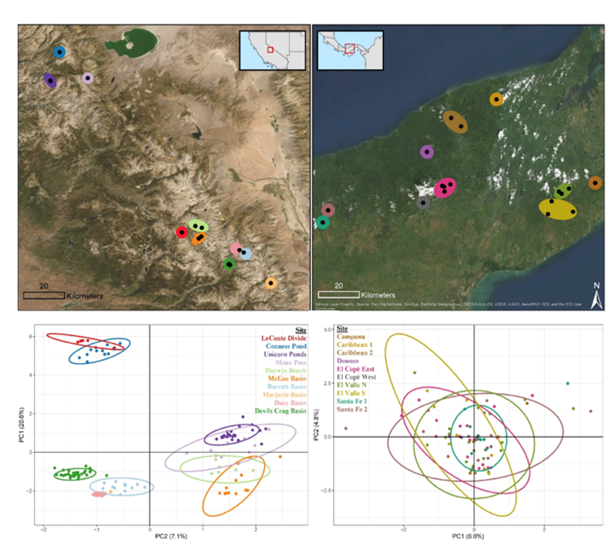 -->

## What makes Bd so deadly?

 
 
 
 
 
 
 
 
 
 
 
 
 

**Genetic evidence of virulence: some of these gene families serve as virulence factors in other fungi that infect vertebrate skin**

## Differences between the winner and the losers

**Why do some frogs NOT die from Bd infection?**
 
 
 
 
 
 
 
 
 
 
 
 
 
 
 
 
 
 
 

**Resistant frogs mount a more robust immune response (via plasticity)**

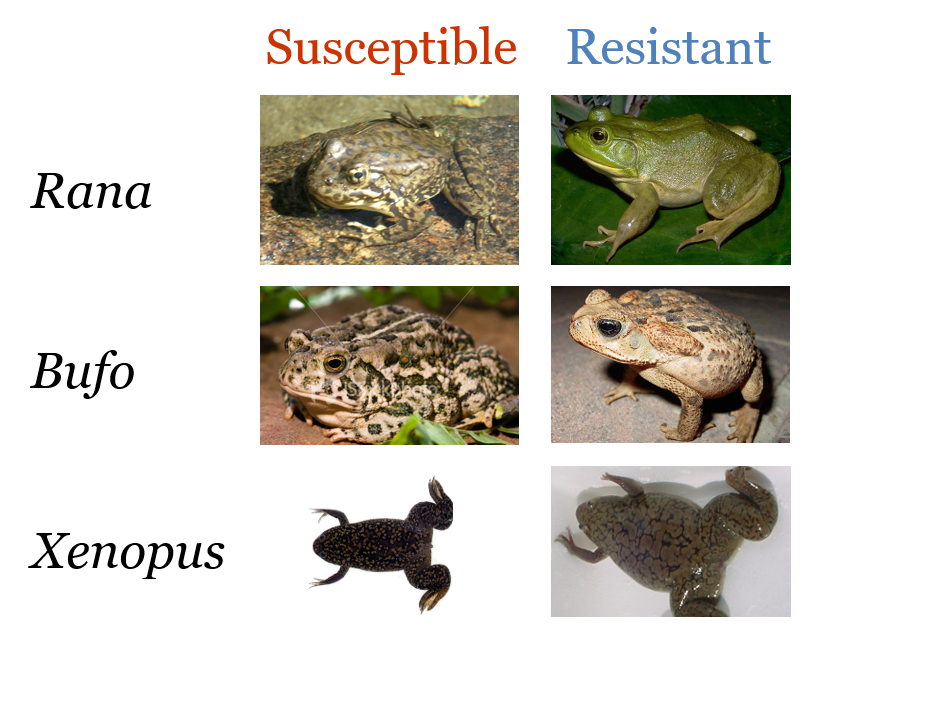

## Field studies reveal the heartbreaks?

**500 species of amphibians have declined significantly because of the outbreak — including at least 90 species presumed to have gone extinct (2019)**

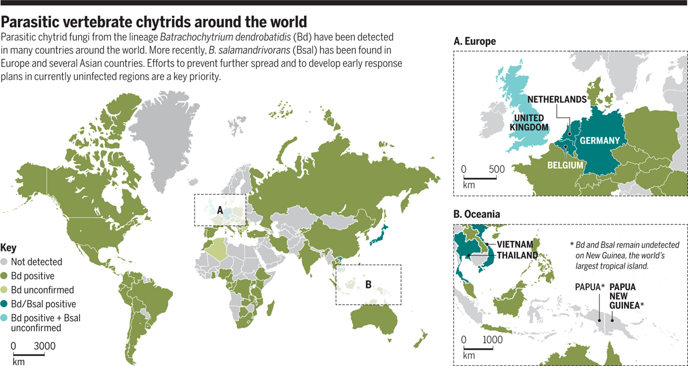

<!-- ## What are the glimmers of hope? -->
<!-- 
 -->
<!-- **Examples of contemporary extinctions…** -->

<!-- 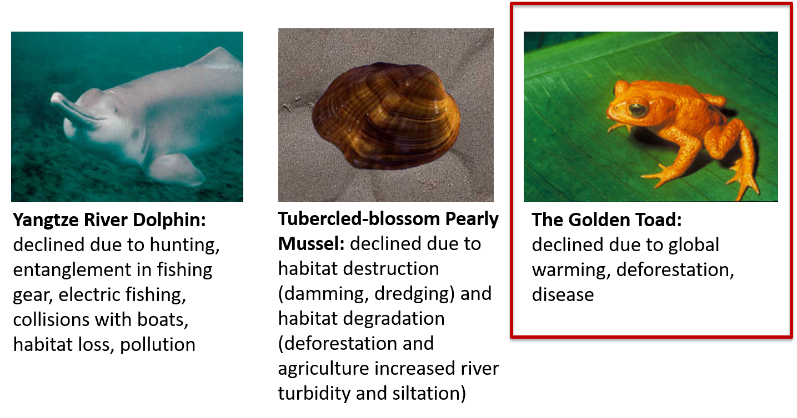 -->

## What are the glimmers of hope?

**Tracking population recoveries**

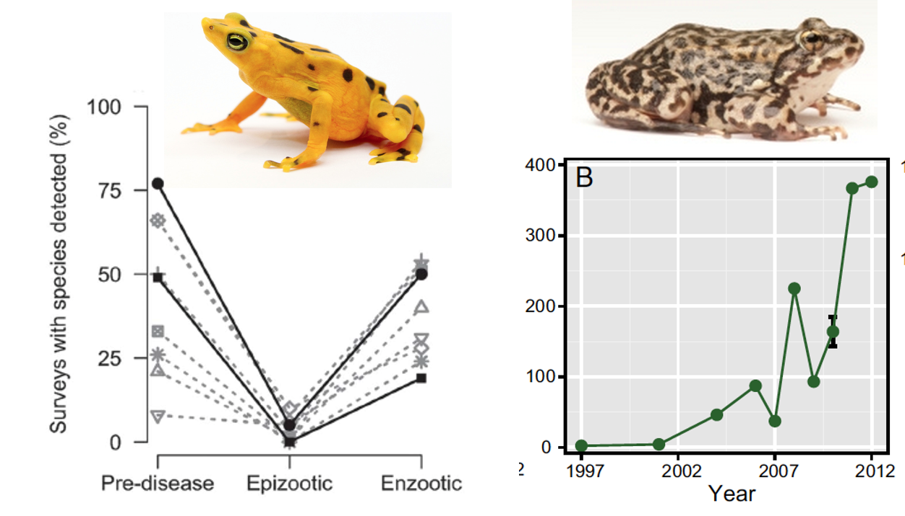

## What are the glimmers of hope?

**Direct support to mangers working on-the-ground for amphibian conservation **

 

**Pinnacles biologists conducted a study of Bd at Pinnacles National Park from 2006-2007**

 

**Tested animals for Bd by swabbing their skin and sending the swabs to a lab for DNA analysis**

 

**All three frog and toad species we tested at Pinnacles are infected with Bd**

 

**Rarely find dead frogs, and frog populations appear to remain stable**

## What are the glimmers of hope?

**Contributions to conservation more broadly**

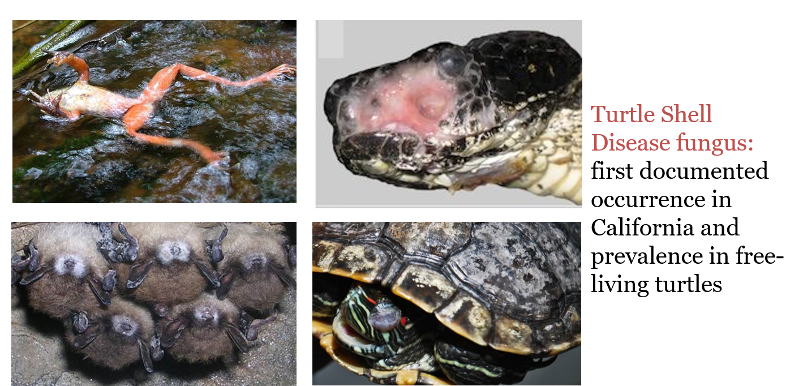

## What are the complexities?

**Intentional extinction of pathogens & parasites?**
 

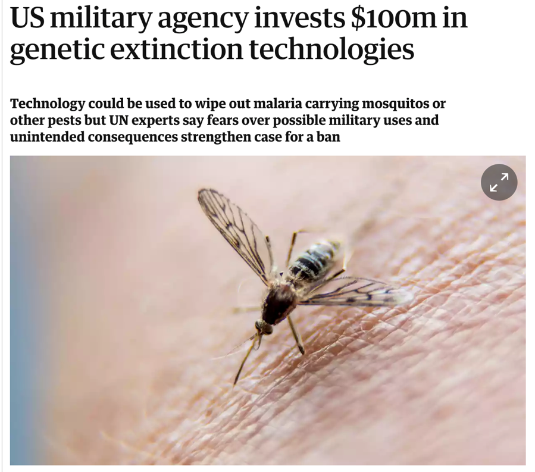

**British biotech firm this week got the green light from U.S. regulators to release over 2 million genetically modified mosquitoes in Florida and California**

 

**Effort to combat transmission of diseases like Zika, dengue fever and canine heartworm**

 

**Genetically modified male (non-biting) mosquitoes mate with invasive female Aedes aegypti mosquitoes, mediating a reduction of the target population as the female offspring of these encounters cannot survive**

