## Course Roadmap

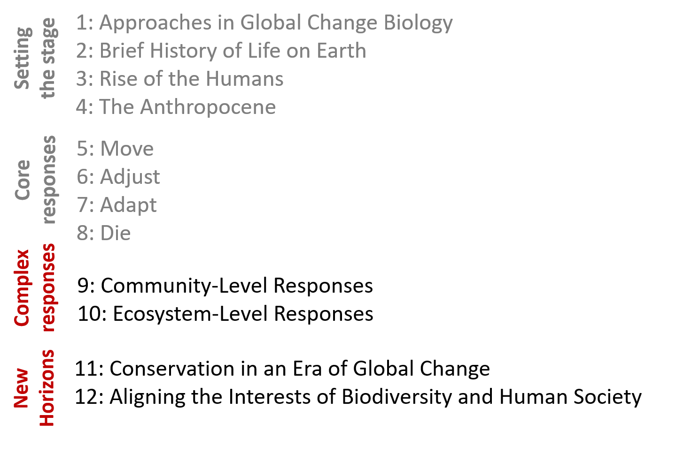

## Organismal response to global change

 
 
 

- **Responses can occur at nested levels:**
    + individuals

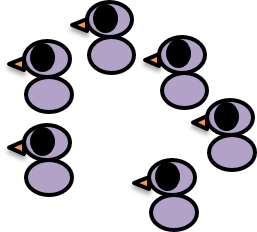

## Organismal response to global change

 
 
 

- **Responses can occur at nested levels:**
    + individuals
    + populations
    + metapopulations
    + species
    + communities
    + ecosystems
    + biomes

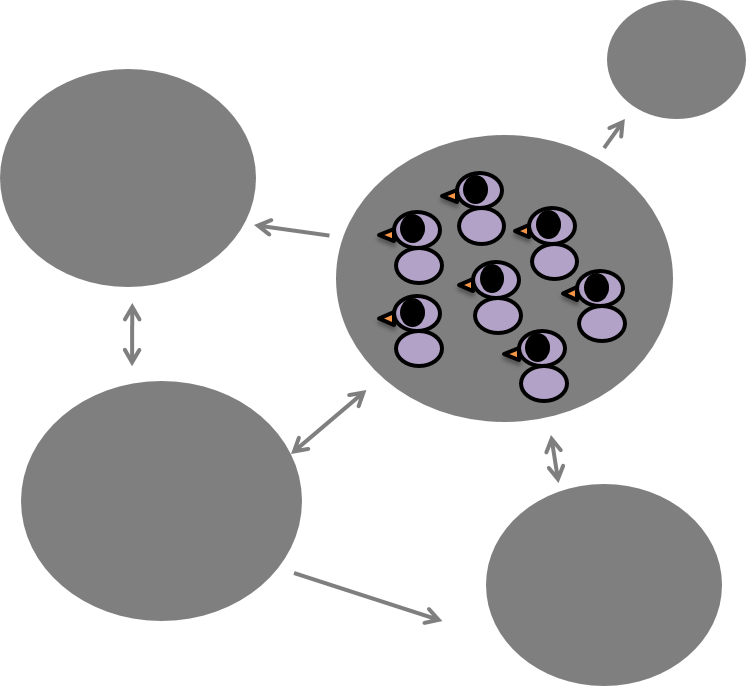 SRC="images/treelife2.png">

## Unit Objective

 
 

**Confronted with a changing world, organisms can move, adjust, adapt, or die**

 

**How do the core responses inter-relate?**

## How do the core responses inter-relate?

 
 

**“The core organismal responses are not mutually exclusive and may often be combined or inter-related**

 

**Pick any two of the core responses (move, adjust, adapt, die) and think of a way in which they relate, overlap, affect, or inform each other**

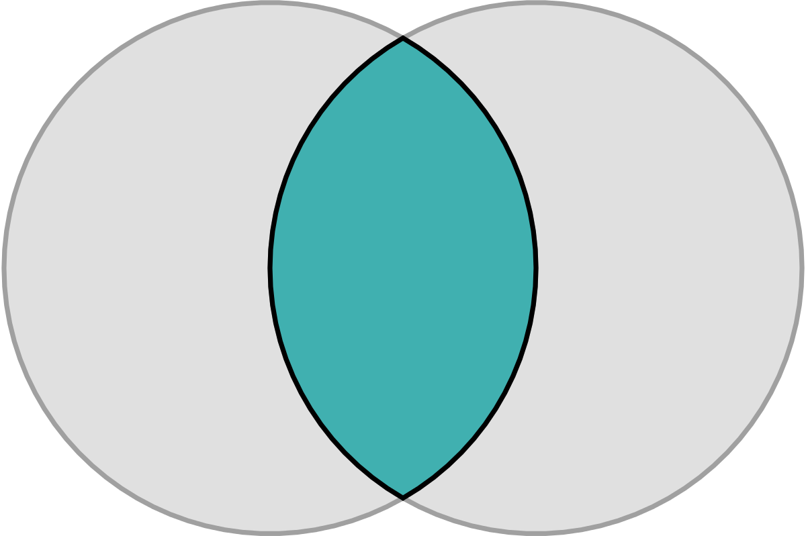

## How do the core responses inter-relate?

 
 

**“The core organismal responses are not mutually exclusive and may often be combined or inter-related**

 

**Pick any two of the core responses (move, adjust, adapt, die) and think of a way in which they relate, overlap, affect, or inform each other**

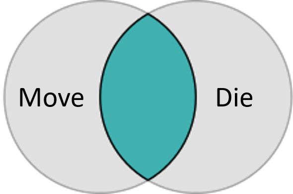

## Failure to move can lead to extinction

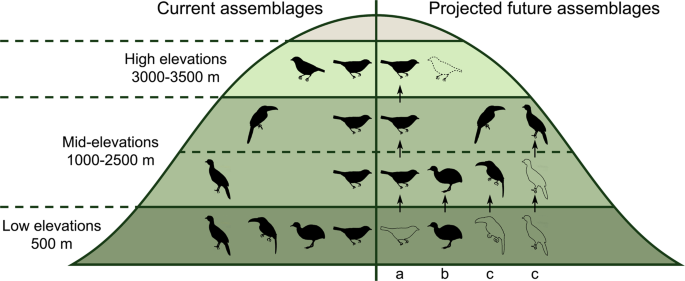

## Or organisms can move but then not successfully establish.

## When organisms move they may adapt or adjust to new conditions

## Imperiled amphibians

**Strong natural selection can actually reduce genetic variation in a population, making it more vulnerable to future changes**

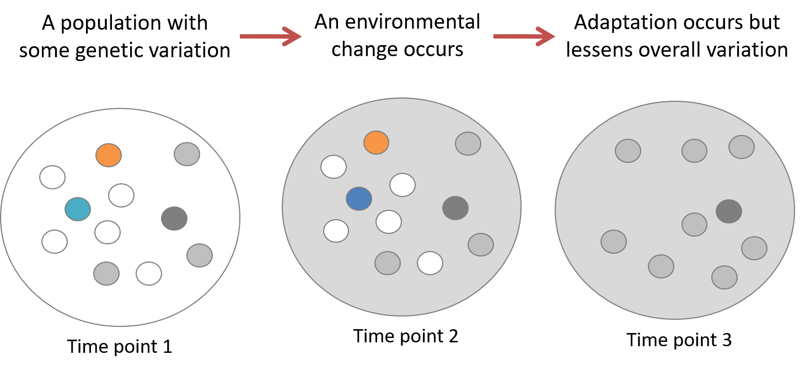

## Adaptation can also sometimes “save” a population from extirpation

**Evolutionary Rescue: When genetic adaptation allows a population to recover from effects of environmental change that would otherwise cause extirpation**

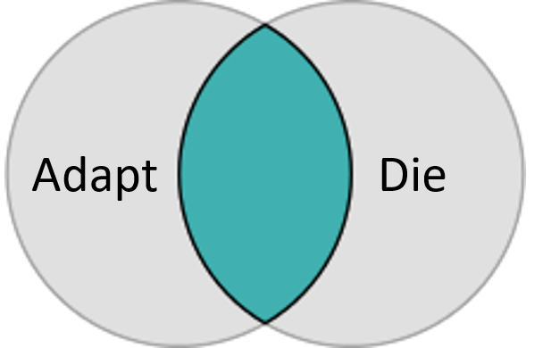

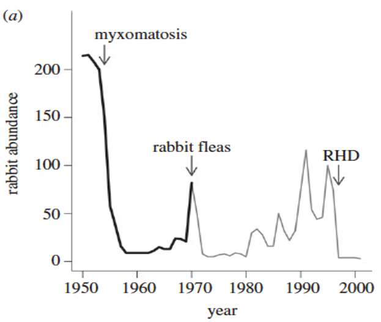

## Adaptation can also sometimes “save” a population from extirpation

**Evolutionary Rescue: When genetic adaptation allows a population to recover from effects of environmental change that would otherwise cause extirpation**

## A single response can be influenced by both plasticity and adaptation

Breeding dates are changing for Arctic squirrels.  Most of this response (>60%) is explained by phenotypic plasticity but some of the response (~10%) appears to be caused by a genetic shift 

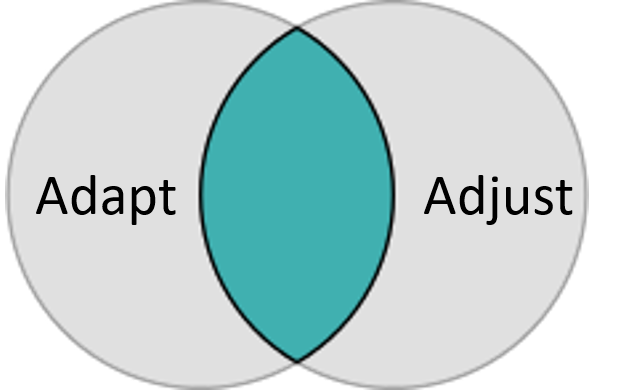

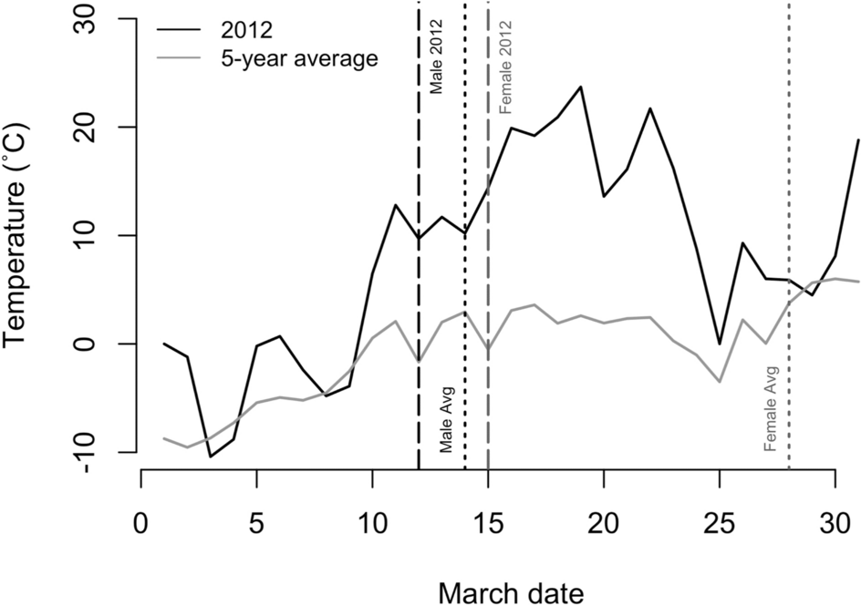

## Plasticity can serve as a “bridge to the future”

## A dystopian game show

 
 

**I have a species and I want you to predict for me whether it will move, adapt, have a plastic response, or die over the next hundred years. **

 

**Work together to brainstorm the pieces of information you’ll need to predict how species may respond!**

 

**Gain points by matching response traits on the game board!**

 

**For each of the four core responses brainstorm what you think are the most important factors influencing the probability of that response**

## 

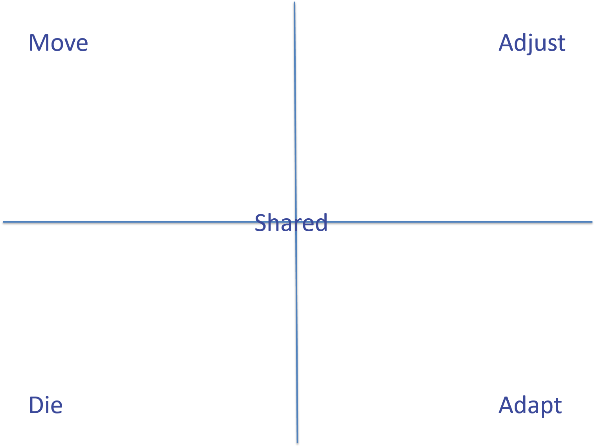

## 

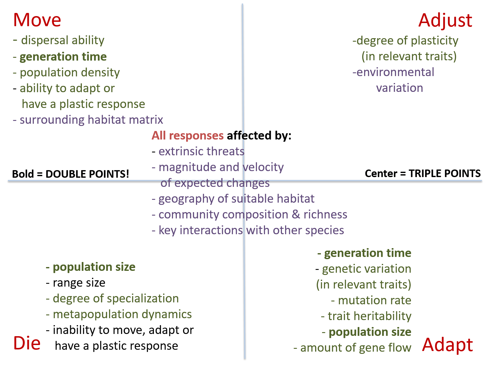

## Individual species intercations ripple through biological communities

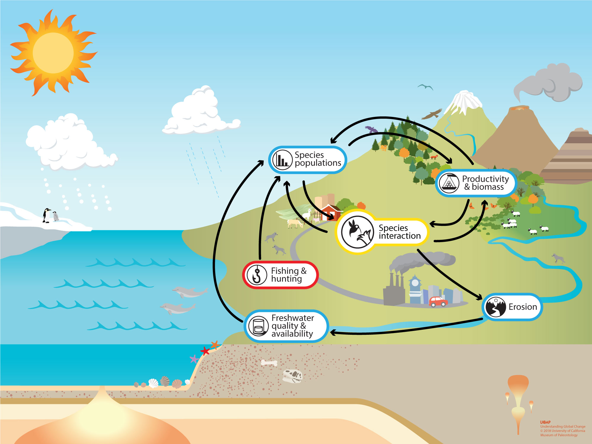