## Course Roadmap

## Organismal response to global change

 
 
 

- **Responses can occur at nested levels:**
    + individuals

## Organismal response to global change

 
 
 

- **Responses can occur at nested levels:**
    + individuals
    + populations
    + metapopulations
    + species
    + communities
    + ecosystems
    + biomes

 

## Finishing Unit II

 

**Confronted with a changing world, organisms can move, adjust, adapt, or die**

 

**How do the core responses inter-relate?**

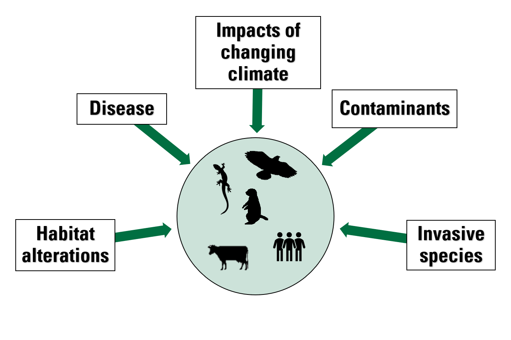

## How do the core responses inter-relate?

 

**Core organismal responses are not mutually exclusive and may often be combined or inter-related**

 

**Pick any two of the core responses (move, adjust, adapt, die) and think of a way in which they relate, overlap, affect, or inform each other**

## How do the core responses inter-relate?

 

**Core organismal responses are not mutually exclusive and may often be combined or inter-related**

 

**Pick any two of the core responses (move, adjust, adapt, die) and think of a way in which they relate, overlap, affect, or inform each other**

## Failure to move can lead to extinction

**What are the dilemmas to the move response?**
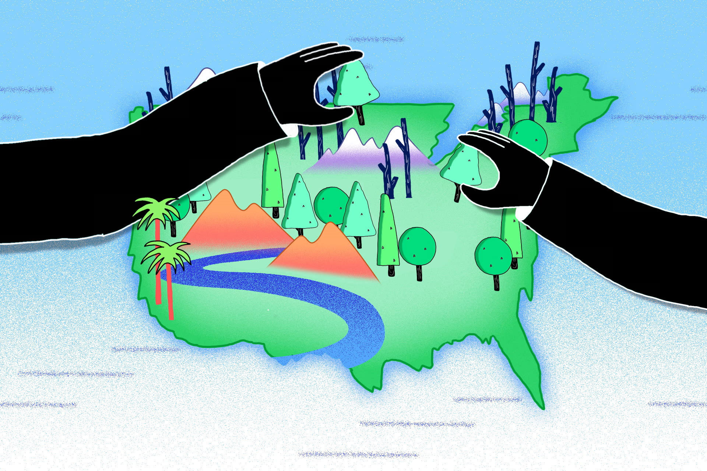

## Failure to move can lead to extinction

**Is the 'higher elevation" move response just an escalator to hell?**

## Or organisms can move but then not successfully establish.

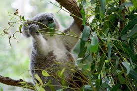

## Moving organisms may adapt or adjust to new conditions

 

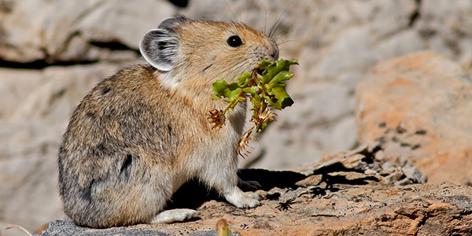

**With warming, pikas living at low elevations can avoid extinction by migrating to cooler, higher parts of the mountain. **

 

**Low-altitude pikas must adjust/adapt to cope with low oxygen of higher altitudes**

 

**Scientists found 3 genes in the mitochondria that code for proteins that help use oxygen to generate chemical energy for the body**

 

**The proteins from high-altitude pikas appear to be very efficient at this conversion, which helps explain how they thrive high up where the air is thin**

<!-- 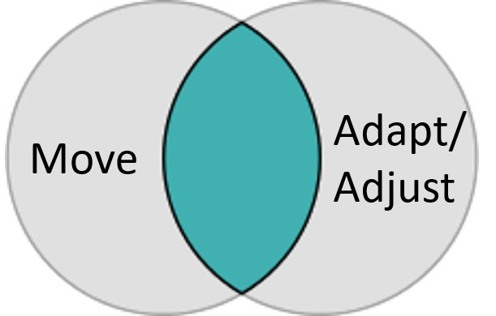 -->

## Natural selection is always a moving target...

 

**Strong natural selection can actually reduce genetic variation in a population, making it more vulnerable to future changes (if the environment shifts in another direction - or has multiple stressors).**

<!--  -->

## Adaptation can “save” a population from extirpation

**Evolutionary Rescue: When genetic adaptation allows a population to recover from effects of environmental change that would otherwise cause extirpation**

<!--  -->

## Adaptation can “save” a population from extirpation

**Evolutionary Rescue: When genetic adaptation allows a population to recover from effects of environmental change that would otherwise cause extirpation**

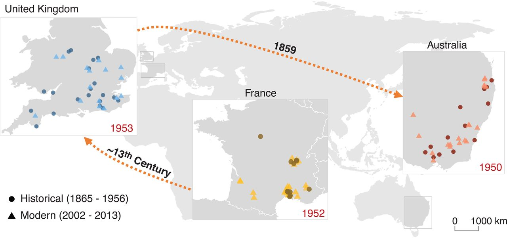

## A single response can be influenced by plasticity & adaptation

Breeding dates are changing for Arctic squirrels. Most of this response (>60%) is explained by phenotypic plasticity but some of the response (~10%) appears to be caused by a genetic shift 

<!--  -->

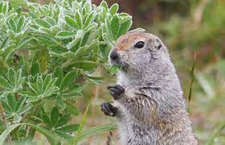

## Plasticity can serve as a “bridge to the future”

<!--  -->

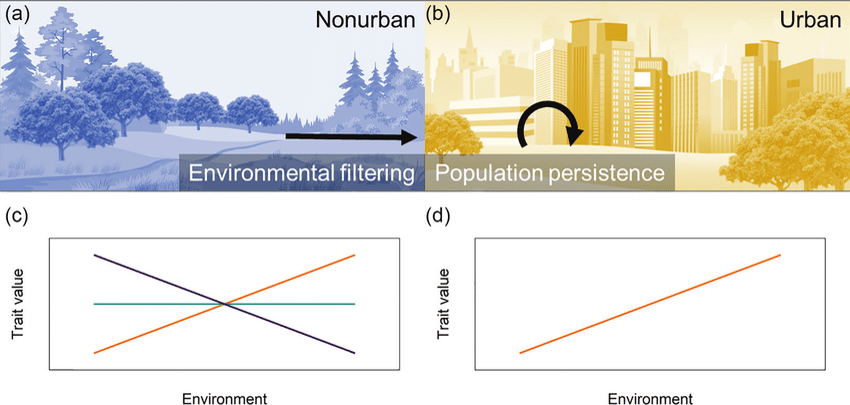

## A dystopian game show

 
 

**I have a species and I want you to predict for me whether it will move, adapt, have a plastic response, or die over the next hundred years. **

 

**Work together to brainstorm the pieces of information you’ll need to predict how species may respond!**

 

**Gain points by matching response traits on the game board!**

 

**For each of the four core responses brainstorm what you think are the most important factors influencing the probability of that response**

## 

##

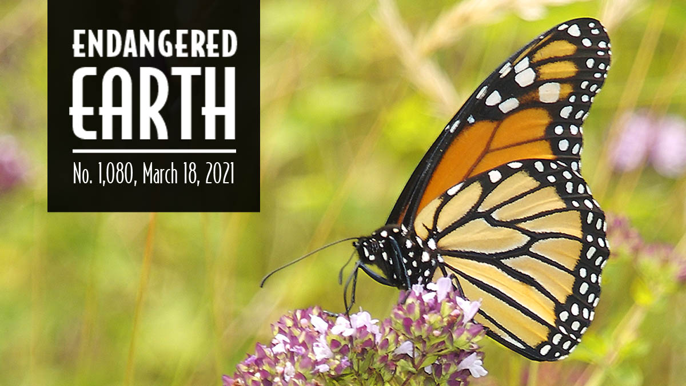

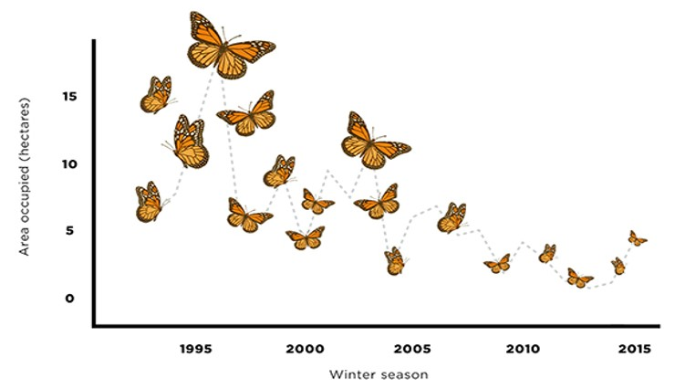

**Loss of breeding habitat in N. America via land conversion to croplands**

 

**Loss of overwintering habitat in Mexico (<5 acres)**

 

**Climate change threatens to disrupt the monarch butterfly’s annual migration patterns via colder, wetter winters and hotter, drier summers**

 

**Beneficial insects like monarchs and other pollinators are negatively affected by the use of pesticides to control unwanted insect and plant species**

 

**Despite the fact that toxins from milkweed may in some ways protect them, monarchs of all life stages are vulnerable to predation and disease.**

## 

## Species interactions ripple through biological communities

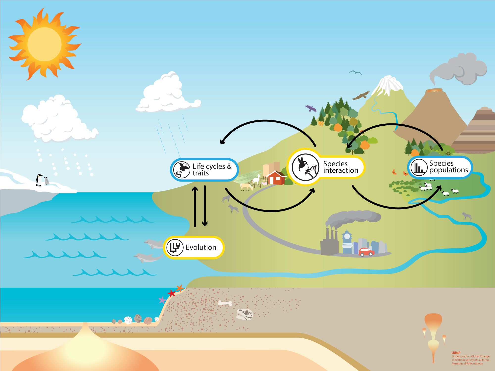