## Today: Moving from the individual to the collective

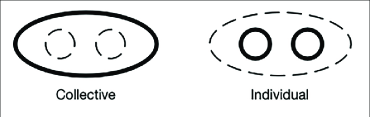

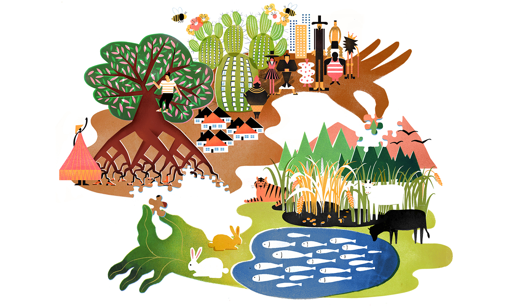

## Evolution of communities

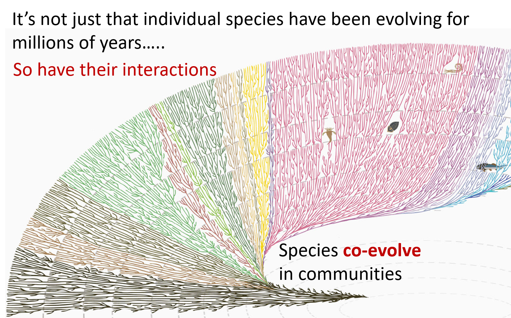

## Evolution of communities: Nothing exists in isolation

 

**Show me one single, isolated tree in a Appalachian forest...**

 
 
 
 

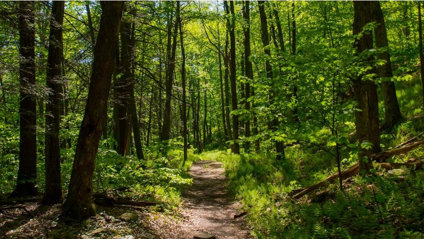

**Biological implications**

 

**Philosophical implications**

## Global change pressures affect biological interactions

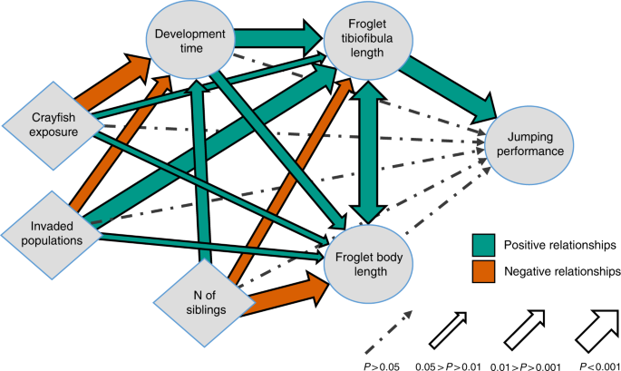

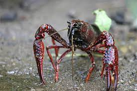

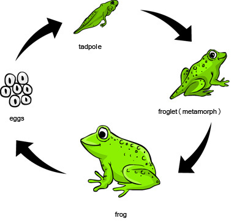

## Cascading effects

 
 

**Every time community composition changes (by species gains, losses, or altered timing, strength, or type of interactions), shit happens**

 

**This is what we are doing on (and to) the planet**

 

**Individual species move, adjust, adapt, die and we care about that, but it’s the cascading effects that can unravel the biosphere as we know it**

##

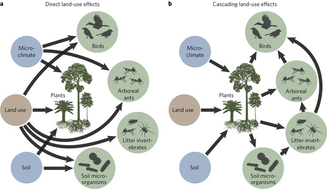

## Cascading effects: co-extinction

 

**Obvious examples like co-extinction where *direct* interaction partners influence each other**

 
 
 
 
 
 
 
 
 
 
 
 
 

**e.g., most vulnerable are obligate interaction partners (can be hosts/mutualists, predators/prey, plants/herbivores prey, hosts/parasites, etc.) **

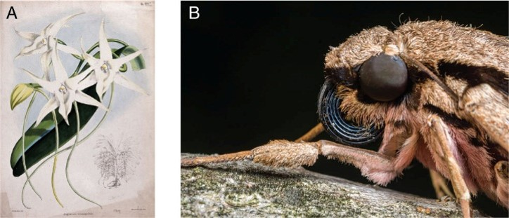

## Cascading effects: keystone predator

 

* **But species impact each other even if they don’t interact directly through biotic interaction chains**

   
 
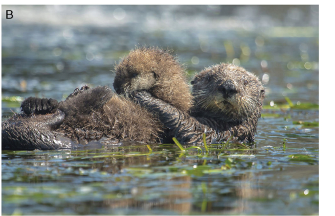

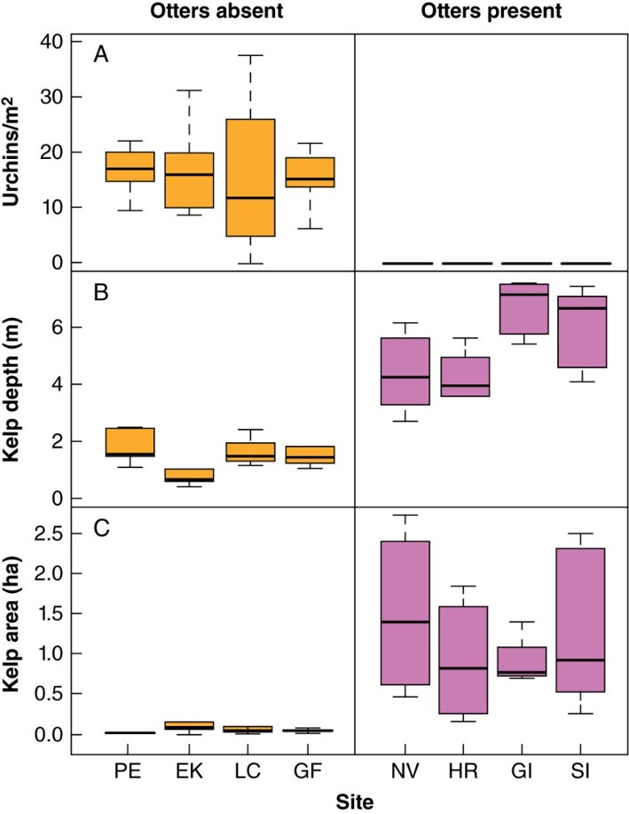

## Cascading effects: introduced species

 

**And this doesn’t need to be a top-down keystone predator; it can be a bottom-up effect**

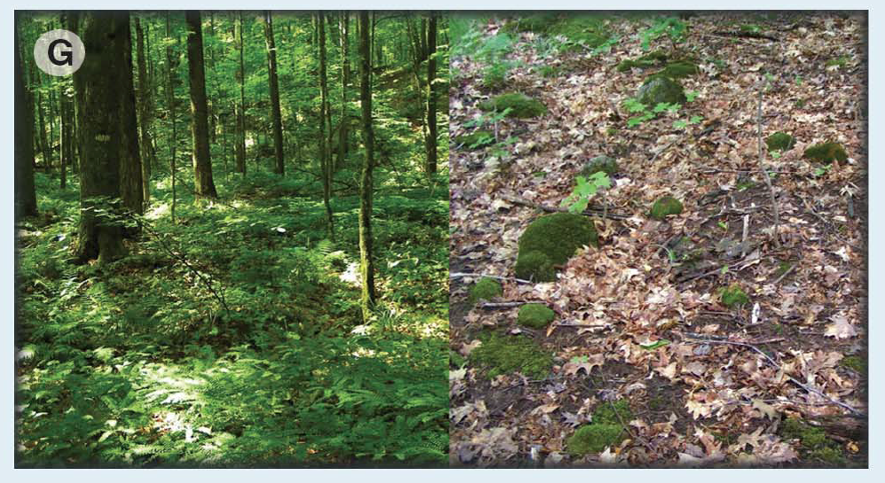

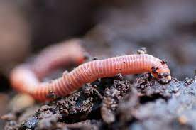

## Global worming

* **The last ice sheet killed off earthworms in the northern 1/3 of North American**
  + worms—with their limited powers of dispersal—weren’t able to recolonize on their own

 

**Humans  move worms,  via dirty ship ballast, horticultural plants, mulch and fishing bait. European earthworms live on every continent except Antarctica.**

 

* **North American hardwood forests develop a thick blanket of slowly decomposing leaves deposited over the course of years that create homes for insects, amphibians, birds, and native flowers**
    + worms breakdown this layer to quickly for plants to capture nutrients and insects lost their homes   

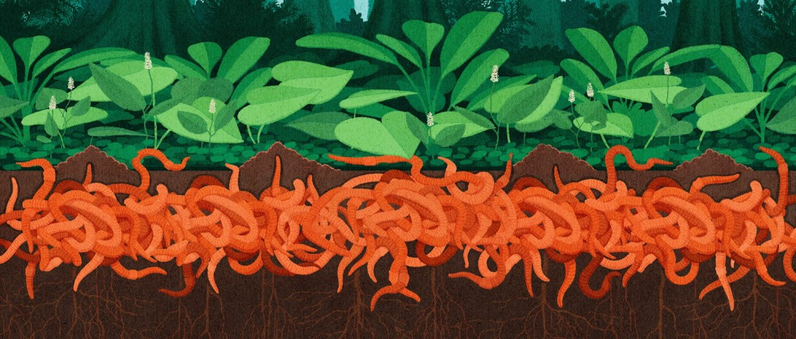

## Cascading effects: complex chains

 

- **Changes can have impacts many trophic levels away**
    + trophic levels = feeding relationships

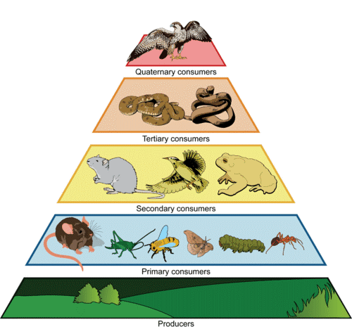

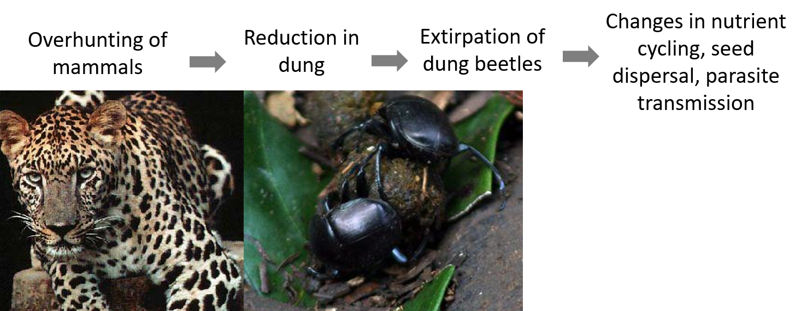

## Cascading effects: complex webs

**And these biotic interaction chains are actually embedded in complex biotic interaction webs**

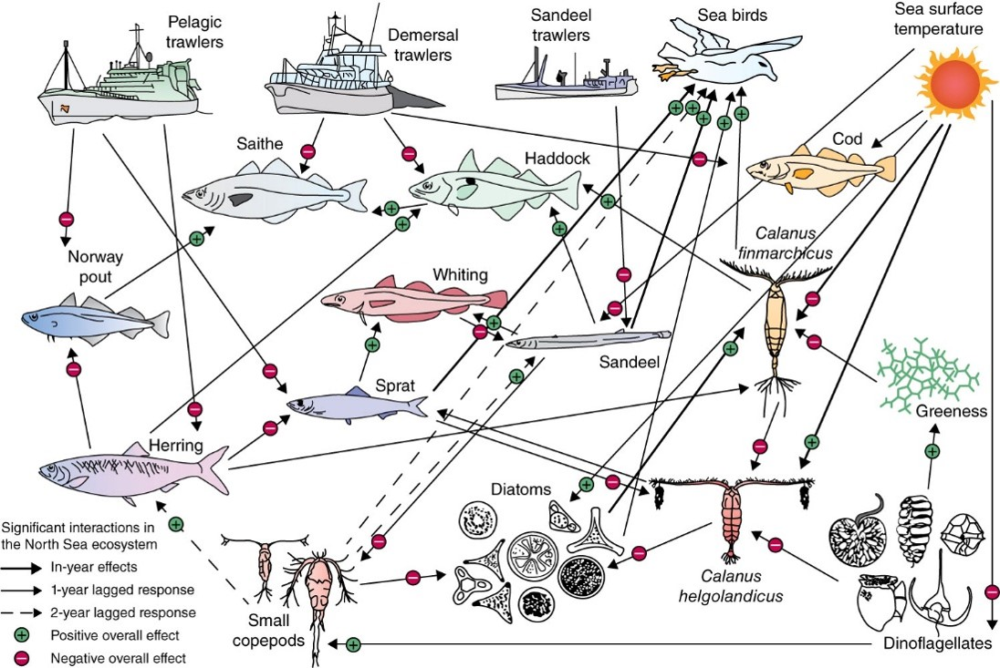

## Cascading effects: the big picture

**And these biotic interaction chains are actually embedded in biotic interaction webs plus complex abiotic interactions (Chap 10)**

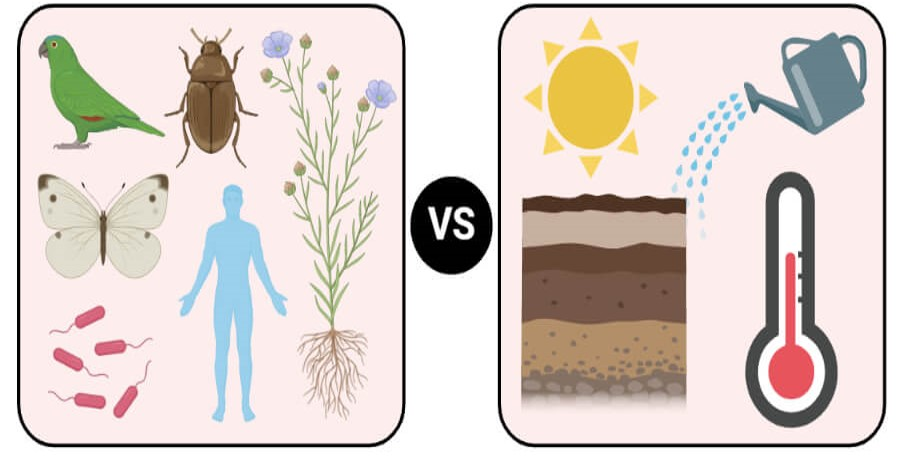

## Evolution of communities

**So we come back to… Nothing exists in isolation**

 
 
 
 

**Biological implications**

 

**Philosophical implications**

## True interconnectedness

 

**Web of life is not some cheesy new-age idea**

 

**It’s also not just a scientific concept**

 

**It’s represented in cultures around the world**

 

**And it is quite simply: TRUTH**

 

**The implications are staggering**

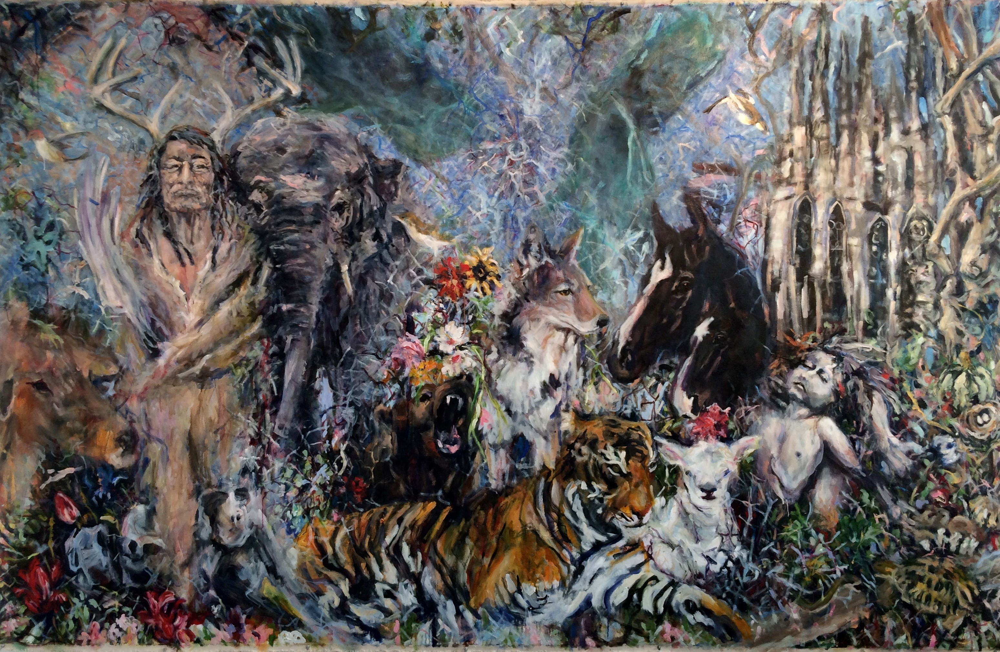

## True interconnectedness: Nothing exists in isolation

**Even in modern selfie culture, can you separate YOU from everything else?**

## True interconnectedness

 

**The problem is that we feel isolated**

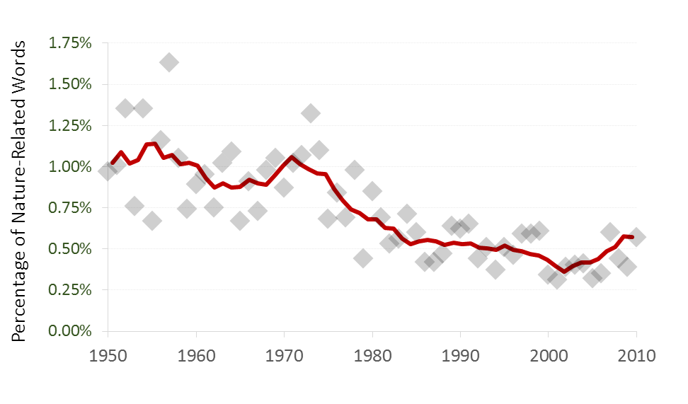

## True interconnectedness: This is about YOU

 

**It is not only about the physical planet Earth, it is about OUR bodies, minds, spirits, and relationships that are being trashed and polluted**

 

**We are being told that we are isolated, not good enough, not important to the big picture**

 

**But it’s not true**

 

**We have to start telling – and believing - a different story**

 

**Do something small this week to begin busting down some of the walls of separation!**

## True interconnectedness: Friday open discussion

**What are the impediments to feeling connected?**

 

**In our societies?**

 

**In our classrooms?**

 

**In our psyches?**

 

**Others?**

 

**Choose a subject to write about or find an article to discuss**

 

**Submit an short paragraph of your conclusions to Brightspace for participation**

##

