## Large-scale earth system impacts

**Changes across levels are all happening at the same time**

 

**Ecosystem structure: abundance & distribution of species & resources**

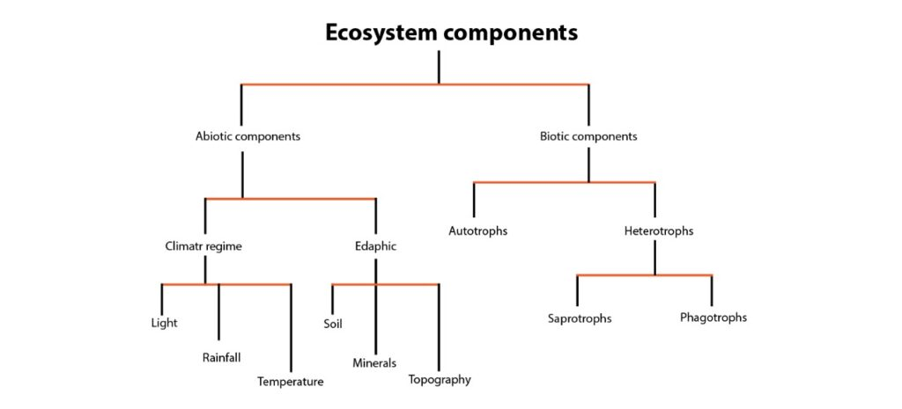

## Large-scale earth system impacts

**Changes across levels are all happening at the same time**

 

**Ecosystem structure: abundance & distribution of species & resources**

 

**Ecosystem function: physical, chemical, & biological processes**

 

**Ecosystem services: processes & products that benefit humans**

 

**Ecosystem services are maximized by properly functioning ecosystems**

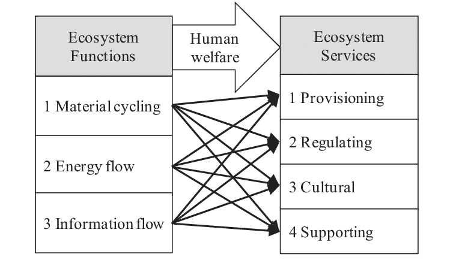

## Feedbacks: when a process/system is modified by its own effects

 
 

**Positive feedback loops= where response increases  stimulus** 

 
 

**Common and lead to amplification of climate change and biodiversity loss**

 
 

**Effects can be on structure and/or function**

 
 

**Despite the name, this is NOT a good thing**

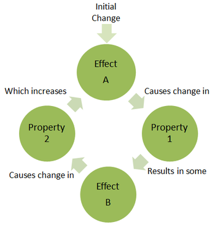 

## Feedbacks: when a process/system is modified by its own effects

 
 
 
 

**Positive feedback loops= where response increases  stimulus** 

 
 

**Common and lead to amplification of climate change and biodiversity loss**

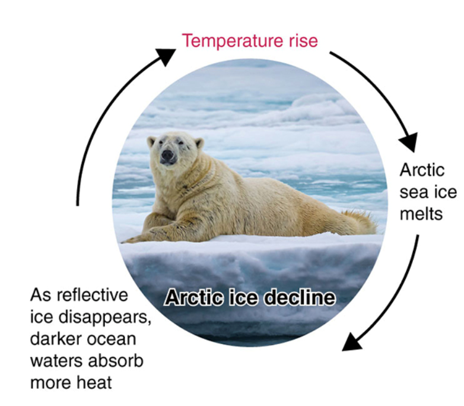 

## Feedbacks: when a process/system is modified by its own effects

 
 
 
 

**Positive feedback loops= where response increases  stimulus** 

 
 

**Common and lead to amplification of climate change and biodiversity loss**

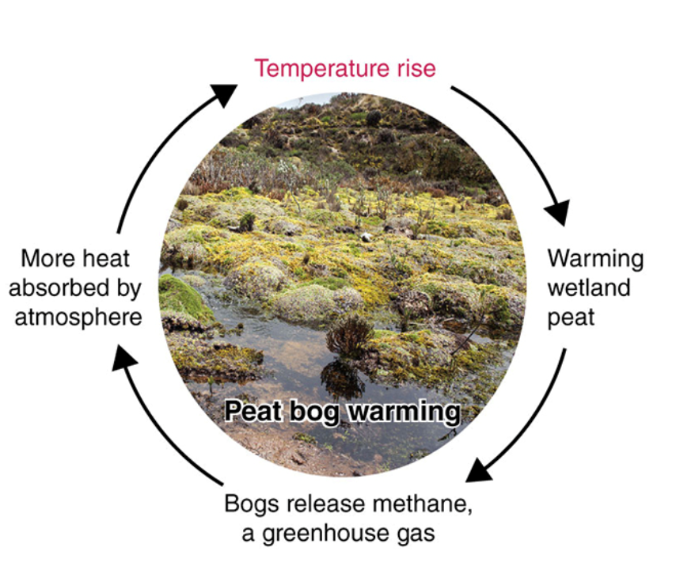 

## Feedbacks: when a process/system is modified by its own effects

 
**Positive feedback loops: Abiotic and biotic feedbacks from deforestation** 

 
 
 
 
 

**Deforestation releases carbon sequestered in trees contributing to global warming. In turn…**

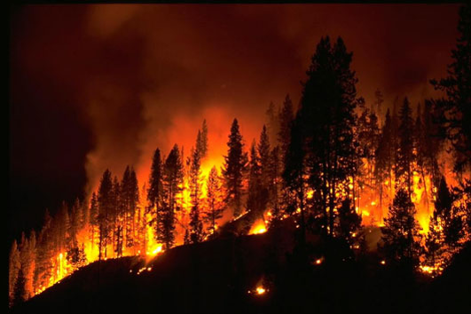 

## Feedbacks: when a process/system is modified by its own effects

 

**Positive feedback loops: Abiotic and biotic feedbacks from deforestation**

 

**Ecoystem functioning can then be hijacked by positive feedbacks from global change factors**

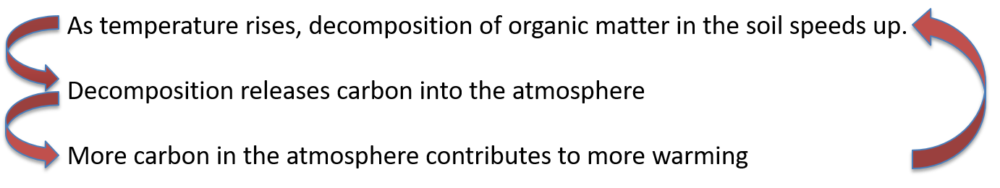 

## Feedbacks: when a process/system is modified by its own effects

 

**Positive feedback loops: Abiotic and biotic feedbacks from deforestation** 

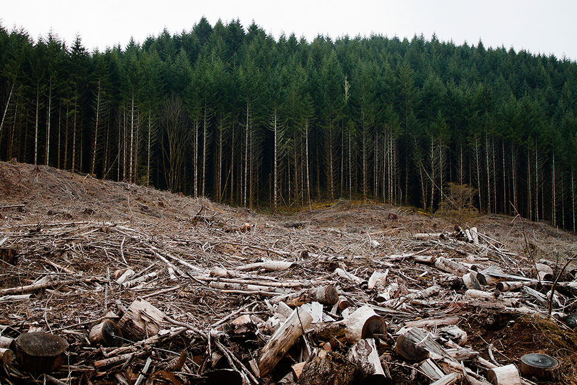 

 
 

**Habitat loss has direct *negative* effects like removing organisms but also has *cascading* effects by facilitating invasions, allowing increased access to hunters (over-harvesting), changing fire regimes, etc...**

 

**…particularly true when habitat loss and fragmentation are combined**

## 

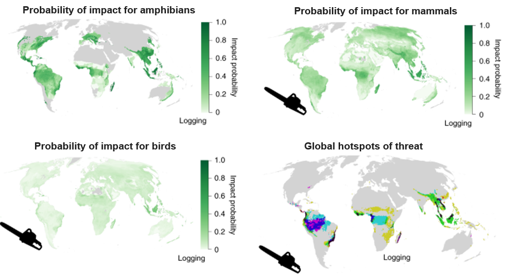

## Feedbacks: when a process/system is modified by its own effects

**Positive feedback loops: Abiotic and biotic feedbacks from deforestation** 

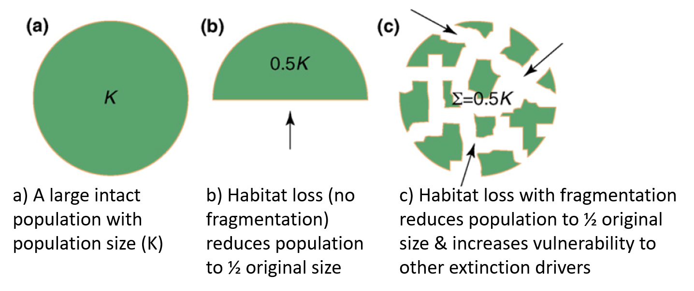

## Feedbacks: when a process/system is modified by its own effects

**Negative feedback loops: works to reduce initial stimulus and return system to normal**
 

**Exist naturally in biological systems, but not a big component of global change**

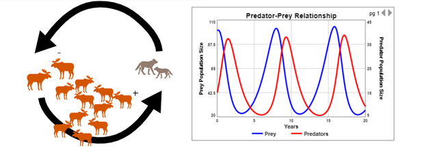

## Threshold effects

**Positive feedbacks and cascading effects can lead to tipping points and ecosystem collapse**

 
**Which can be reversible, partially reversible, or irreversible**

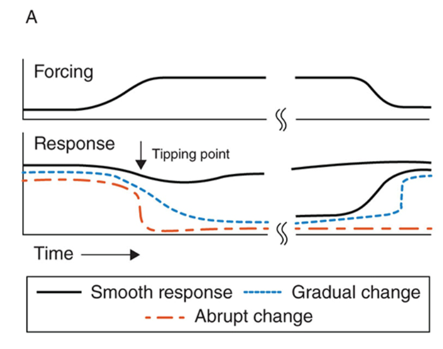

## Threshold effects

**Threshold effects can occur at many levels from…**

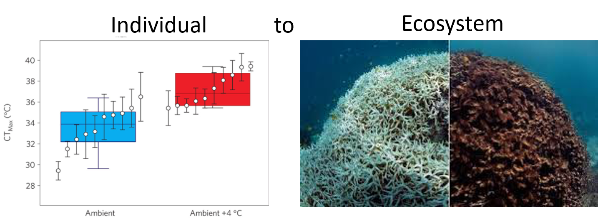

## Tipping points are generally unknown, making restoration hard

**Restoration always involves addressing the prior threats **

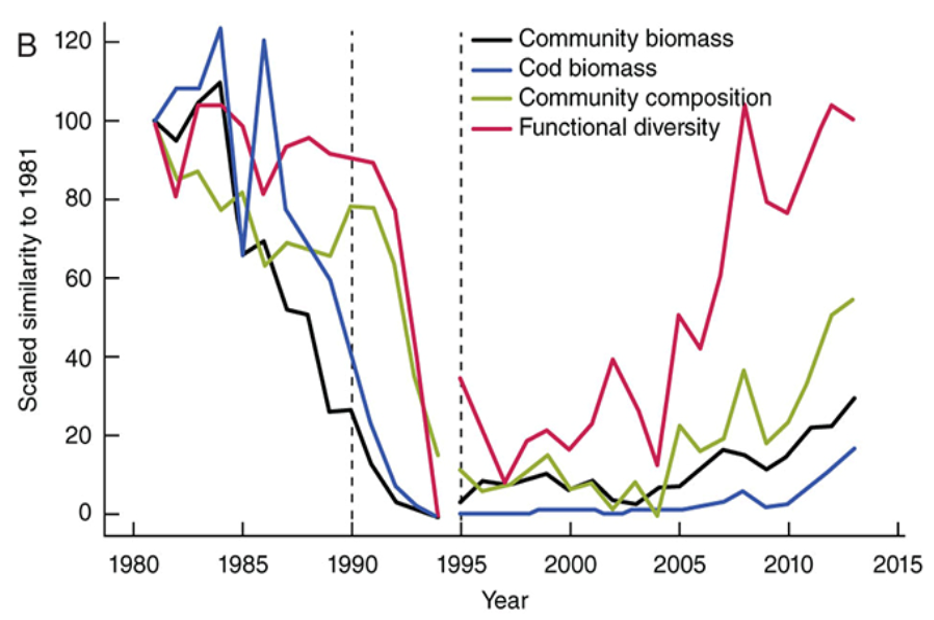

## Resilience and restoration

**Many factors contribute to resilience and potential for restoration (use Taking a Closer Look as a study guide and remember the hammer and nail analogy)**

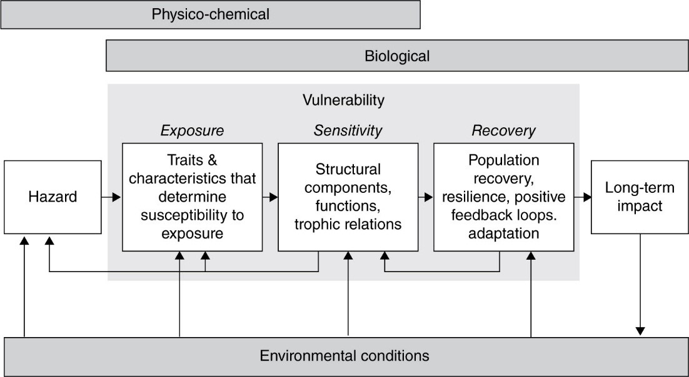

<!-- ## Resilience and restoration -->
<!-- 
 -->

<!-- **Many factors contribute to resilience and potential for restoration (use Taking a Closer Look & Chap 4 “Vulnerability” section as a study guide)** -->

<!--  -->

## Resilience and restoration

**Different elements of vulnerability: The degree to which a species or system is susceptible to adverse effects of global change is a function of:**

 

* **Exposure: Likelihood system will experience a given stressor**
    + How big & quickly is the change occurring?
    + Are there lag effects? 
    + Is the system exposed or buffered?

 

* **Sensitivity: Degree the system will be impacted by a given stressor**
    + Is the system fragile or robust?
    + Are there highly specialized species or obligate interactions?

 

* **Response: Ability of a system to respond to a given stressor**
    + Which core responses do species exhibit?
    + Can communities reorganize into a new stable state?

## Connecting the dots: true interconnectedness

 
 

- **Our systems are out of balance**
    + Earth systems
    + Our own body systems
    + Many of our socio-political-cultural systems

 
 
 
 

**Premise that all systems are out of balance in shared ways**

 

**We extract and deplete without giving time and energy to the process of recharge and restoration**

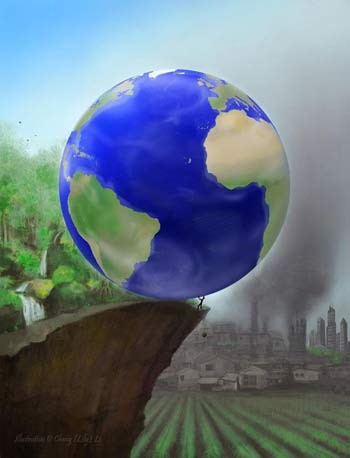

## Connecting the dots: college classrooms

 

* **Higher education has long prioritized:**
    + Content over context
    + Facts over wisdom
    + Competition over cooperation
    + Grades over reflection
 
 

**The consequence is that the system runs on fear, lack, and depletion and can suck you dry**

 

* **This class design trys to fight this style, but it is not enough...**
    + you are still pressured, stressed and running on empty

## Earth's systems are nested...and vulnerable 

**Ecological and evolutionary interconnectedness across all nested levels from cellular to planetary**

 
 
 

**Coordinated networked interdependent systems**

 

**Resulting from deep  symbiosis + co-evolution**

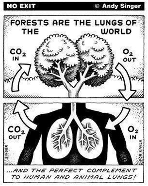

<!-- ## Nested ecosystems -->
<!-- 
 -->

<!-- 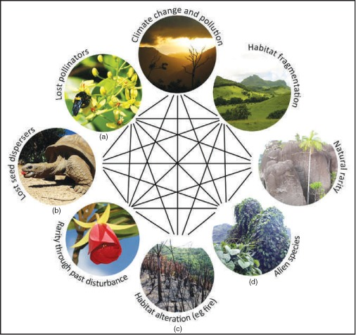 -->

## Open disccussion: Is there a solution for our disconnectedness?

 

**What would an alternate model be for resilience and restoration?**

 

**How could we create a new system (on both visionary and practical levels) that prioritizes the values and approaches that we will need to create a more life-sustaining society?**

 

**How could models like these inform our work in other contexts?**

 

**Find an article or come up with a solution, post to Brightspace**

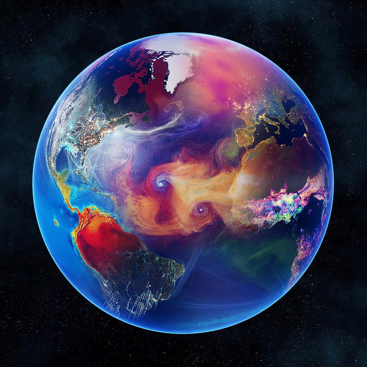