## Session objective

 
 

**Unit III: Last unit!**

 

**Conservation in an era of global change**

 

**How do we define conservation priorities (today)?**

 

**What are the challenges to conservation in the era of global change (Wednesday)?**

 

**To Start: Conservation is a broad term**

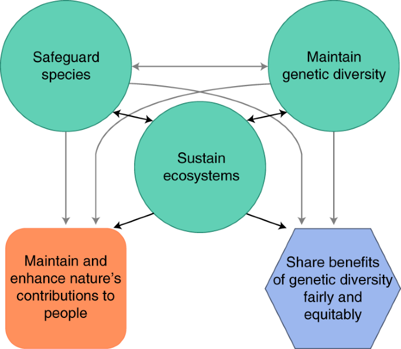

## What is the grand conservation challenge?

**https://conservationxlabs.com/grand-challenges**
 

- **Preserve biological diversity**
 
    + from genetic diversity to species diversity to functional diversity to ecosystem diversity
 
    + across spatial scales from local to global…
 
    + across time scales from now to the imaginable future…

## What is the grand conservation challenge?

**https://conservationxlabs.com/grand-challenges**
 

- **Preserve biological diversity**
 
    + from genetic diversity to species diversity to functional diversity to ecosystem diversity
 
    + across spatial scales from local to global…
 
    + across time scales from now to the imaginable future…
 
    + amidst uncertainty, in a world that will continue to change

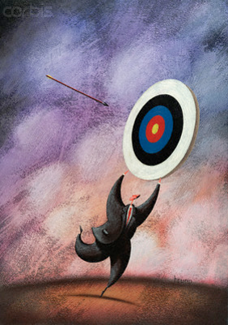

## What is the grand conservation challenge?

**https://conservationxlabs.com/grand-challenges**
 

- **Preserve biological diversity**
 
    + from genetic diversity to species diversity to functional diversity to ecosystem diversity
 
    + across spatial scales from local to global…
 
    + across time scales from now to the imaginable future…
 
    + amidst uncertainty, in a world that will continue to change
 
    + with finite resources

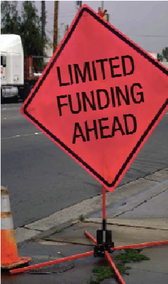

## Defining priorities for conservation (hard choices ahead)

 
 

**What types of species or ecosystems should be highest priority?**

 

**We have millions and millions of species on the planet interacting in complex ecological networks**

 

**How should we decide where to put our conservation dollar?**

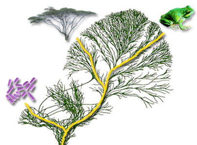

## Defining priorities for conservation (hard choices ahead)

**What types of species or ecosystems should be highest priority?**

* **Keystone species?**
 
* **Umbrella species?**	
 
* **Rare species?**	
 
* **Strong ecological interactors?**	
 
**Pros and Cons list might look like:**
 
* **Species under most stress?**
 
* **Species most likely to persist?**
 
* **Species with economic value to humans?**
 
* **Species with cultural significance?**
 
* **Species with stakeholder interest?**
 
* **Indicator species?**
 
* **Charismatic species?**
 
* **Old species?**
 
* **Young species?**

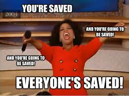

## Say we decide to prioritize a favorite species

**Of the ~6,500 known amphibians more than 1/3 are threatened with extinction (IUCN Red List)**

 
 
 

**Which should we prioritize?**

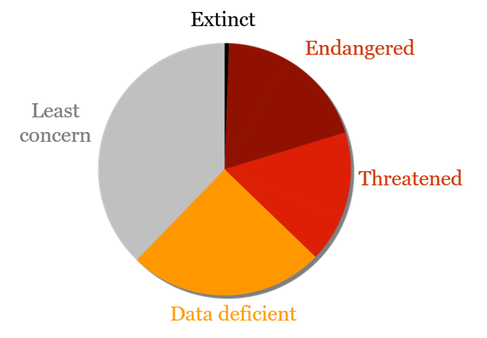

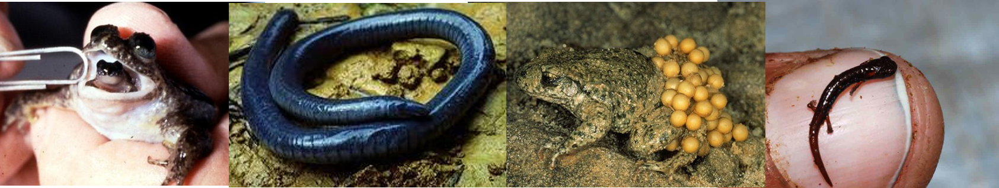

## Say we decide to prioritize a favorite species

**Yellow-legged mountain frog: Several tracktable interventions but each is costly...**

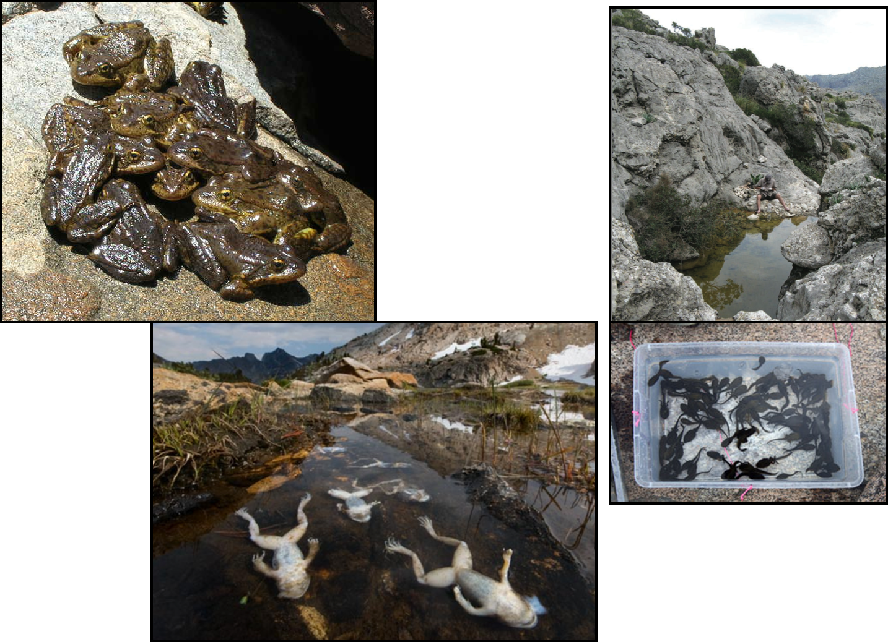

## Say we decide to prioritize a favorite species

**Should we give more conservation attention to the more susceptible (they need our help) or the more resistant (they might actually survive) populations?**  **What would you vote for?**

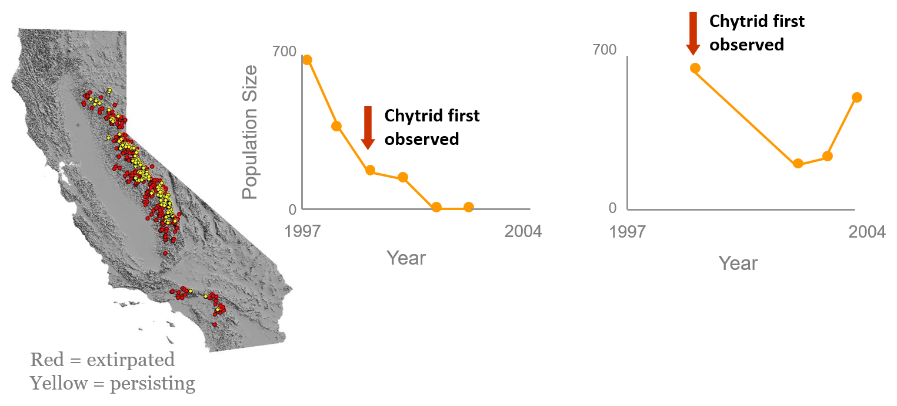

## Alternate strategies

**Many tractable interventions, but most very costly**

 
 
 

**Saving the Yellow-legged mountain frog**

* **Captive breeding**
 
* **Antifungal treatments**
 
* **Probiotic treatments**
 
* **Addressing the threat**
 
* **Legislation**

 

 **What would you vote for?**

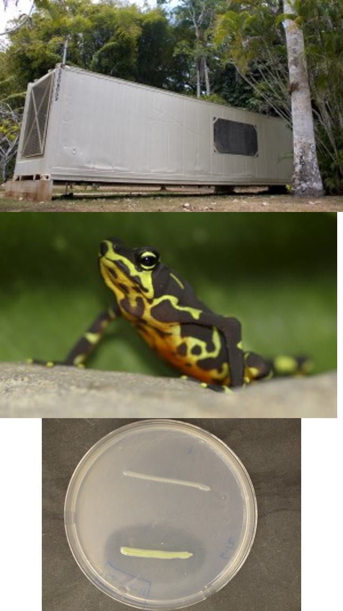

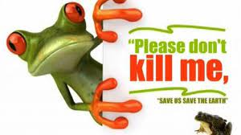

## Defining priorities for conservation

**So…first step in conservation planning is to explicitly define conservation priorities**

 

**There are some explicit and data-driven ways to do this, for example…**

## Defining priorities for conservation

**Example:   selection algorithms are computer algorithms that apply biodiversity optimization rules**

 
 

**Example optimization rules:**
 

* **Complementarity: add areas that contribute most new biodiversity**
 
* **Irreplaceability: add areas with unique species or attributes**
 
* **Bang for buck: add areas which maximize environmental benefit while minimizing economic costs**

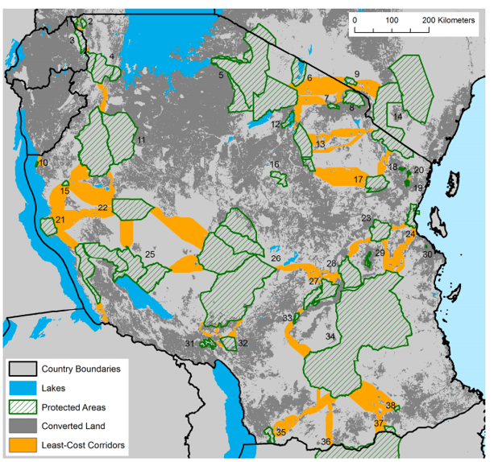

## Defining priorities for conservation

**Example: The Evolutionarily Distinct and Globally Endangered Initiative Zoological Society of London**

 

**Uses data from phylogenetic trees to give species a “phylogenetic uniqueness” ranking**

 

**Then adds a weight to this score based on IUCN red list risk of extinction.**

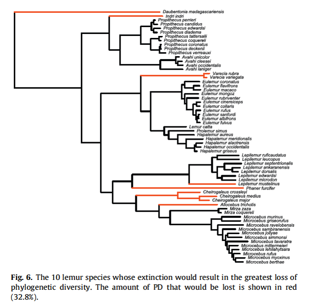

## Defining priorities for conservation

 

**Once conservation targets are selected, what are key management approaches?**

 

* **Fine filter: focus on protecting populations or species**
    + reducing overharvest
    + captive breeding
    + translocations

 

- **Coarse filter: focus on protecting ecosystems or landscapes**
    + creating reserves
    + re-establishing corridors
    + re-establishing natural disturbance regimes
    + enhancing habitat in high modified settings

## Flexibilities and complexities

 

**Flexible levels of access: Corridors and reserves can be static or flexible (e.g., dynamic rules to reduce detrimental synergies).**

 
 
 

**For example, like closing dive tourism in coral reefs during heavy storm seasons**
 

**vs**
 

**Building wildlife corridors to cross highways**

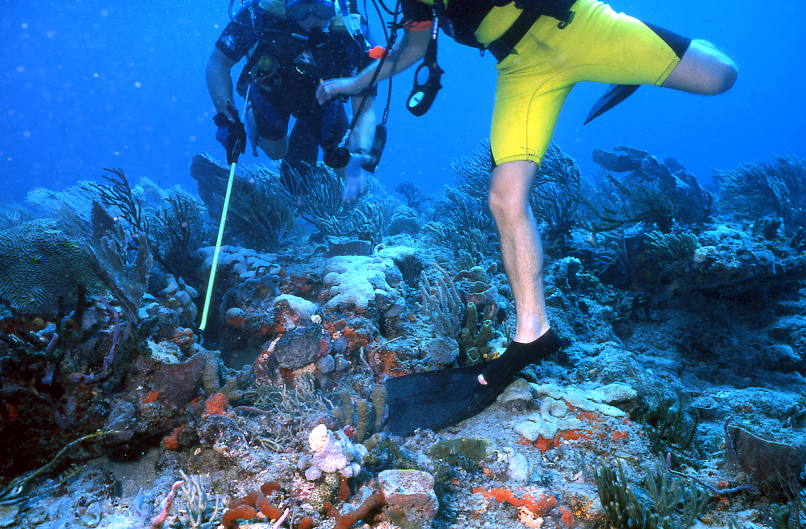

## Flexibilities and complexities

 
**There have been some captive breeding “success stories”**

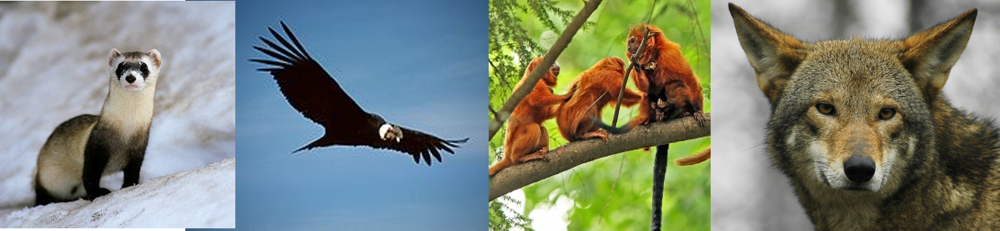

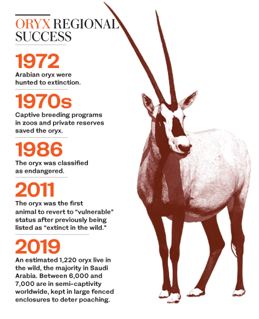

## Flexibilities and complexities

 
**There have been some captive breeding “success stories” and other high profile attempts**

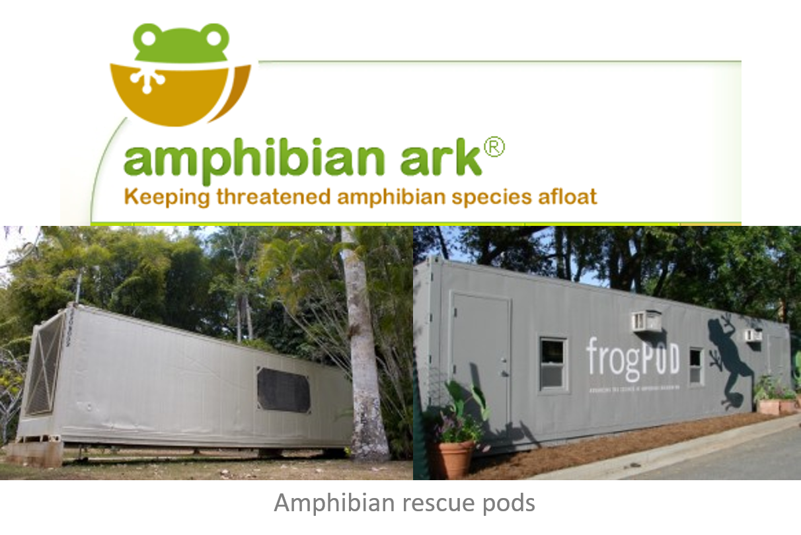

## Flexibilities and complexities

 
**There have been some captive breeding “success stories” and other high profile attempts**
 
**You are less likely though to hear about captive breeding failures, even though they constitute the majority of them**

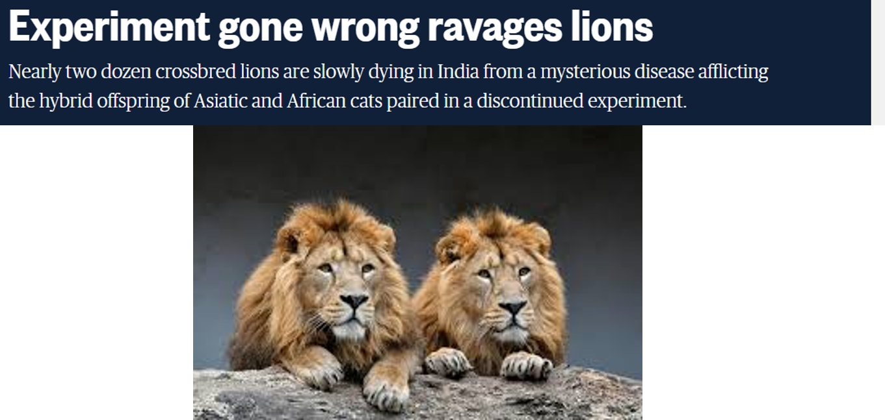

## Flexibilities and complexities

 
**There have been some captive breeding “success stories” and other high profile attempts… but only effective when coupled with efforts to reduce threats**

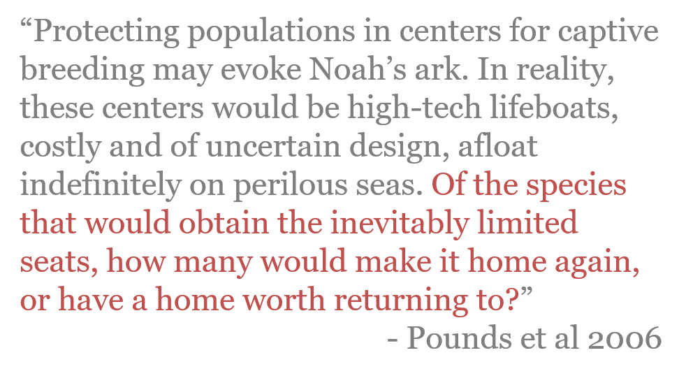

## Flexibilities and complexities

 

**Adaptive management: Learning-by-doing**

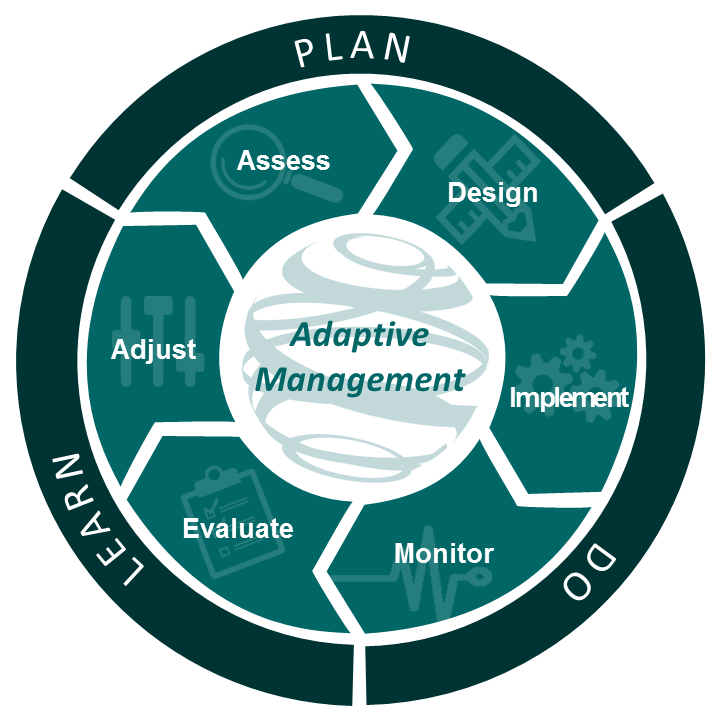

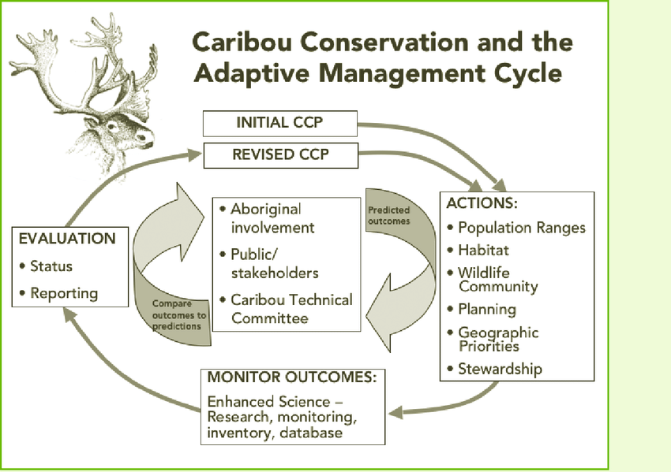

## Flexibilities and complexities

 

**The law of unintended consequences (aka hubris): “intervention in a complex system tends to create unanticipated and often undesirable outcomes”**

 
 
 
 

**And complex systems include humans!**

## Should we micromanage nature?

**Many projects kill plant/animal species based on the mistaken assumption that another plant or animal will benefit**

 
 
 
 
 
 
 
 
 
 
 
 

**Nature Conservancy decimated the population of rare Arctic grayling fish in Montana by damming the streams to create ponds for the benefit of the equally rare trumpeter swan**
 

**Grayling spawned in those streams and the population plummeted when the streams were dammed**
 

**Scientists are trying to compensate for the damage to the grayling population by killing cutthroat trout that is considered a predator**

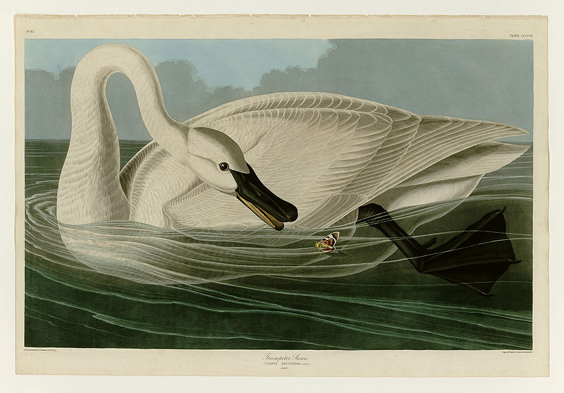

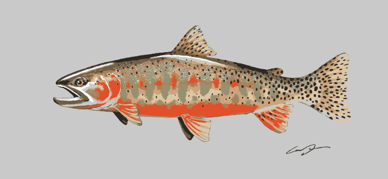