## Today's goal

 

**Explore one small slice of Conservation Ethics**

 
 
 
 
 
 
 
 
 

**Explore the spectrum of possible actions for restoration focusing on examples of wildlife reintroductions**

 

**(being with uncomfortable choices)**

## Chat

 
 

**Do we have an ecological and/or ethical obligation to restore (at least some) ecological communities that we directly disturbed?**

 
 
 
 

**yes**
 
**no**
 
**I'm not sure how I feel about this**

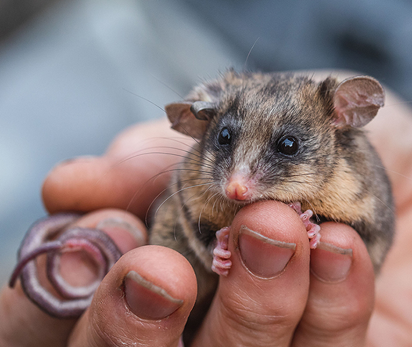

## Thought experiment

 
 
 
 
 
 

**Imagine that an ecologically important species (e.g., a key predator or an ecosystem engineer) has very recently been lost from a local community. The loss is clearly caused by humans (e.g., over-hunting or over-harvest)**

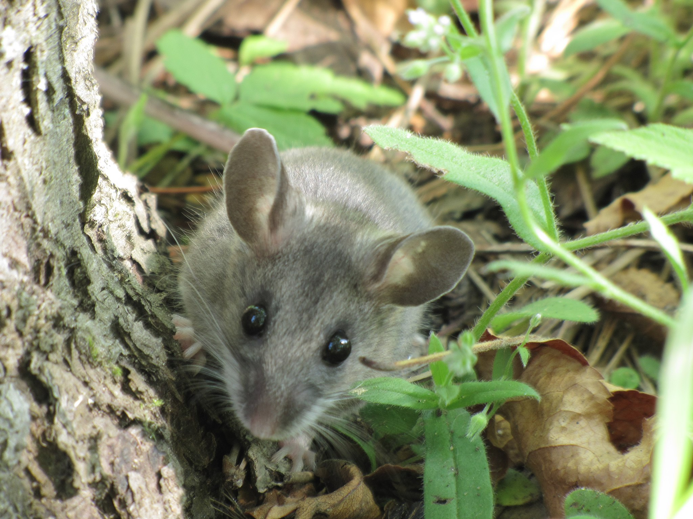

## Chat

 
 

**All else being equal, should we reintroduce the ecologically important endemic species that was recently extirpated if it is still found nearby?** 

 
 
 
 

**yes**
 
**no**
 
**I'm not sure how I feel about this**

## Translocations

 

**This is a basic translocation and it is a commonly used approach in biodiversity management.**

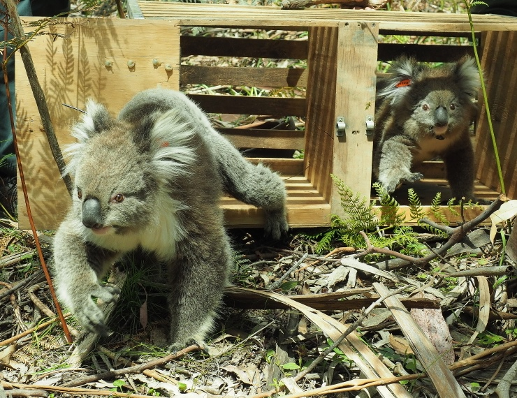 

## Translocations

 

**Translocations can be data-driven to ensure a match between donor and recipient populations**

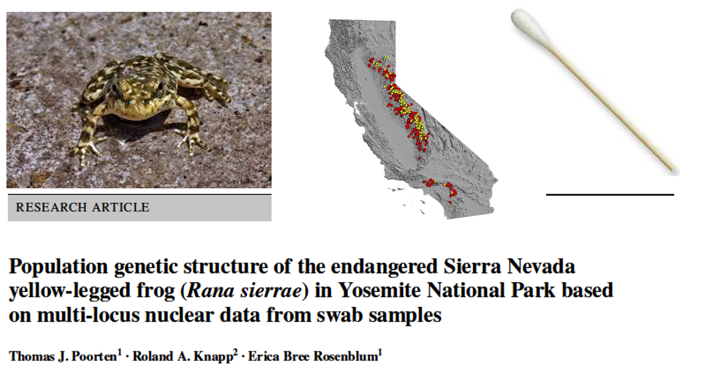 

## Translocations

 

**Even within-species translocations or re-introductions can be highly controversial**

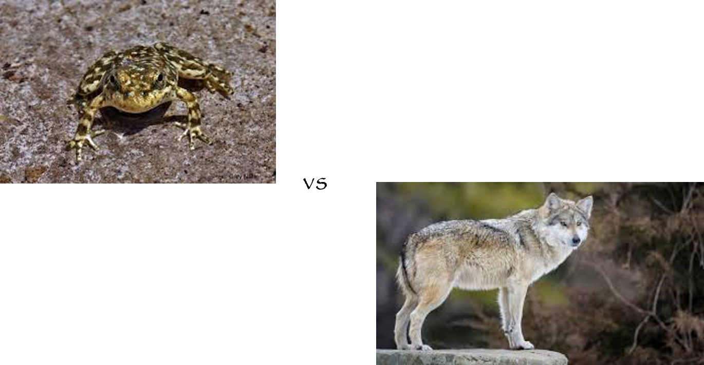 

## Translocations

 

* **Wolves hunted to near extinction**

 

* **Decreased predation had catastrophic cascading effects**

 

* **Last known wild gray wolves captured in 1980**

 

* **Intensive captive breeding brought back from brink of extinction **

 

* **Now individuals throughout the western US**

 
 

**But also tons of controversy with concerns about the impacts of wolf populations on livestock, and deer/elk hunting**

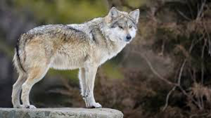

##

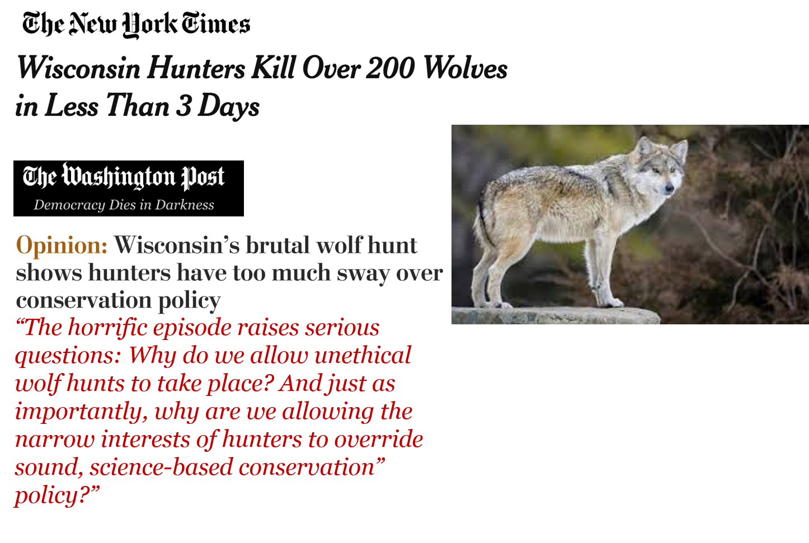

## Translocations

 
 
 

**Controversy can be even greater when the predator has been gone from the ecosystem for longer, when there is less open space, and when the predator inspires more fear in humans** 

 

**For example, possibility of reintroducing cougars to East Coast**

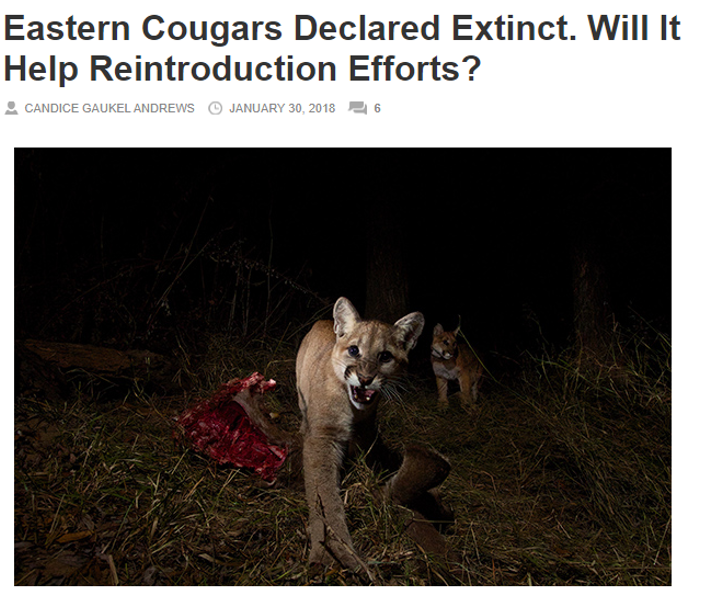

## Thought experiment

 

**But what if there aren’t any other extant populations of the species we want to restore?** 

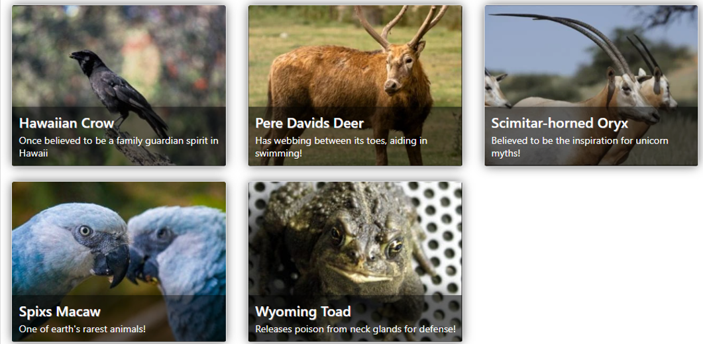

## Translocations

 

**Can we justify translocating close relatives**

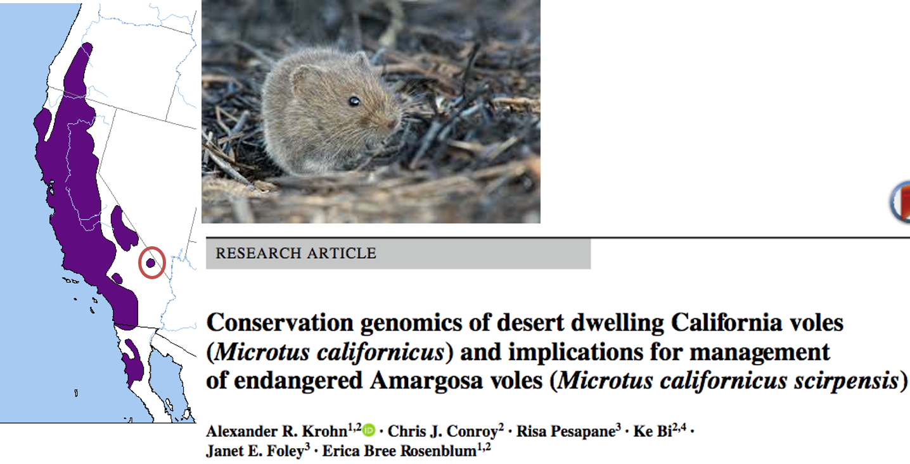

## Thought experiment

 
 

**But what if a close relative isn’t an option?**

 

**All else being equal, should we introduce an ecological analog of that species that isn’t endemic to the community but is surviving in a similar ecosystem elsewhere in the world? **

 
 

**yes**
 
**no**
 
**I'm not sure how I feel about this**

## Taxon substitution

 

**Taxon substitutions: Reintroducing an ecological analog to restore ecosystems, reduce secondary extinctions, and avoid other cascading effects.**

 
 

**Example, in the Galapagos, following extinction of Pinta Tortoises, Saddleback and Domed tortoises were released to fill the “empty niche” and help with seed dispersal.**

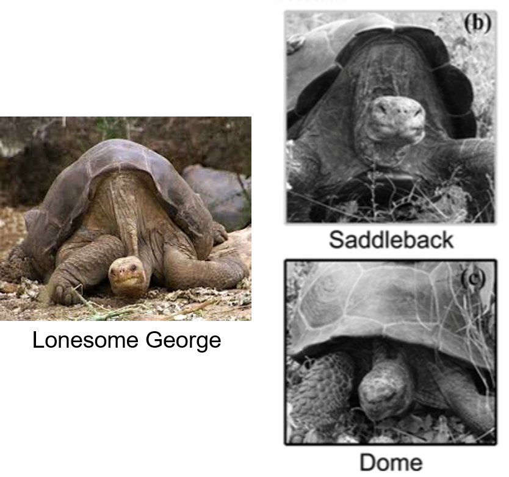

## Taxon substitution

 

**But even seemingly similar species are not interchangeable as ecological replacements…**

 
 

**Niche differentiation between saddleback (in gray) and domed (in black) tortoises introduced to Pinta **

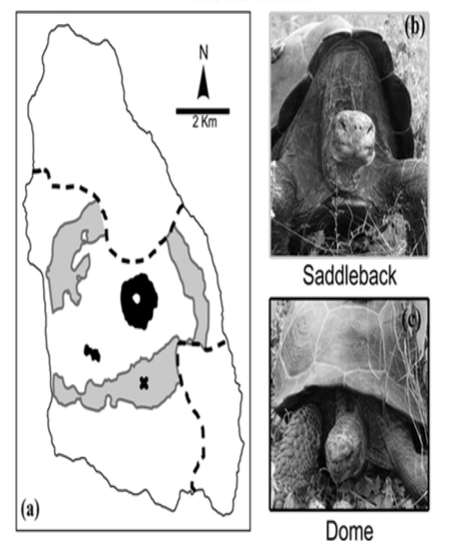

## Taxon substitution

 

**And how far away (in terms of geography or relatedness) is too far?**

 
 

**For example, should we introduce ecological analogs from Africa to the US?**

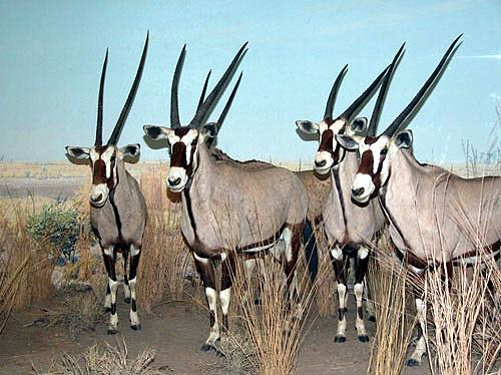

## Taxon substitution

 

**And how far away (in terms of geography or relatedness) is too far?**

 
 

**For example, should we introduce ecological analogs from Africa to the US?**

 

**How about their predators?**

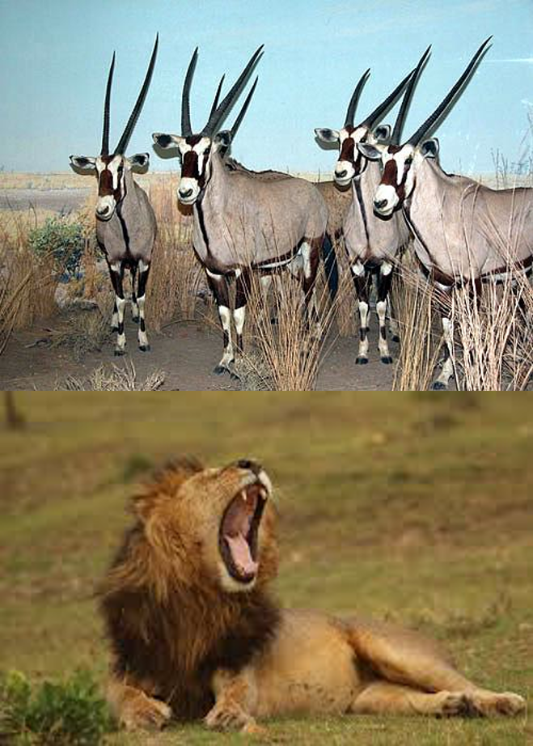

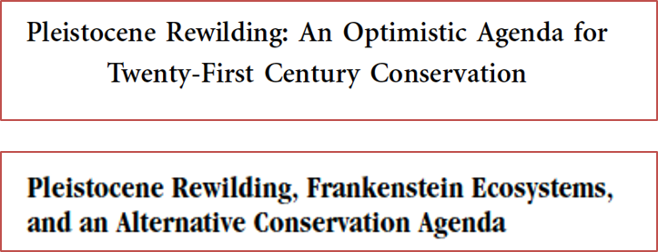

## Taxon substitution

 
 

**In the extreme, we could be bringing back mammoths or dinosaurs?**

 
 

**IF we can resurrect species, why don’t we just bring back the species that went extinct and not fuss about taxon substitutions**

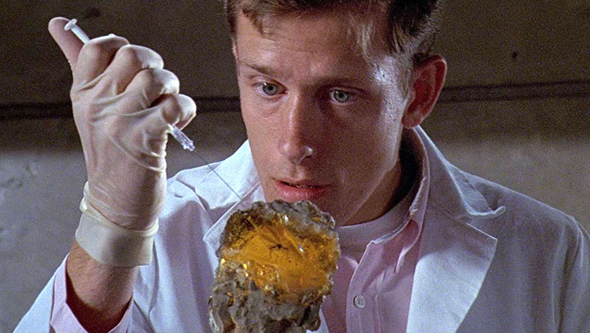

## Thought experiment

 
 

**All else being equal, should we bring back an extinct species that was *recently* lost and re-introduce it to its original community?**

 
 

**yes**
 
**no**
 
**I'm not sure how I feel about this**

## De-extinction

 

**Death of “Sudan” last male of his subspecies**

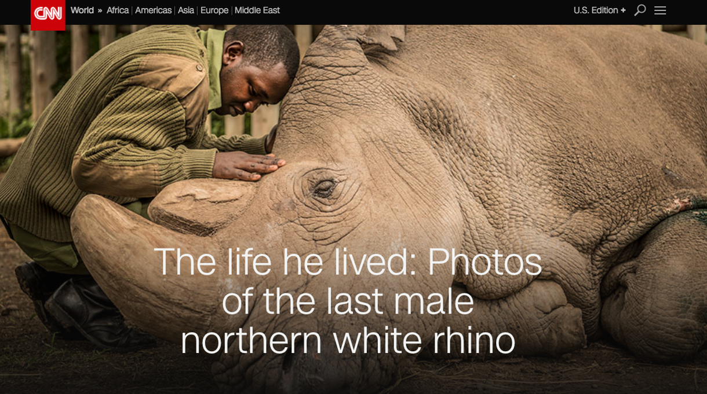

## De-extinction

 

**Two remaining females (his daughter & granddaughter)**

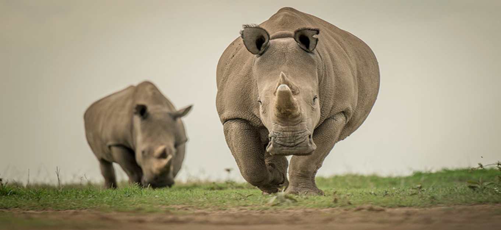

## De-extinction

 

**“There still might be hope, however, for the northern white rhino. Scientists have saved some of Sudan’s genetic material, and they hope to use in-vitro fertilization to bring the subspecies back. They’ll have to use a southern white rhino as a surrogate, Vitale said, but they like their chances.”**

## De-extinction

 

**De-extinction: Process of resurrecting a species (or a functional proxy of that species) that has died out. Typically proposed to be accomplished by:**

 
 

* **In-vitro Fertilization : produce embryos in the lab and use a surrogate for gestation**

 

* **Selective Breeding : artificial selection on living relative to produce desired traits**

 

* **Cloning : grow new individual from genetic material of a single parent (transferred to modified egg cell)**

 

* **Genome editing : making targeted changes to the genome of a close relative**

## From Dolly to De-extinction

**“The researchers who brought back the bucardo stated that only two things stand between them and a whole herd of healthy de-extinct bucardo: time and money”**

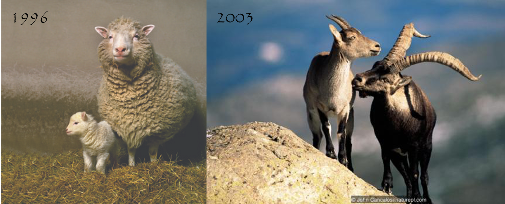

## From Dolly to De-extinction

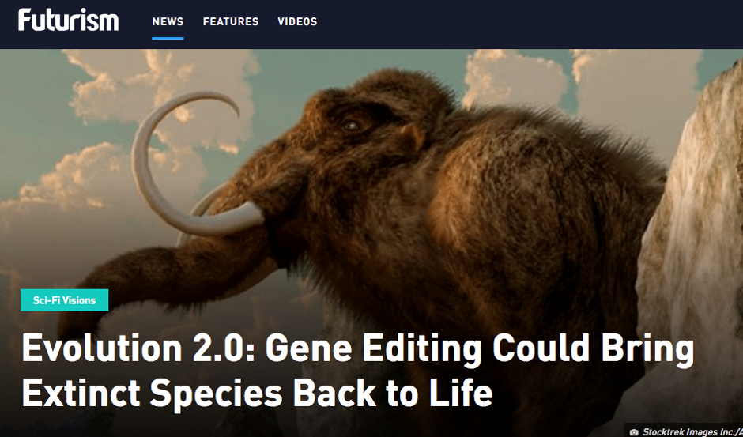

## From Dolly to De-extinction

 

**BBC Helen Pilcher: “For the last few years, Church and his team have been carefully placing mammoth genes into the cells of Asian elephants, woolly mammoths' closest living relatives… Church's team have made 45 changes to the elephant genome. They are moving closer to their goal of "mammoth-ifying" an elephant cell…**

 

**But they may have a long way to go. A 2015 study compared the woolly mammoth genome with that of living Asian elephants, and identified changes in 1,642 genes**

 

**Church's 45 changes amount to a small fraction of that total, but Church argues that he does not need to put every single tweak into his elephant cells to make something mammoth-like.”**

 

**Will the result be a mammoth...**

## Climate relavant gene editting....

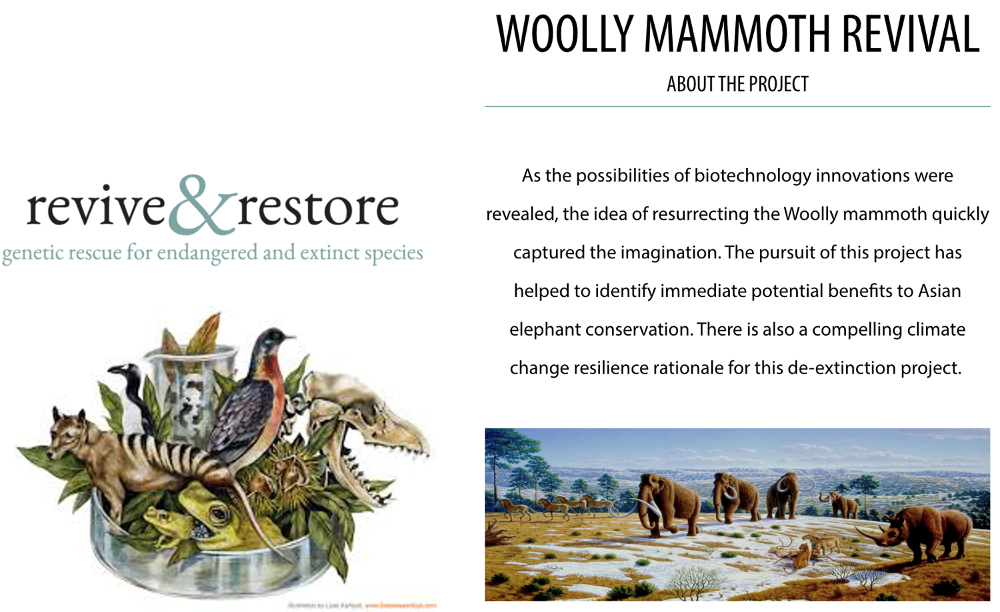

## Open discussion: Biotechnology and conservation...

 

**These efforts raise interesting and difficult questions about conservation priorities and whether funds are better spent on protecting species that are endangered but not yet extinct.**

 

* **Pick one topic and write a reflection or report on an intersting article**
    + Should we restore biodiversity through de-extinction?
    + Should we use existing technology to engineer climate resilence in threatened species?
    
 

* **Make sure and reflect on scientific, social, ethical, economic, regulatory, and science communication questions/issues.**
    + Submit your response on Brightspace
    

