## Chapter 1: Group Consensus

 
 

* **What are the key chapter elements (take home messages) that I should test you on?**

 
 

* **What new things are you curious about and/or did not fully understand**

 
 

* **What is the coolest thing you learned?**

## Get your global change biologist vibe on

 
 

* **Global Change Biology is a new-ish formal field of biology**

 

* **Focused on understanding environmental change and its effects on (and interactions with) life on Earth**

 

* **Represents a pressing need from early career young biologists**

 

* **Communicated many times a day in the news**
    + science and non-science communication

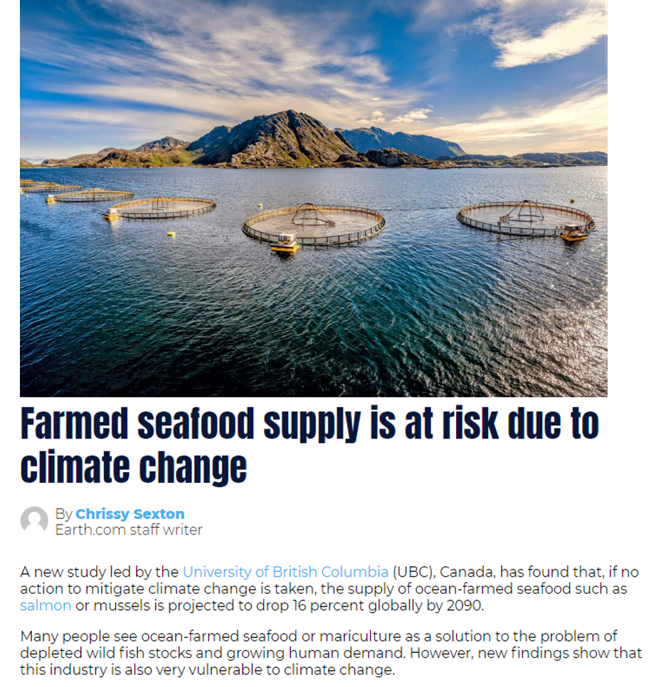

## Humans are an unprecendented force on natural systems

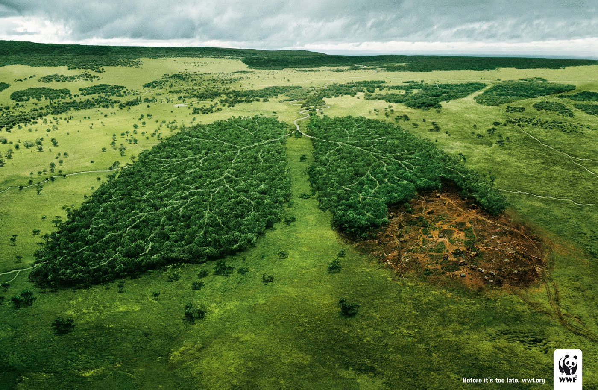

* **This is largely a numbers and size game**
    + 7.9 billion individuals and growing
    + we are no small organisms

 

* **Environmental change, largely driven by human forcings, impacts most systems across time and space**
    + impacts microbes to mammals
    + impacts marine to mountain ecosystems
    
 

* **GCB scientists must:**
    + understand past environmental change (for context)
    + evaluate current pressures from humans (for degree)
    + predict trends into the future (for decision making)
    
 

* **Today: How does GCB biology work?**

## The makings of the field of Global Change Biology

* **“On the Influence of Carbonic Acid in the Air upon the Temperature of the Ground.” published by Arrhenius in 1895 while studying ice ages**
    + argued that variations in trace atmosphere components (CO~2~) could greatly influence the heat budget of the Earth
    + Later, he published equations and argued that burning fossil fuels could impact surface temperature

 

* **Alexander von Humboldt noted that areas surrounding land transformed by agriculture had altered climate (late 1800's)**

 

* **Guy Callendar published first data linking CO~2~ and surfaces temperatures in 1938**

 

* **Soon after, studies of the biological impacts of environmental change exploded**

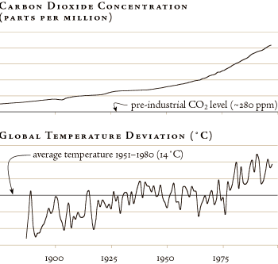

## What does the field of GCB look like now?

 
 

* **Scientific publications are the building blocks of science**

 

* **GCB studies are a key component of the permanent wall of science**
    + Now dedicated journals to the field 
    + Several high impact journals (Global Change Biology, Nature Climate Change)
    + dedicated books and textbooks

 

* **Note: communicating science outside of formal publishing is essential**
    + indigenous ecological knowledge

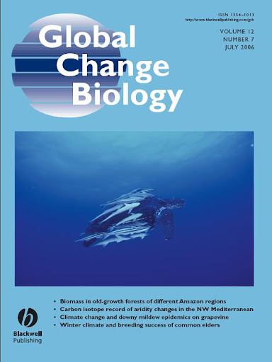

## 

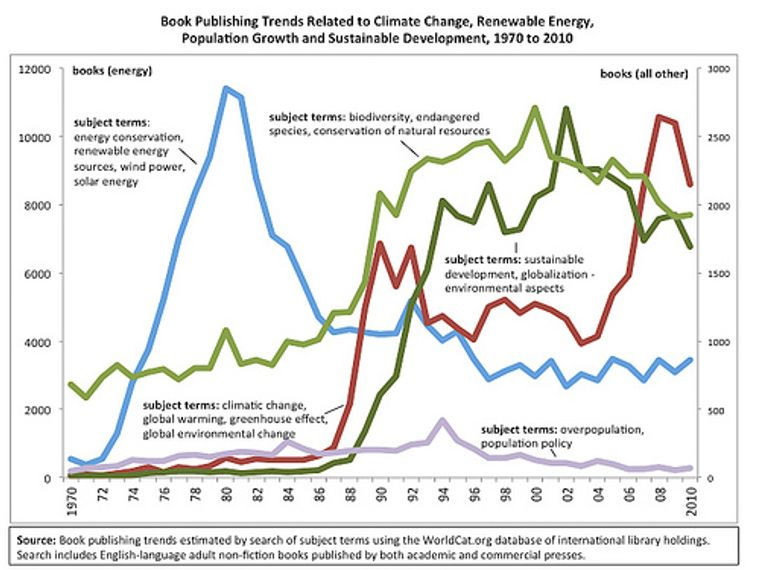

## GCB scientists face/d an uphill battle

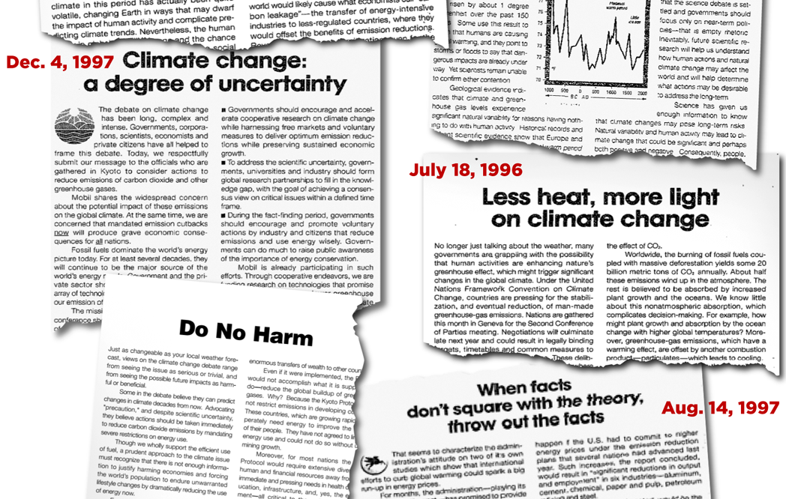

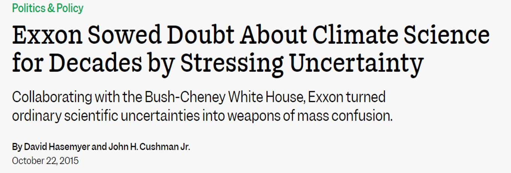

## GCB science is interdisciplinary by necessity

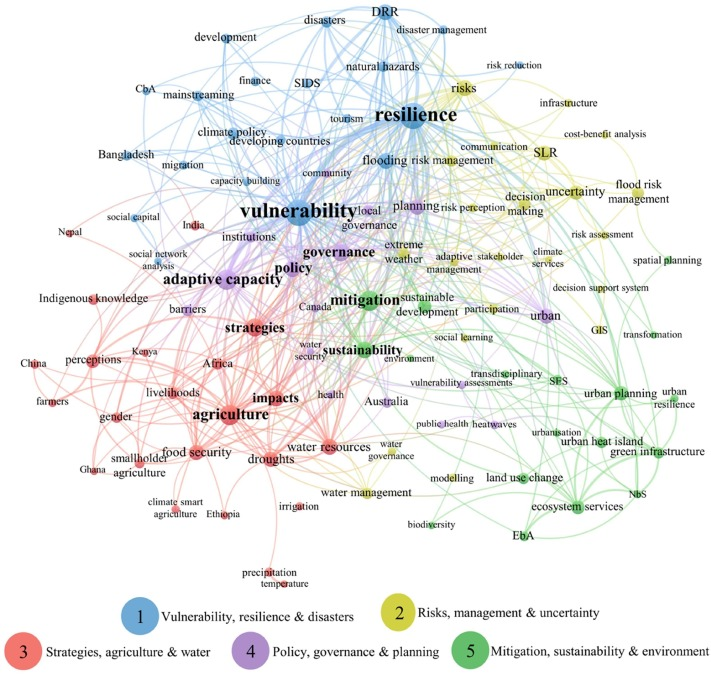

## 
 

**GCB embraces diverse perspectives by necessity**

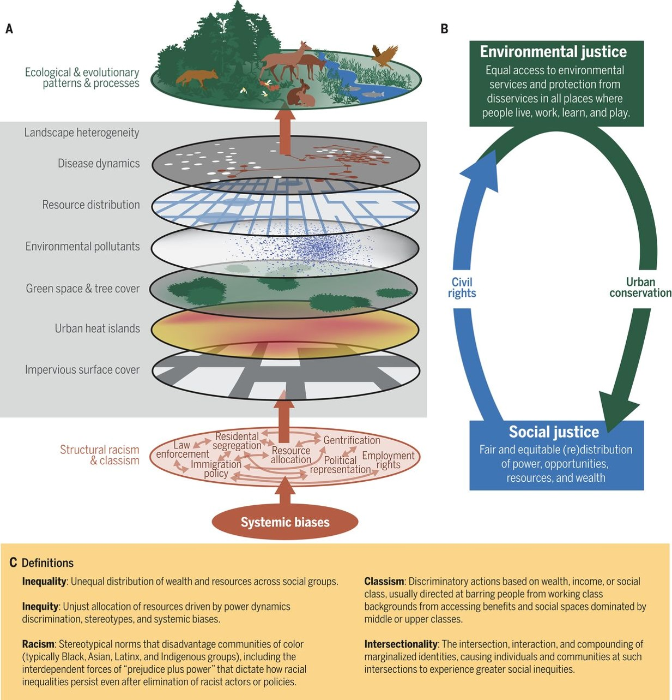

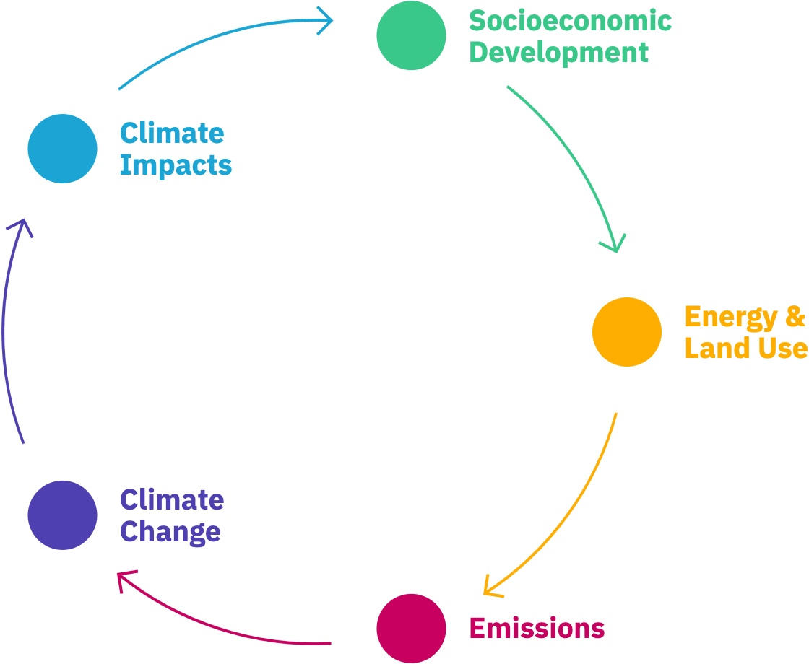

## Scientific bias in GCB can have vast socio-economic consequences

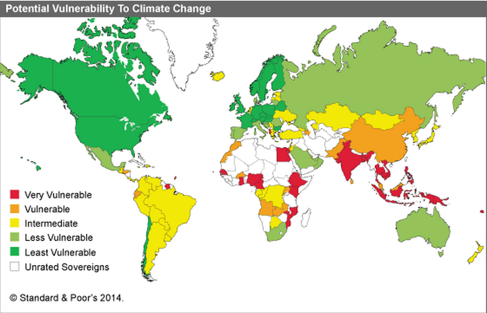

## Targes, investment, policy and consequences do not align

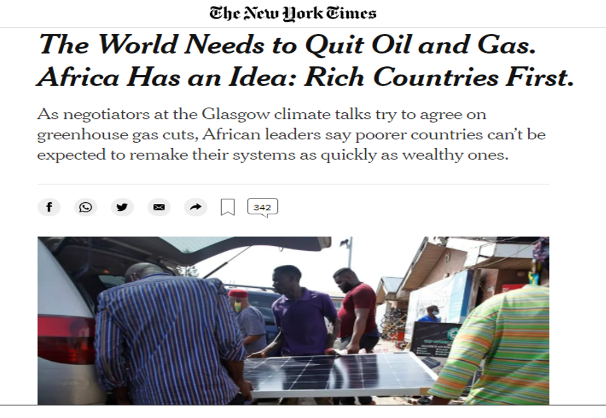

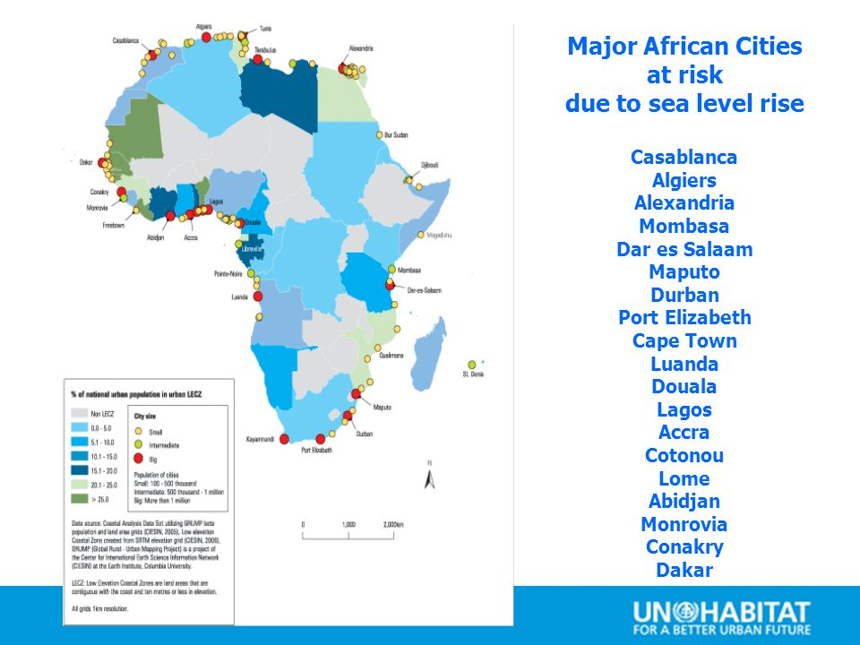

## GCB is diverse but utilizes same scientific principles

 

* **Vast array of methods due to diversity of fields**
    + ecology, evolution, conservation, physiology, etc.
  
 

* **Data generated is super diverse**
    + observational study &#8594; genomics &#8594; climate modeling

 

* **Stressors to be studied are many**

 

* **Time frames needed are not the same**

* **All these studies utilize the same design principles**
    + Independent and dependent variables
    + Treatments and controls
    + Main effects and interactions
    
 

* **Studies must have replication**
    + modeling or genomics may be exceptions
    
 

* **Studies should have randomization**

## Review and critical thinking of experimental design

 
 

**Simply define *independent* and *dependent* variables**

 

**Why is a *control* treatment absolutely necessary?**

 

**Why does *replication* matter for statistics?**

 

**If there is an *interaction effect* between 2 variables (say warming and drought) are you allowed to talk about a *main effect* by itself (say warming)?**

## GCB science varies in approach

* **Observe and record natural systems undergoing change without manipulation**
    + tuskless elephants, length of butterfly tongues, etc.

 

* **Search for mechanisms by manipulation (treatments)**
    + field or laboratory
    + focus on key variables
    
 

* **Use math and computers to predict**
    + use measured trends to project forward with some level of uncertainity
    + species interactions to global climate
 
  
 
* **Combine many single studies to understand if broad patterns exist**
    + may ignore unexpected or negative results

  
 
* **Use citizen participation to increase scope**

## GCB science uses the entire cool science toolkit

 
 
* **Environmental monitoring must be expansive**
    + ocean &#8594; atmosphere &#859
    + satellites &#8594; lasers &#8594; submarines

  
 
* **Lots of different organisms to monitor**
    + microbes &#8594; plants &#8594; whales
    + human observation &#8594; satellites
 
   
  
* **Biodiversity and species responses are key**
    + soil microbiome &#8594; adaptation &#8594; allele diversity
    + molecular biology tools are vital

  
 
* **Many experiments or approached generate large datasets**
    + climate monitoring to genomics
    + advanced computing is often necessary

  
 
## How is GCB data often visualized? Let's review and practice

 

* **How could we show a *significant* relationship between 2 key variables?**

 

* **What is the difference between a linear and exponential function (relationship)?**
    + draw a weak exponential relationship between atmopsheric CO~2~ and ocean pH
    
 

* **How could you show the results of an experiment with treatments?**

 

* **Why does both the center and the spread of data matter**?
    + draw a comparison of control and warming treatments that are likely biologically different

