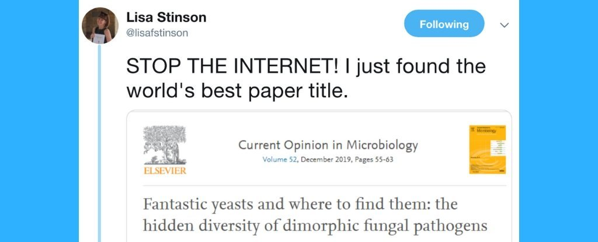
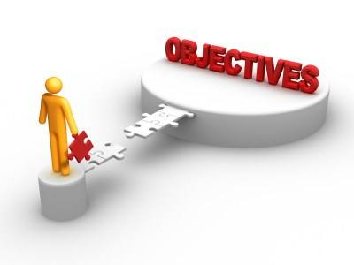
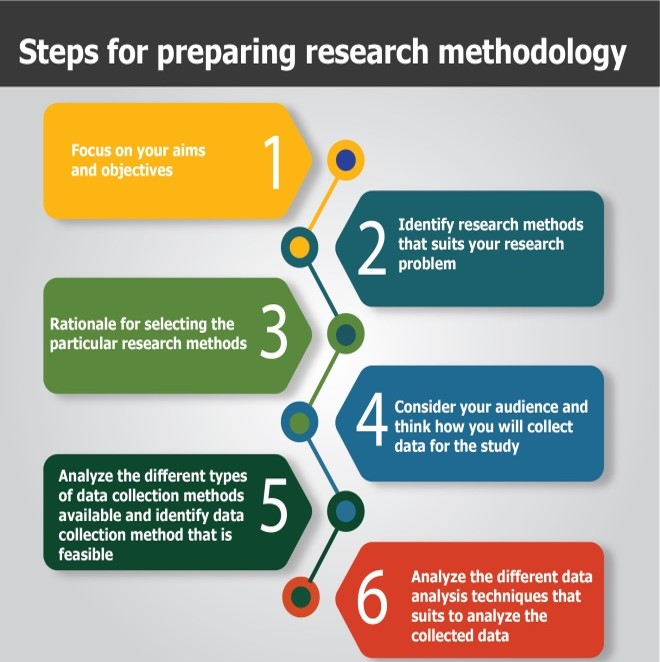
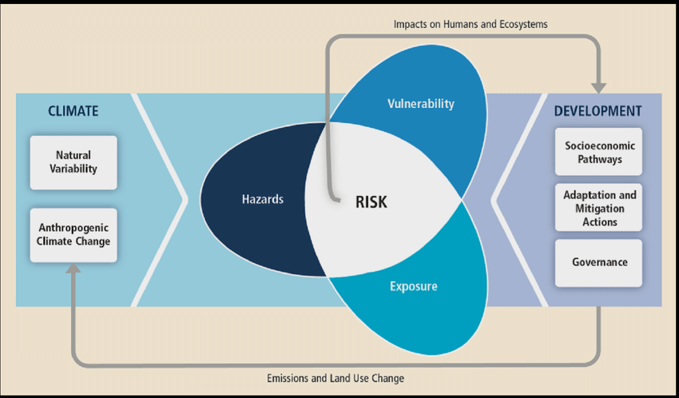
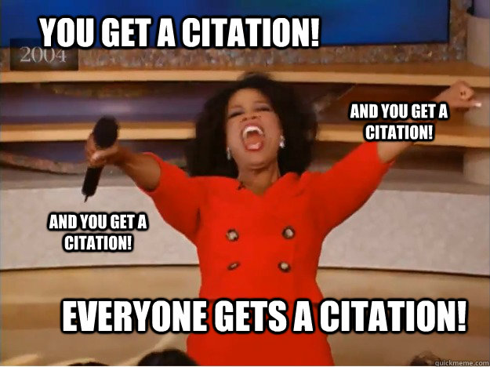
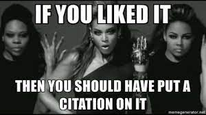
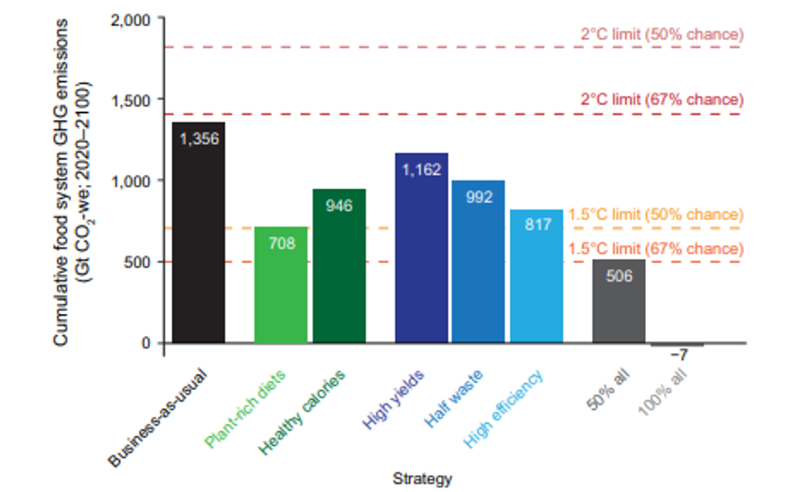
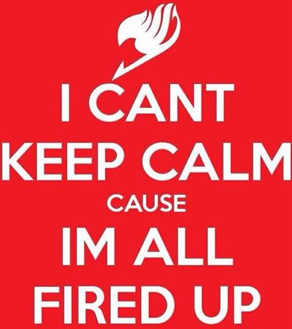
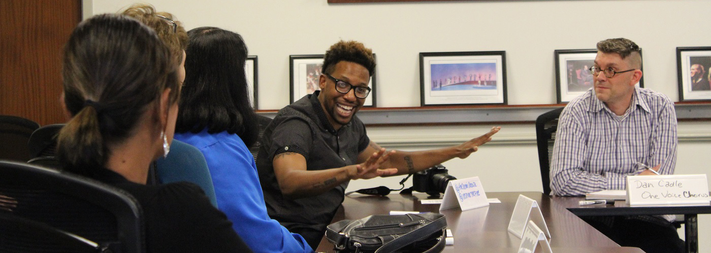

## Term project

 

* **GCB discovery grant proposal (5 pages) meant to inspire your own independent, creative direction.**

 

* **Submission windows:**
    + Project topic selection: February 2^nd^
    + Term project rough drafts: March 22^nd^
    + Term project peer reviews: March 28^th^
    + Final term project: April 12^th^

 

* **Start thinking about what sparks your interest!**

 

* **Writing resources are available on Brightspace**
    + Ask me for help!
    

    
## Term project components: Choose a catchy title

 

**Titles represent first impressions. We all know what can happen when that goes wrong...**

## Term project components: Introduction

   
 

**Your introduction will be the substance of your literature review (2-3 pages)**

 

* **Provide background information about your topic and describe why it is important.**
    + describe the current state of knowledge 
    + describe the unresolved questions are in the field

 

**The best introductions read like a "story" or "argument" where you lead the reader to understand why you are going to study what you want to study**

 

* **You need to reference a minimum of 10 scientific articles.**
    + primary literature articles and review articles in scientific journals
    + cannot be websites or popular press articles.
    
## Term project components: Objectives

      
 

**Here is where you very explicitly state your question and summarize what you will do to answer that question**
 
**~1/2 page**

 

* **Research question should be clearly stated**
    + provide enough specifics that one's audience can easily understand its purpose without needing additional explanation

 

* **The level of detail will vary from project to project**
    + make sure that your readers understand the scope of your question and your general approach to answering it

## Term project components: Research approach

 
 
 

**Here is where you describe what you will do for your study (~1-2 pages)**

 

* **This will be a more fleshed out version of the "research synopsis" in your objectives section.**
    + do not need to propose overly complex methods
    + focus on developing a realistic study that could be implemented 

 

## How do you design a real scientific study?

    
 

* **Approach #1: Find a well-designed study and adapt that study to a different system?**
    + study in the arctic that you could adapt to answer a questions about the tropics 
    + socio-economics of certain regions/countries applied to untested regions

 

* **Approach #2: Find a study in a system you are interested in and propose a follow-up study**
    + design a study to answer a new question that was raised in the Discussion section of a primary research article
    + you **CANNOT** just copy someone else's study but you can be inspired by other researchers
    + ultimately your work needs to be creative and needs to be your own!

 

* **Approach #3: Just go for it!**
    + Embrace your creativity to design something novel and forward thinking
    
## Term project components: Significance

 

**You should conclude your proposal with a discussion of why your research is important**
 
**~1/2 page**

 

**You need to convince your reviewers/funding agency that your idea will have an impact and that you are worth funding!**

 

* **National Science Foundation evaluates significance on 2 criteria**
    + *Intellectual merit*: potential to advance knowledge
    + *Broader Impacts*: potential to benefit society and contribute to the achievement of specific, desired societal outcomes.

## Term project components: Figure

* **Prepare one figure that will help your readers understand your project proposal**
    + not counted in page limit

 

**It can be a diagram of your experimental design, images to help bring the proposal to life, etc.**

## Term project components: References

 
 

* **Your references should be cited using APA format**
    + not counted in page limit

 

* **Lots of available guides for APA (what we are using in all Biology)**
    + I will post some but they are everywhere

 

* **If you would like to learn to use free citation software (Zotero/Mendeley) let me teach you during office hours**
    + It will make your writing life soooooooooo much easier

 

## APA References examples

* **Typical in-text APA citations (commonly at end of sentence):**
    + (Campany, 2012).
    + (Campany & Skywalker, 2022).
    + (Campany et al., 2019). *3 or more authors*
    + you can sparingly use: Campany et al. (2022) showed that ....

 

* **EX. Plants are superior to bacteria, animals and fungi (Campany et al., 2023).**

 

* **Multiple citations are allowed (alphabetical, separated by ;) and encouraged when citing:**
    + Plants are superior to bacteria, animals and fungi (Campany et al., 2023; Fischer et al., 2020; Robbins, 2021;  Witmer & Robbins, 2019)
    
 

* **Typical citation for you bibliography**:
    + Greer, C. F., & Ferguson, D. A. (2011). Using Twitter for promotion and
branding: A content analysis of local television Twitter sites. Journal of
Broadcasting & Electronic Media, 55(2), 198-214. 

## How to avoid plagrism like the plague...

* **Always cite any information that is not common knowledge**
    + If you are unsures, just cite it!!!

 

* **Paraphrase, paraphrase, paraphrase**
    + you must write everything in your language
    + I will know if you don't
    + If you cite another citation, you must find the original source
    + NO "QUOTATIONS"

 

* **Paragraphs (i.e. Introduction) should be composed of multiple citations around a central theme**
    + topic sentence
    + citations from several sources
    + closing and/or transition
    + overuse of one citation is a form of plagiarism (no paragraphs built around 1 paper)
    

    
## 
**We find that cumulative food system greenhouse gas emission emissions from 2020 to 2100 can be reduced by 14 to 48% through changes in dietary composition and healthier caloric consumption, through increased crop yields, through decreased food loss and waste, or through increased emissions efficiency of food production,provided that these strategies are adopted individually and gradually such that they are fully adopted by 2050 (Fig. 1). If all five strategies were to be partially implemented together (50% adoption of each), cumulative emissions through 2100 could be reduced by 63% relative to business-as-usual. Full adoption of all five strategies could result in a food system with marginally negative net cumulative emissions because of lowered emissions and net carbon sequestration on abandoned croplands.**

##
 
 
 
 
 
 
 
 

**Future greenhouse gas emissions from food production can be reduced from a multitude of strategies, including vegetation diets, consuming fewer calories, reducing food waste, more efficient food production, and increasing crop yields (Smith et al. 2021).**

## Term project on Brightspace

 

**Writing Resources will be added as needed (and requested)**

 

**Pay attention to grading rubric before submission**

 

**Each of you will blind peer review 2 papers**

 

**Ask questions along the way**

 

**Topic selection examples now posted**

## Review (or not) on accessing scientific papers

 

**https://www.shepherd.edu/library**

 

**How to setup your personal computer to have Shepherd's subscription access:**
 
**https://shepherd.ask.libraryh3lp.com/questions/42571**

 

* **Interlibrary Loan: have a librarian use external resources to find papers you cannot access**
    + free service
    + easier request is through Worldcat search on library page
    + do searches now, so you have time to find the papers you need
    
## Take Home Message: You have an identity in your writing

 

**What topic should you choose?!?!?**

 

* **Global change is now views through both the *natural world* and *socio-economic* linkages**
    + feel free to explore either or both

 

**Pick a system, species, regions, group, concept and get going**

 

**Only explore a topic that means something to you**

## Lets get started: New sheet of paper or electronic notes...

 
 

* **On the top of your page write: Interests Inventory**

 

* **Free write about about any topics you are naturally drawn toward in the Global Change Biology arena**
    + brainstorm with your neighbor

 

* **What issues 'get you fired up'?**
    + critter or part of the tree of life
    + biome or region of the world
    + environmental issue or human stressor

## Topic Selection: due February 2^nd^

 

* **Evaluate your 'Interest Inventory**
    + see which ones have juice. 

 

* **Explore narrowing your focus until you have an idea for a specific project that will answer a specific question**

 

* **Submit a short project topic proposal that answers three questions:**
    + What is the problem or question that you want to study in more detail?
    + What approaches might you use to tackle your question?
    + Why is addressing this problem or question important?

 

* **Submit on Brightspace (about 1/2 page)**
    + high quality examples posted already
    
<!-- ## Friday: Evaluating examples as a NSF panel member -->
<!-- 
 -->
<!--  -->

