##

**What are (at least three) key reasons this cartoon lacks accuracy and is deeply problematic?**

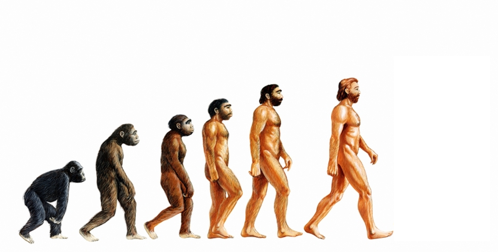

## Misconceptions about human evolution

 

**Humans did not evolve from chimps, we both evolved from a common ancestor**

 

**Early human evolution was not a linear progression but a branching tree**

 

**Multiple species of ancient humans walked the earth, often at the same time**

 

**Modern humans originated in Africa and then spread around the world evolving incredible diversity (so the buff-white-male-endpoint is not only ridiculous but problematic in many ways)**

 

**There is no endpoint, humans are still evolving**

## Think Critically: Global Question...

 

**What are the consequences of common misconceptions about human evolution past, present & future? **

## Human evolution fact and fallacies

 

- **Humans are a part of the tree of life, not above it**

 

- **Are humans the most complex organism on Earth?**
    + octopus eye vs human eye
 
  
 
- **Nothing that exists on Earth is actually 'primitive'**
    + consider the basics of evolution and selection!

  
  

- **Why does this matter now?**
    + stewardship not extraction
    + societies/cultures create false hierarchies based on ladder approach
    
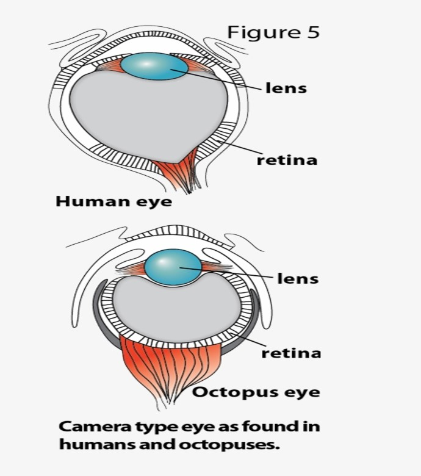

## Dangers of false hierarchies

 
 

**Manufactured tiers within human species based on the ladder approach to evolution**

 

**A more perfect race of humans is developing/evolving (or can be created)**

 

**Used to uphold white supremacy, imperialism, colonialism, slavery and genocide**

 

**Used to create eugenics programs**

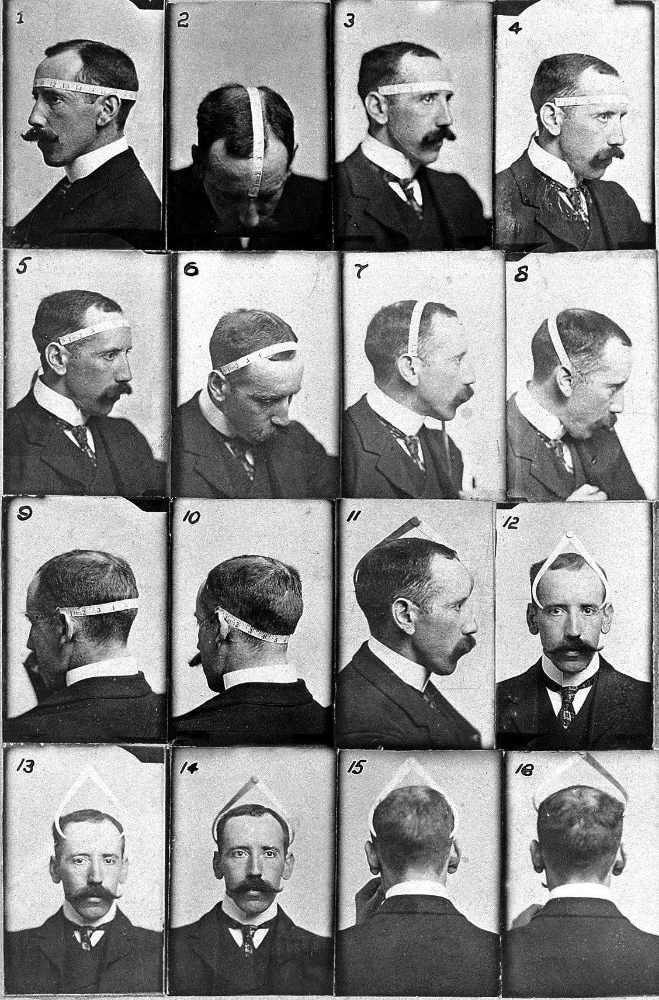

## Misconception: Trees not ladders!

 

**Aristole (Scala Natura & Great Chain of Being) was wrong**

 

**Phylogenies do not imply that organisms are more advanced**

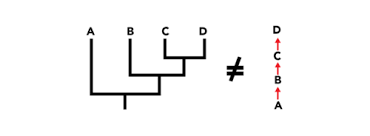

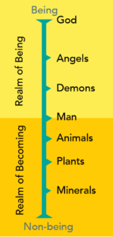

## Humans are the new kids on the block

 
 

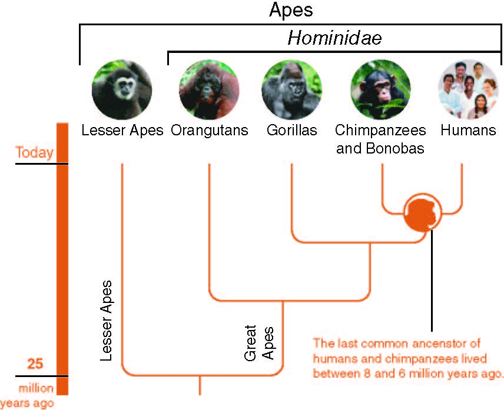

- **Humans belong to a family of primates**
    + group also contains chimps, gorillas and orangutans

 

- **Our genus (*Homo*) shares a common ancestor with chimps (*Pan*)**
    + early 'humans' and *Pan* diverged 6-8mya

 

- **Our species (*Homo sapien*) evolutionary history is BRIEF**

## Whats in a name - Relatedness through taxonmy

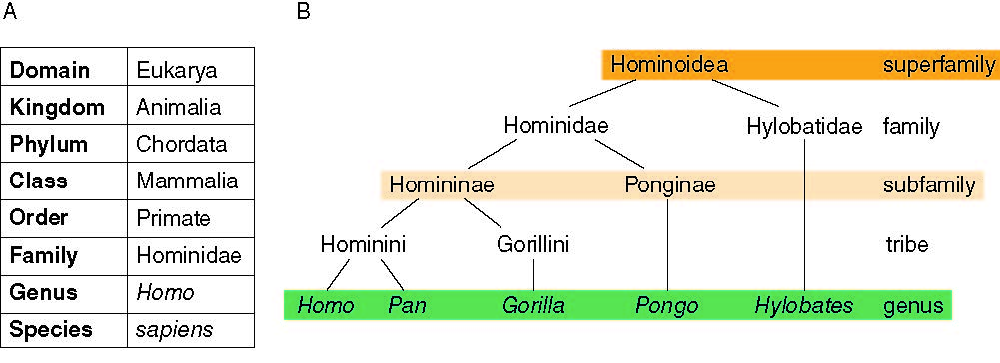

## There have been many species in the genus *Homo*

 
 
 

- **Ancestral 'humans' can be split into ~4 groups (genera)**

 

- **Groupings relate to timing and evolutionary milestones**

 

- **Fossil record is very incomplete**
    + common ancestor to *Pan* is unknown
    + total number of ancestral humans may change

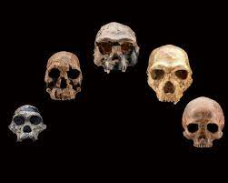

## 

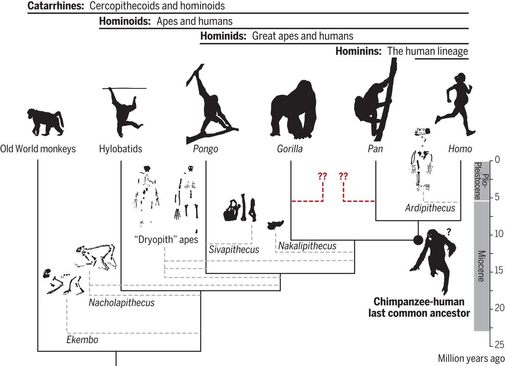

## 

## The *Homo* genus is all that is left

**H.habilis was probably first (most primitive) &#8594; 2.3-1.4mya**

 

**H.sapient evolved appro. 300,00 - 200,00- years ago**

 

**The evolution of the *Homo* genus was not a ladder!**

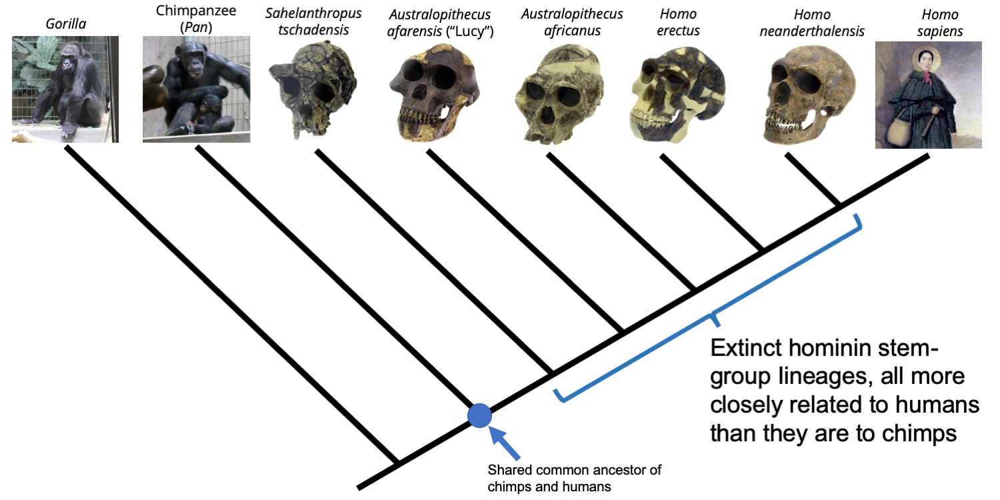

## 
**Different species of *Homo* very likely interacted**

<!-- 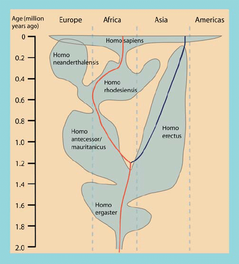 -->

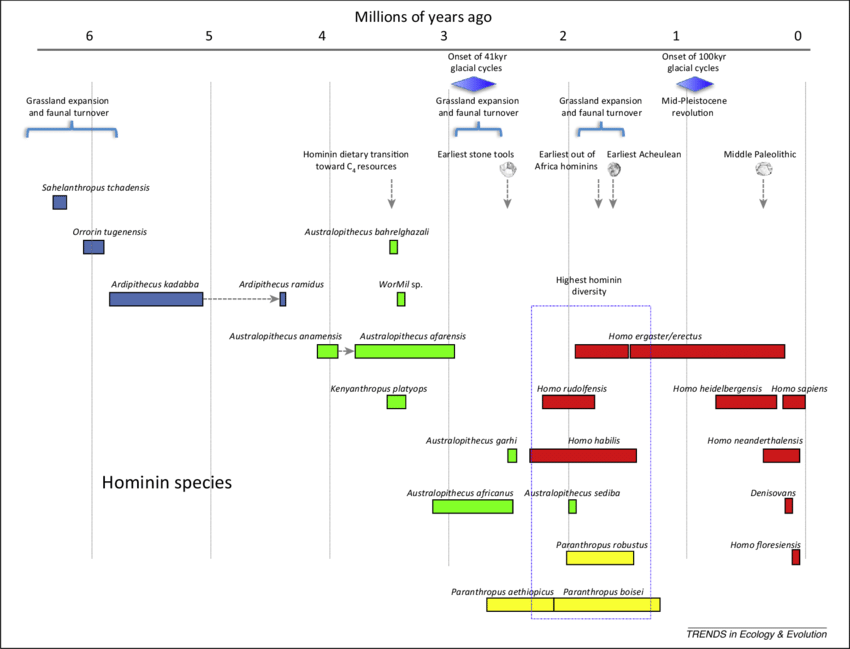

## Out of Africa and beyond

 
 

- **H. sapien evolved on African continent**
    + massive migration ~100,000 ya
    + not the first to leave

 

- **H. erectus probably left first**
    + or H. egaster
    + then H. neanderthalensis

 

- **Lots of debate!!**

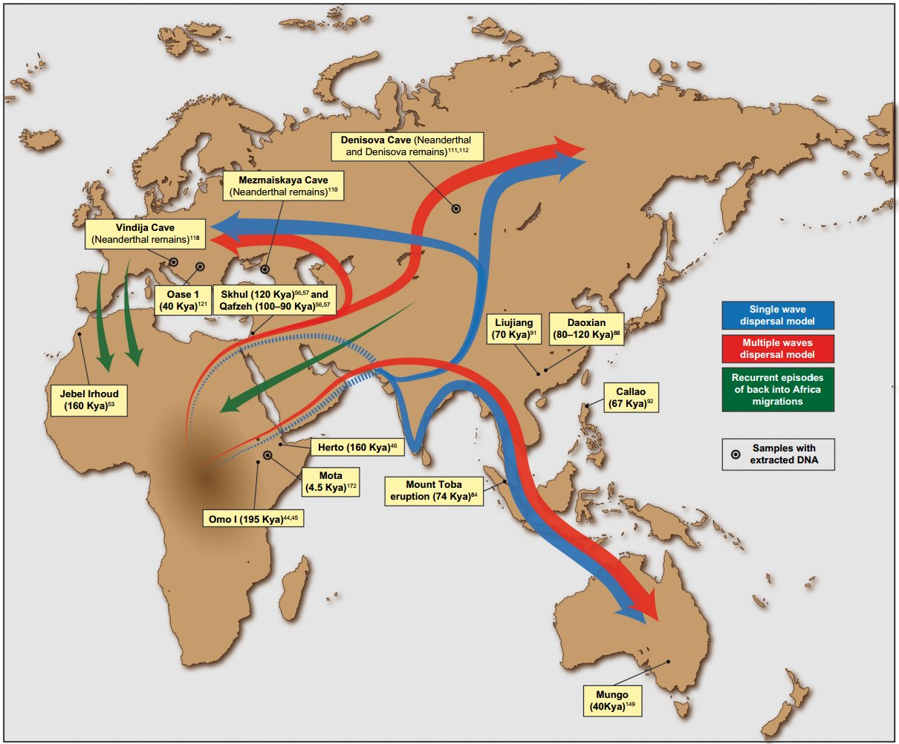

## Different species of *Homo* may have interbred

- **Humans from outside Africa have traces of Neanderthal DNA**
    + about 1–2% of their genomes
    + fossils suggest met in Middle East (~50,000 ya)

 

- **DNA from a 40,000-year-old human skeleton suggests a Neanderthal great-great grandparent**

 

- **Denisovans lived across Asia, giving them opportunity to interbreed**

 

- **Neanderthals and Denisovans likely interbred in Asia (~50,000ya)**
    + Denisovans with immune-system genes from Neanderthals.

## Is human evolution, dispersal and climate related?

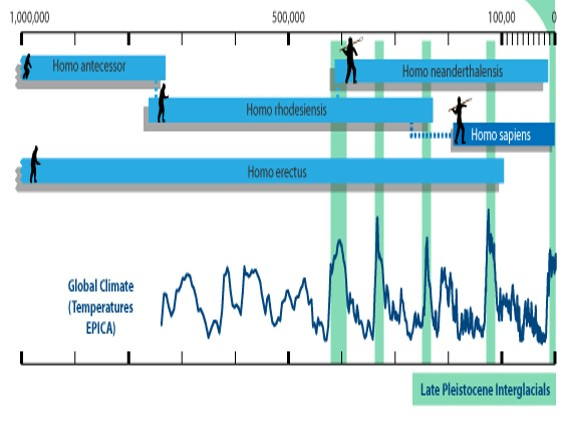

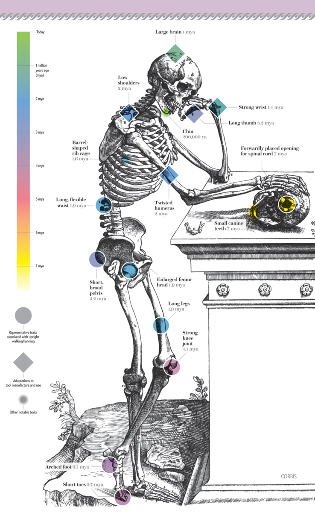

## 

- **H. sapiens just about everywhere by 15,000ya**
    + beyond other *Homo* spp.
    + Out competed other *Homo* spp.

- **Adapted to become ecological generalist/specialist**
    + able to persist anywhere (generalist)
    + able to persist in extreme places (specialist)

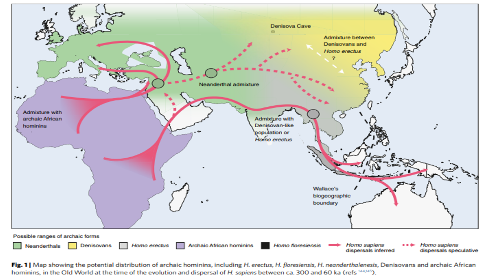

## Early Homo sapien migration altered the landscape

 

* **Humans have always been hunters**

 

* **Human arrival associated with biodiversity loss**
    + centered around larger animals
    + impacted whole ecosystems
 
  
 
- **Islands are great case studies**
    + New Zealand, Madagascar
 
  
 
- **Humans not the only reason**
    + related to big climate shifts
    
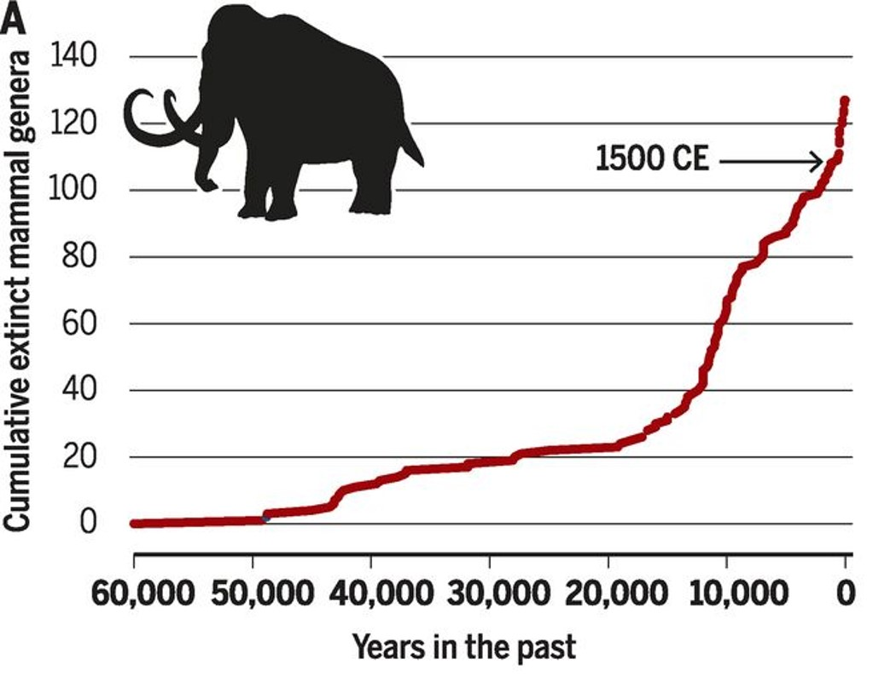
    
## H.sapien population increased slowly until farming (11,000ya)

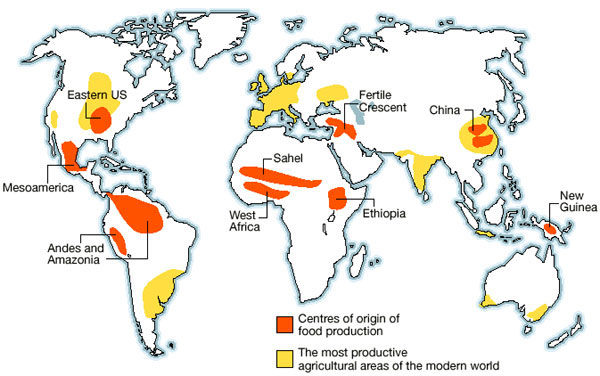

## Why does this matter for global change?

  
   
   
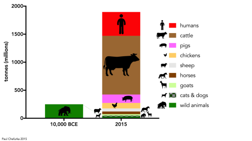

- **Over human history...**
    + **Biomass of terrestrial vegetation has halved**
    + **More than 20% reduction in biodiversity**
    + **At least one million species threatened with extinction**
    + **More than 70% of the Earths land surface has been altered by humans**
    + **Total global biomass of wild animals today is < 25% of what it was during the Late Pleistocene**
    + **Terrestrial vertebrates biomass today is represented by livestock (59%) and living human beings (36%)**.

