## What else is wrong with this representation?

 

**In addition to other harmful fallacies this cartoon propagates, it makes “being human” seem very simple, very separate, and very independent**

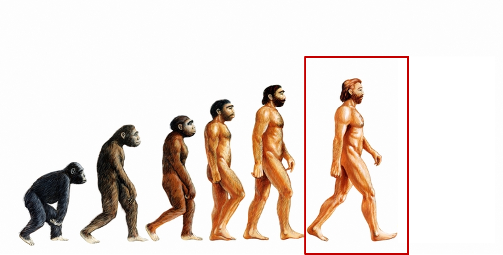

## The complexity of being human

 

**In addition to other harmful fallacies this cartoon propagates, it makes “being human” seem very simple, very separate, and very independent**

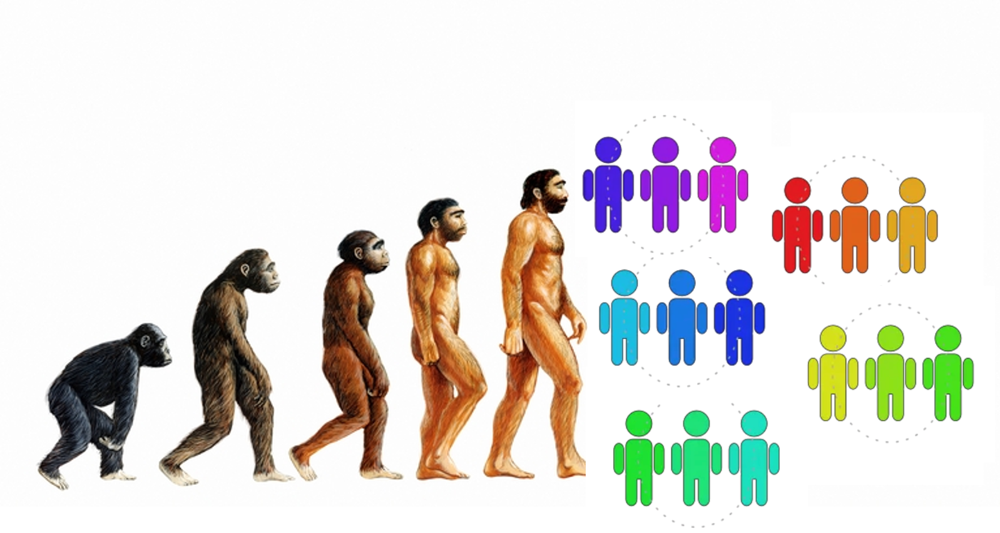

## The complexity of being human

 

**In reality, *Homo sapiens* wouldn’t exist without our complex evolutionary and ecological associations**

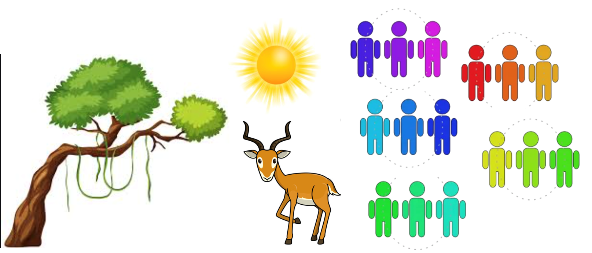

## The complexity of being human

 

**This isn’t only “external” but also internal**

## What does it mean to be *Homo sapiens*?

 

- **Example 1: your inner ecosystem**
    + >10,000 species occupy human body
    + 80-100 genera

 

- **39 trillion microbial cells including bacteria, viruses and fungi live on-in us**
    + 'cell-wise' the human body is 43% human
    
 

- **Human microbiome has 500x more genes than human**

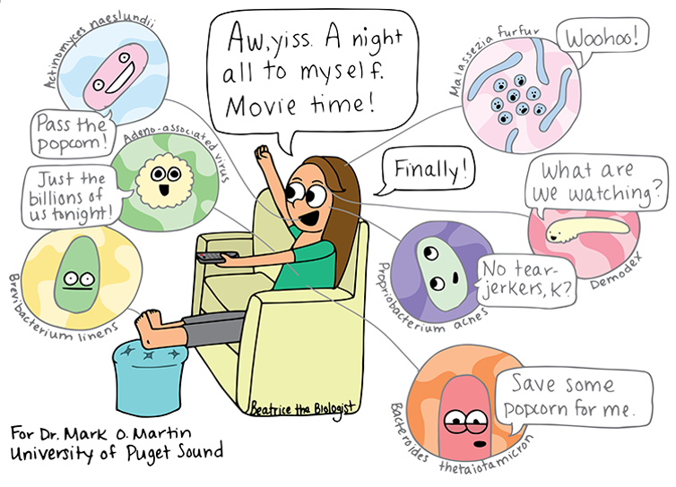

## How independent are we?

 

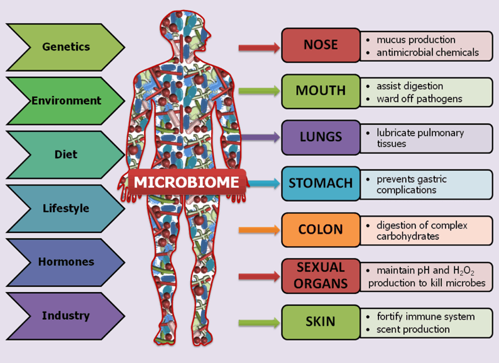

## What does it mean to be *Homo sapiens*?

 
 

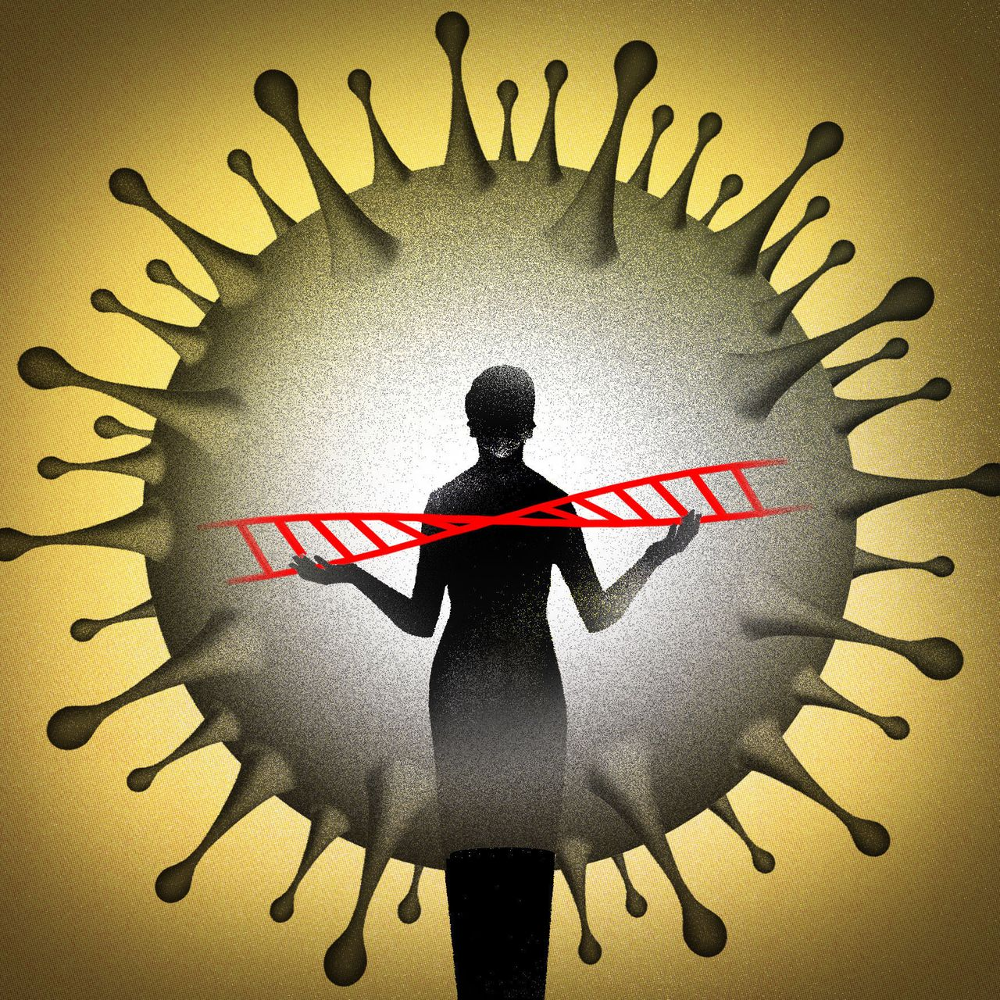

- **Example 2: (barely) hidden in your DNA**

 

- **~8% human genome is viral remnants**

 

- **~40% human genome is repetitive DNA which also likely has a viral origin**

 

- **100,000 pieces of ancient viral DNA live among our genes**
    + function, if any, has long been unclear
    

    
## What does it mean to be *Homo sapiens*?

 
 
 

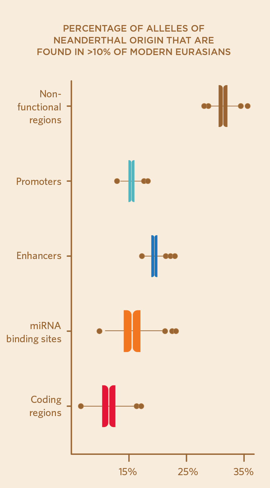

- **Example 2: (barely) hidden in your DNA**

 

- **Most humans have 2% Neanderthal DNA**
    + remember - both species co-existed and mated

 

- **Neanderthal allele variants range in diverse expression of skin and hair color to immune function and neuropsychiatric disease**
    + may gave left us prone to allergies!

## Review: Lots of overlap in hominins is space and time

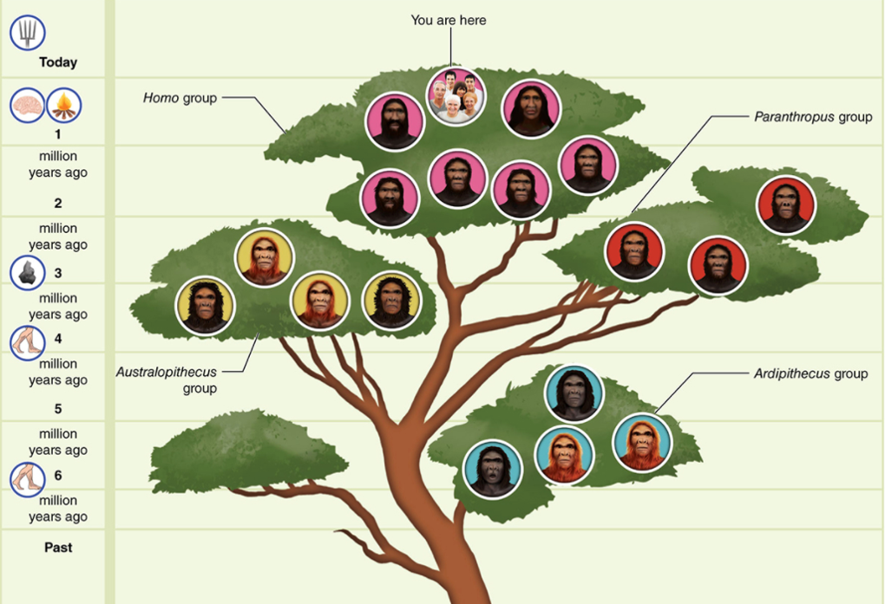

## *H.sapiens* overlapped with 2 others for 1,000s of years

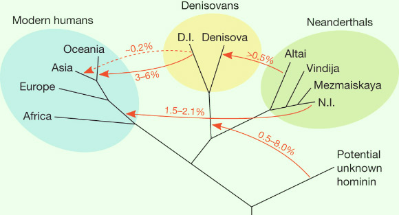

## H. neanderthalensis are our closest extinct relative

 
 
 

- **Modern molecular tools have been able to sequence Neanderthal and Denisovan genomes**

 

- **Denisovans left genetic traces in oceanic and Asian regions**
    + genomes of Australian aborigines, New Guineans and Pacific Islanders ~6% Denisovan

 

- **87 specific genes in modern humans are different from related genes in Neanderthals and Denisovan**           + potential clues for our survival?

## Meet the Data: Has proportion of shared ancestry changed?

**Fu et al. (2016) The genetic history of Ice Age Europe. Nature 534: 7606-7616**

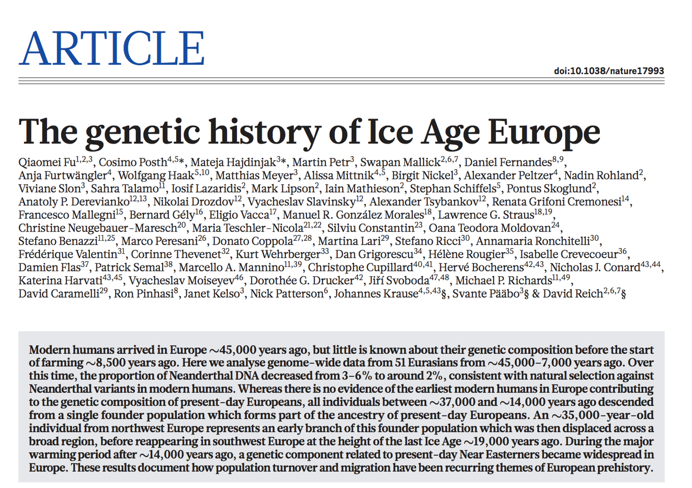

## Key questions from Fu et al. 2016

 

**Is there a particular part of the world where you would predict Neanderthal ancestry in modern human genomes would be particularly high? Why?**

 

**Do you expect the proportion of Neanderthal ancestry to increase, decrease, or stay constant over the last 50,000 years? Why?**

 

- **Data: genomes of 51 modern humans over a time series of Europe migration**
    + 45,000 - 7,000 years ago
    + taken from archaeological cites

 

- **Compared SNP's (single nucleutodie polymorphisms) to find variations across the genomes**
    + about 1 or out 1000 letters of code is a SNP

## What do the data show?

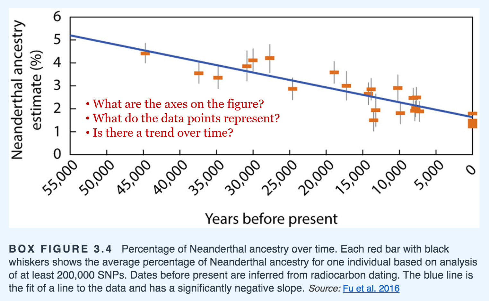

## Why would ancestral Neanderthal DNA be decreasing in modern humans?

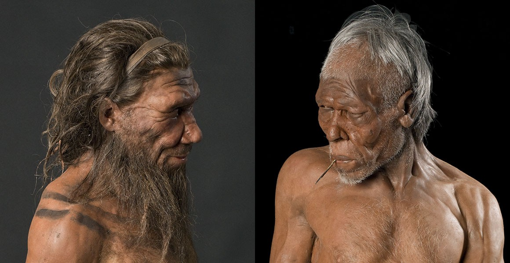

## Why did humans win the survival race?

- **Was it key 'human' traits?**
    + many of these were shared (bi-pedalism, tools)

 

- **Was it evolution of larger brains?**
    + our we that different than Neanderthals?

 

- **Was it fire?**
    + H.erectus may have used fire before we evolved

 

- **Was is related to social aspects**
    + survival of the friendliest

 

- **Was it related to our adaptability**?
    + climate was unpredictable
    
 

- **Was it something non-human?**
    + superior microbiome

 

 

 
- **Was it luck?**
    
 
   
 
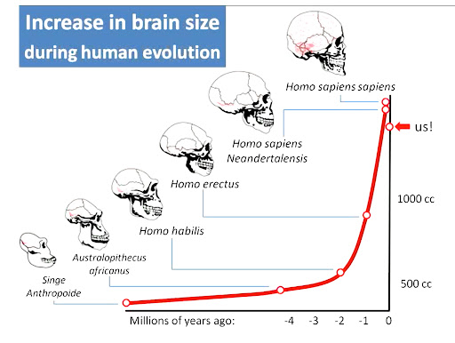

## Next up: Friday open-discussion of human impacts

 

- **Humans have existed for ~300,000 years**

 

- **For how long and in how many ways have *H.sapiens* altered Earth's systems and landscapes**

 

- **Find as many examples as you can**
    + Be creative in your search (scholarly or not)
    + think beyond Industrial Revolution and CO~2~

 

- **We will create a time line of influence on the board**
    + each of you will add something

     

- **We will then discuss what it all means**