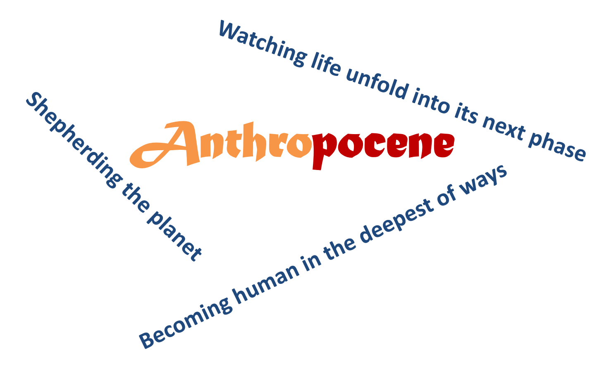
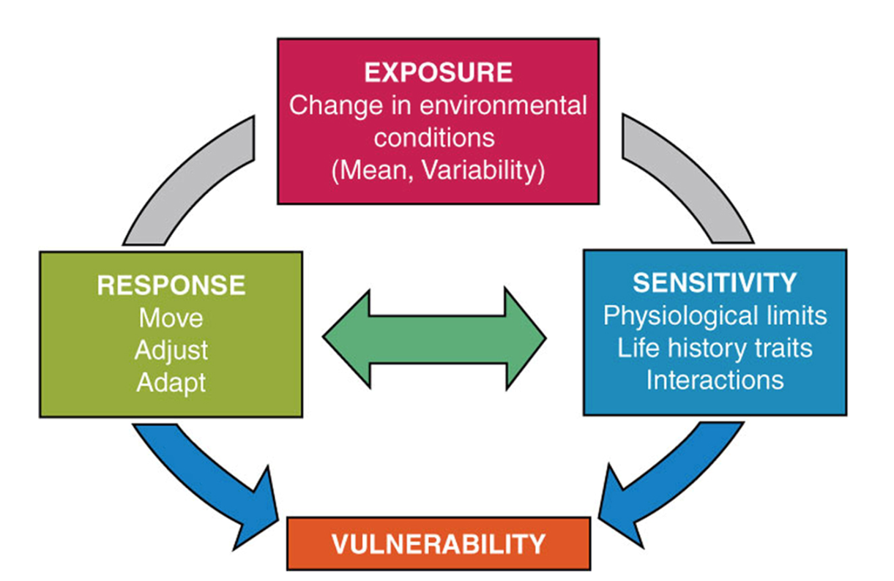
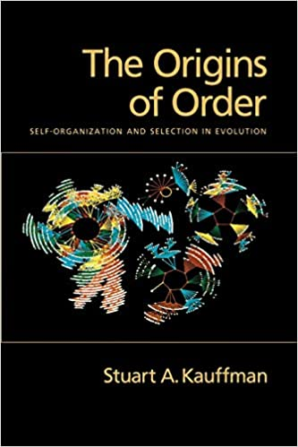
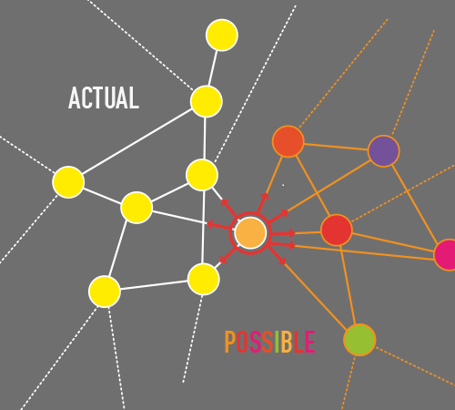
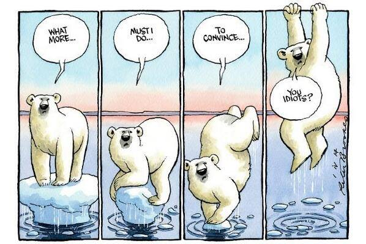
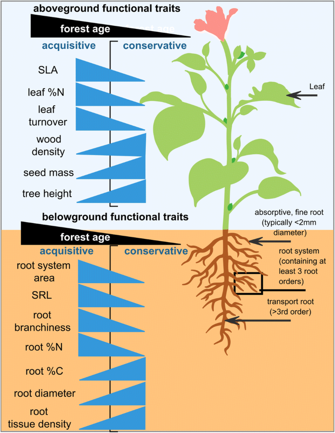
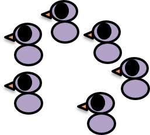
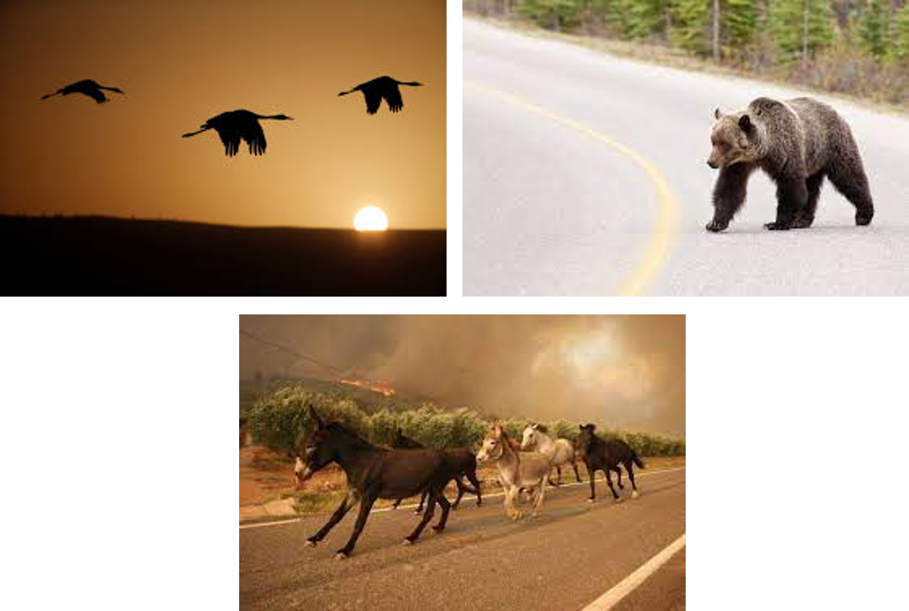
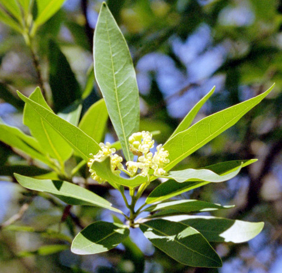
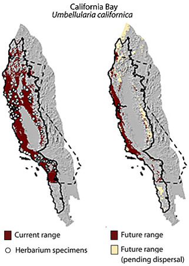

## Whats in a name: Revisting the Anthropocene

## Whats in a name: Revisting the Anthropocene

## The effect of global change on organisms

 
 
 

**Are human impacts like a hammer and biological systems a nail? **

 
 

**What are the problems with this analogy? (brainstorm with a partner)**

## The effect of global change on organisms

 
 

- **Hammer strikes have different characteristics**
    + Global change stressors can vary in magnitude, velocity, etc.

 

- **Nails have different characteristics**
    + Organisms vary in their vulnerability to global change stressors

 

- **Also… the nail can influence the hammer**
    + Living things can respond to global change stressors and affect the entire system

## The effect of global change on organisms

 

**Organisms have different elements of “vulnerability”**

 
**The degree to which a system is susceptible to adverse effects of global change is a function of:**

 

- **Exposure: The character, magnitude and rate of a perturbation**
    + How hard & fast does the hammer hit?

 

- **Sensitivity: Degree the system changes from a given perturbation**
    + Is the nail fragile or robust?

 

- **Response: Ability of a system to respond from perturbation**
    + Can the nail bounce back?

<!-- Good to add specific examples for each of these: -->

<!-- Shallower or deeper in ocean – which is more exposed? -->

<!-- Generalist or specialist – which is more sensitive? -->

<!-- X or y, which is more resilient? -->

## The effect of global change on organisms

**So organismal responses are critically important–**
 
**Organisms affect their own fate and also the dynamics of biotic systems as a whole **

## Humans now dominate and modify the planetary system 

 
 

- **As human populations continue to rise, so do the pressures placed in natural systems**

 

- **How do biological systems respond to human impacts on planet Earth?** 

 

- **Confronted with a changing world, what can organisms do?**

 

- **What we will consider in Unit II is: WHAT IS POSSIBLE?**

## The "Adjacent Possible' Theory - Stuart Kauffman

 

- **Theory proposes that biological systems are able to morph into more complex systems by making incremental, relatively less energy consuming changes in their make up**
    + small steps rather than extreme jumps or more distant possibilities

 

- **Kauffman was particularly interested in the origins of order and the mechanisms that drive self-organization, via evolution**
    + how the *actual* expands into the *adjacent possible*

## The "Adjacent Possible' theory - Stuart Kauffman

 

How the *actual* expands into the *adjacent possible*

 
 
 

- **The *actual* describes the system in its current state, with all its components and interconnections**

 

- **The *adjacent possible* contains the set of possibilities available to individuals, communities, institutions, organisms, productive processes, etc., at a given point in time during their evolutions**

## The adjacent possible for other species

 

**If environmental conditions are changing…what are the adjacent possible options for survival?**

 

**In physical space -> move**

 

**In physiological / behavioral space -> adjust**

 

**In genetic / adaptive space -> adapt**

 

**If no adjacent possible -> die**

 

**Responses are not mutually exclusive**

## The adjacent possible for other species

 
 

**If environmental conditions are changing…**
 
**what are the adjacent possible options for survival?**

 
 
 

- **What determines the adjacent possible?**
    + Organisms traits
        + developmental, physical, behavioral
    + Environmental features
    + Dynamics of change
    + etc.

## Organismal response to global change

 
 
 

- **Responses can occur at nested levels:**
    + individuals

## Organismal response to global change

 
 
 

- **Responses can occur at nested levels:**
    + individuals
    + populations
    + metapopulations
    + species
    + communities
    + ecosystems
    + biomes

## Core Response: Move (Chapter 5)

**Move: movement of *individuals* (dispersal, migration), *populations* or *species* (range changes)**
 
**QUESTION: How would you categorize different types of movement?**

## The adjacent possible for the move response

## The adjacent possible for the move response

