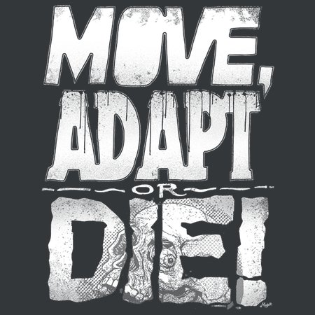
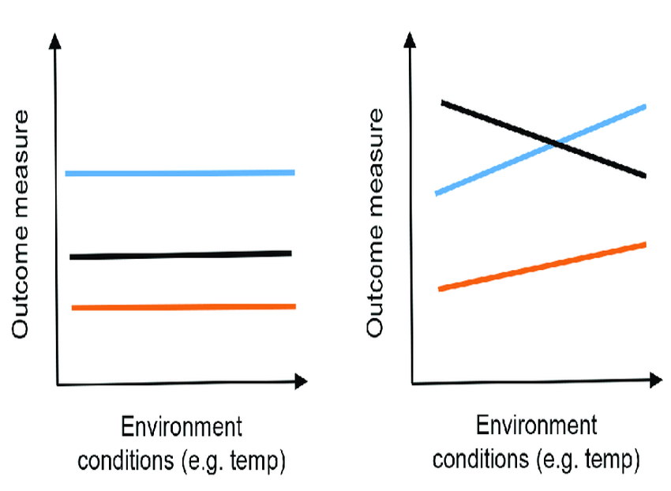
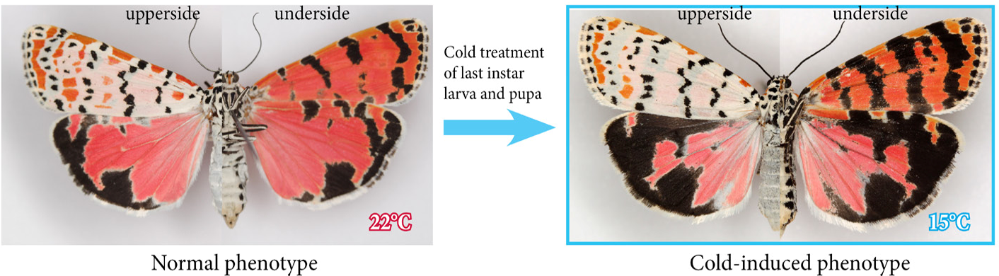
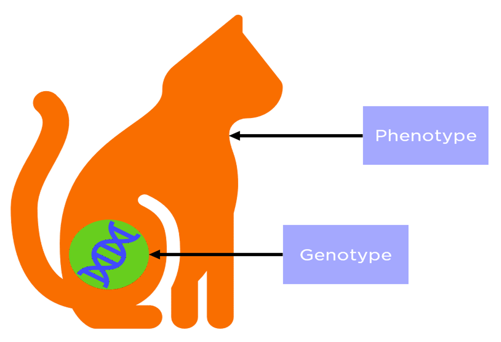
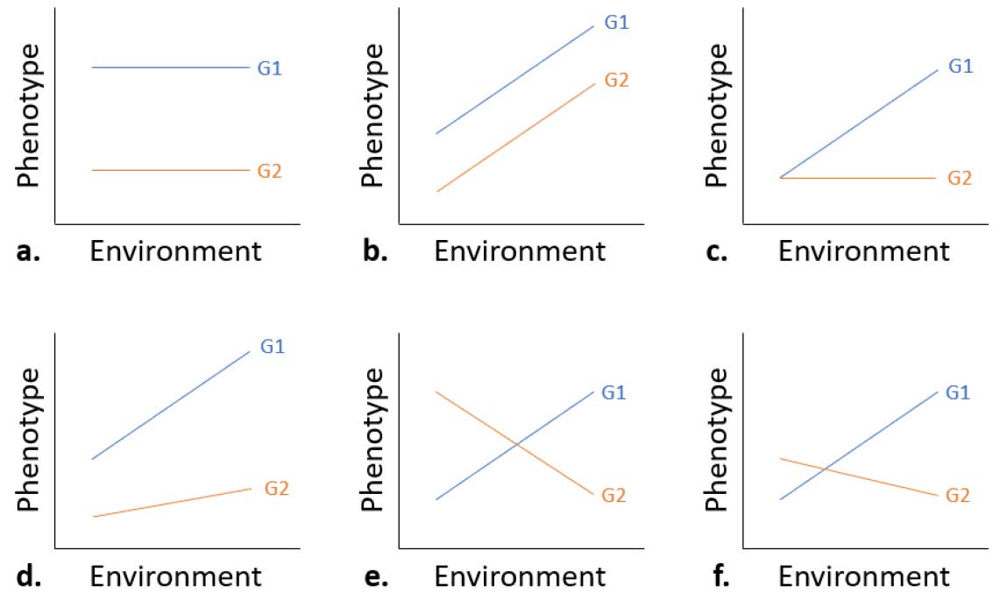
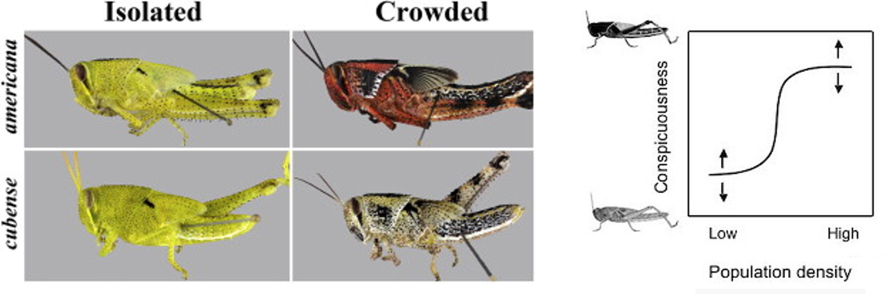
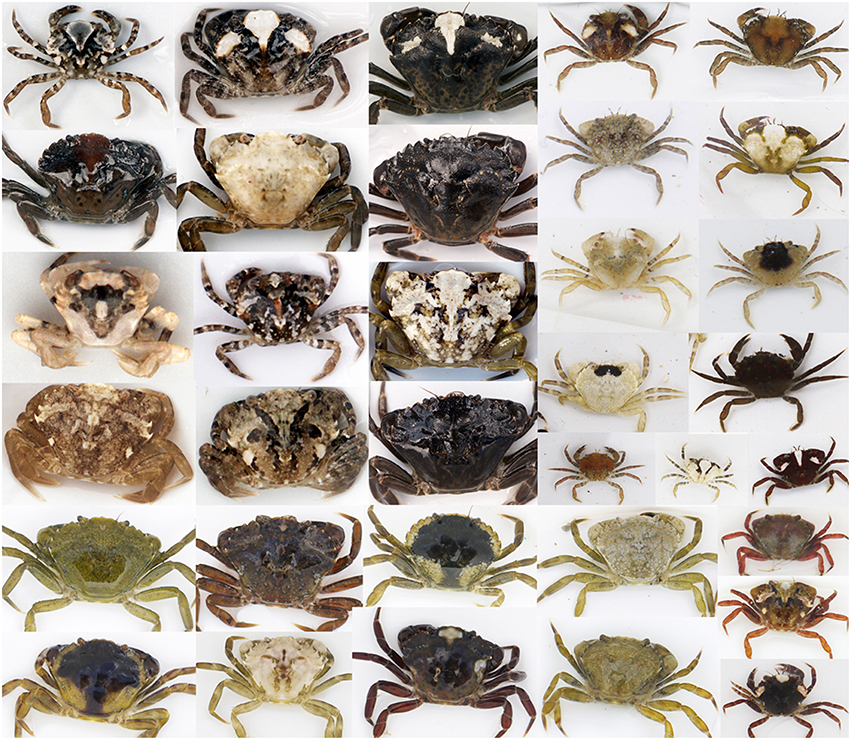
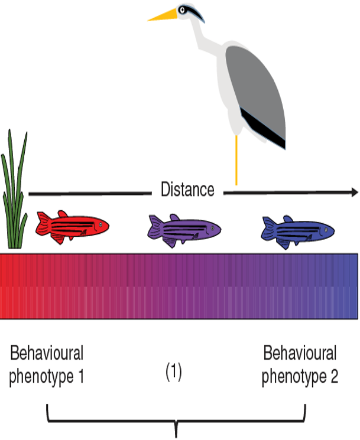

## The Adjacent Possible

**Confronted with a changing world, organisms can move, adjust, adapt, or die**

 

**In physical space -> move**

 

**In physiological / behavioral space -> adjust**

 

**In genetic / adaptive space -> adapt**

 

**If no adjacent possible -> die**

 

**Responses are not mutually exclusive**

## The Adjacent Possible for other species

**If environmental conditions are changing…**

 

 

* **What are the adjacent possible options for survival?**

 

* **What determines the adjacent possible?**
    + Organismal traits
    + Environmental features
    + Dynamics of change

 

* **Can a trait adjust?** 

##

## Organismal responses to change: Adjust

* **Adjust: non-genetic shifts in organismal traits in different environments**
    + *phenotypic plasticity*, acclimation, acclimitization

 

* **Adjust response happens at the *individual* level and within a *single* generation**
    + What does this mean?

## Organismal responses to change: Adjust

 

**Genotype: inherited genetic information **

 

**Phenotype: observable traits or characteristics**

 
 

**What is the connection between genotype & phenotype?**

 

**Genotype x Environment = Phenotype variation?**

 

**G x E interactions are the foundation of phenotypic plasticity**

## 

## What is phenotypic plasticity?

 

**When a single genotype can produce multiple phenotypes depending on environmental conditions**

 
 
 

* **Inducible defenses are classic example**
    + animals and plants
    + often fast
    + stabilize population dynamics
    + dedicated sensory systems to interpret the environment

 

**Daphnia produce horns and neck teeth in presence of predators**

## Density-induced grasshopper plasticity

**Plasticity can occur as a specturm of changes in a trait (not just off or on)**
 

**Grasshopper camoflauge and behavior is influenced by 'crowdedness'**

## Some shore crabs shift colors diurnally!

 
 
 
 

**Camouflage**

 

**Thermoregulation**

 

**Signaling for mating/competition**

 

**UV light protection**

## What is phenotypic plasticity?

 
**When a single genotype can produce multiple phenotypes depending on environmental conditions**

 
 
 

* **Plasticity doesn’t have to be for morphological traits.**

 

* **Physiological, developmental and behavioral traits can also exhibit plasticity**

 

* **Behavior has long been considered the 'most plastic' phenotypic trait** 
    + quickest response to temporal changes 
    + e.g., bird song frequency in urban environments

## What is phenotypic plasticity?

 
**When a single genotype can produce multiple phenotypes depending on environmental conditions**

 
 
 

* **Developmental plasticity: the ability of an individual to modify its development in response to environmental conditions**
    + might facilitate the evolution of novel traits

 

* **How developmental flexibility promotes innovations that persist over evolutionary time is unclear**

 

* **However, exposure to environmental variation is a characteristic feature of normal development**
    + do certain genotypes have the ability to produce different development outcomes?
    
##

## Are all traits plastic? 

 

* **Optimal responses to environmental challenges would include perfect plasticity**
    + organism possesses perfect information on its current environment
    + mechanisms to produce an appropriate phenotypic response at all points in development

 

* **Instead, traits exist on a spectrum that are determined exclusively by genetics and those influenced mostly by the environment**
    + no organism is entirely or infinitely plastic
    + what is the cost to evolving plasticity?
    
 

* **Interesting point: Organisms in heterogeneous (variable) environments are more likely to have selection of traits that can be plastic**
    + low genetic diversity can limit selection of plastic traits
    
## How do you test for phenotypic plasticity?

 
**How do you figure out if a trait is controlled by genes, the environment or both?**

## How do you test for phenotypic plasticity?

 
**Effect of genotype only (not phenotypically plastic under these conditions)**

## How do you test for phenotypic plasticity?

 
**Effect of environment only (YES phenotypically plastic under these conditions)**

## How do you test for phenotypic plasticity?

 
**Effect of both environment and genotype (genotype by environment interaction)**

## Are global change and the adjust response compatible?

