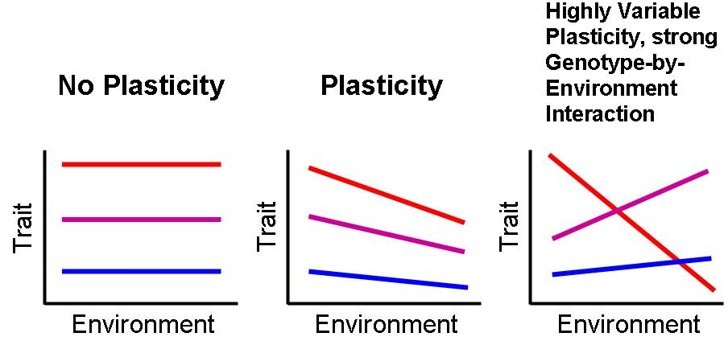
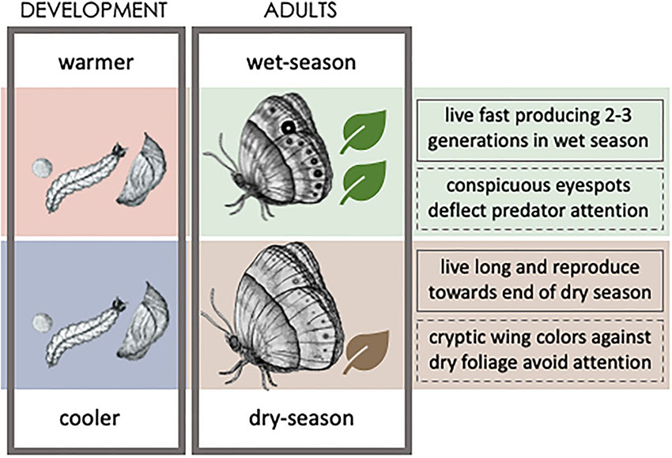
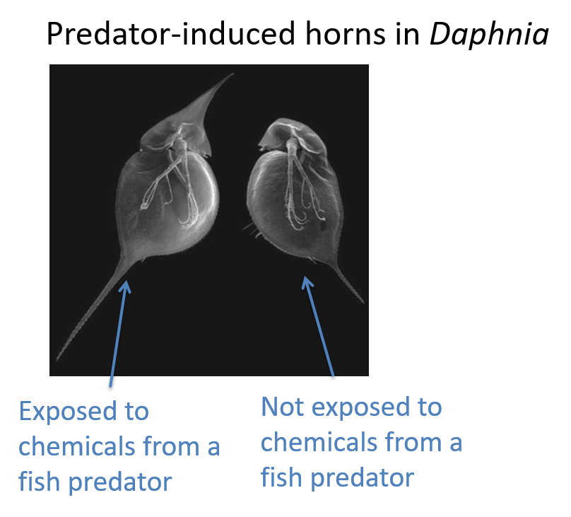
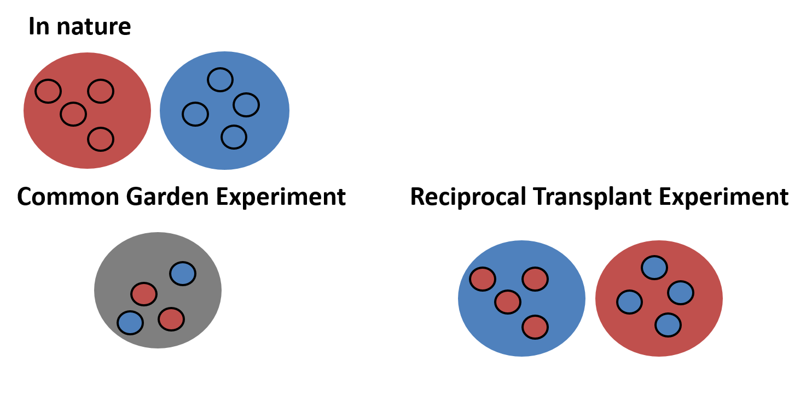
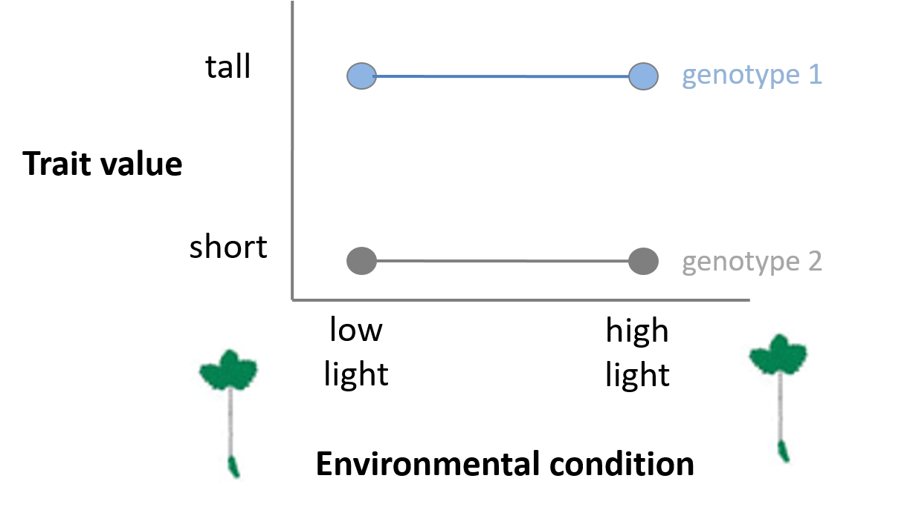
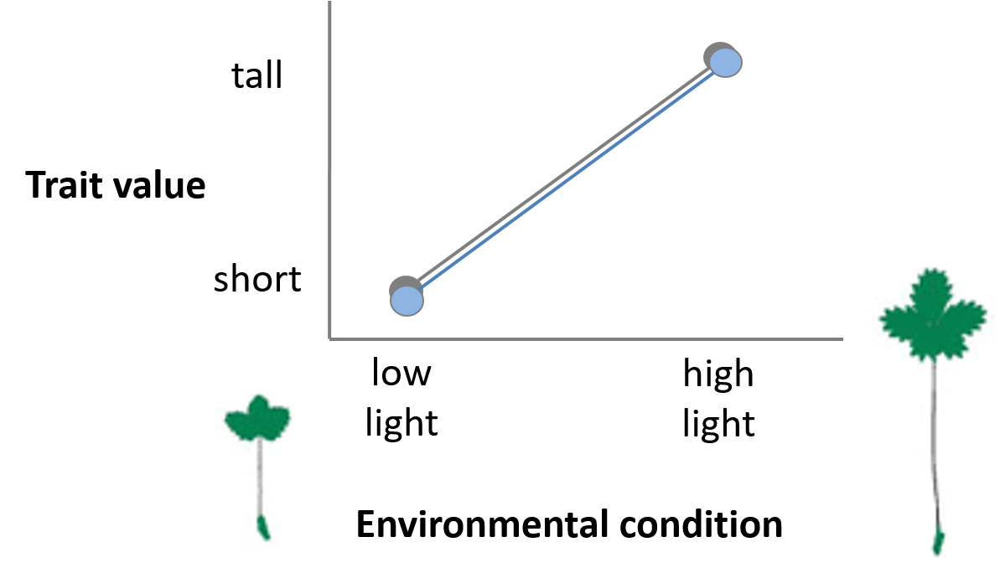
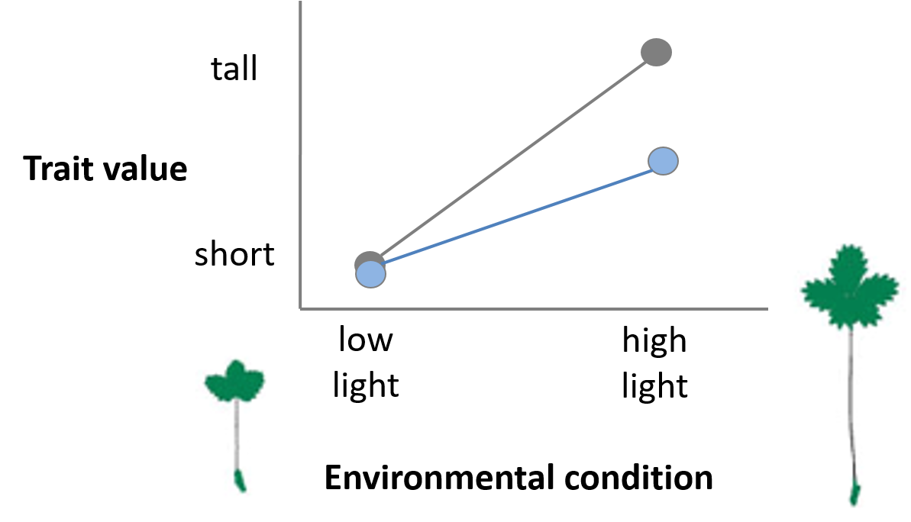

## The Adjacent Possible

**Confronted with a changing world, organisms can move, adjust, adapt, or die**

 

 

**In physical space -> move**

 

**In physiological / behavioral space -> adjust**

 

**In genetic / adaptive space -> adapt**

 

**If no adjacent possible -> die**

 

**Responses are not mutually exclusive**

## The Adjacent Possible for other species

 
 

**If environmental conditions are changing…**
 
**what are the adjacent possible options for survival?**

 

* **What determines the adjacent possible?**
    + Organismal traits
    + Environmental features
    + Dynamics of change

## The adjust response

**Adjust: non-genetic shifts in organismal traits in different environments**
    + *phenotypic plasticity*

 

**The adjust response happens at the level of the *individual* and happens within a *single* generation**

 

**What does this mean?!?**

## The adjust response

 

**Genotype: inherited genetic information **

 

**Phenotype: observable traits or characteristics**

 

**What is the connection between genotype & phenotype?**

 

**Genotype x Environment = Phenotype**

 

**G x E interactions are the foundation of phenotypic plasiticity**

## What is phenotypic plasticity?

**When a single genotype can produce multiple phenotypes depending on environmental conditions**

 
 
 

* **Inducible defenses are classic example**
    + animals and plants
    + oftern fast
    + stabilize population dynamics
    + dedicated sensory systems to interpret the environment

 

**Daphnia produce horns and neck teeth in presense of predators**

## Density-induced grasshopper plasticity

## Some shore crabs shift colors diurnally!

 
 
 

**Camouflage**
 

**Thermoregulation**

 

**Signaling**

 

**Protection from ultraviolet (UV) light**

## What is phenotypic plasticity?

**When a single genotype can produce multiple phenotypes depending on environmental conditions**

 

* **Plasticity doesn’t only have to be for morphological traits.**

 

* **Physiological, developmental and behavioral traits can also exhibit plasticity**

 

* **Behaviour has long been considered the 'most plastic' phenotypic trait** 
    + quickest response to temporal changes 

## What is phenotypic plasticity?

**When a single genotype can produce multiple phenotypes depending on environmental conditions**

* **Developmental plasticity, the ability of an individual to modify its development in response to environmental conditions, might facilitate the evolution of novel traits**

* **How developmental flexibility promotes innovations that persist over evolutionary time remains unclear**

## How do you test for phenotypic plasticity?

How do you figure out if a trait is controlled by genes, the environment or both?

## How do you test for phenotypic plasticity?

Effect of genotype only (not phenotypically plastic under these conditions)

## How do you test for phenotypic plasticity?

Effect of environment only (YES phenotypically plastic under these conditions)

## How do you test for phenotypic plasticity?

Effect of both environment and genotype (genotype by environment interaction)

