## How does phenotypic plasticity happen?

 

* **Instantaneous / instinctual responses**
    + behavior or physiology
    
 

* **Gene expression responses**
    + DNA -> RNA
    + increase or decrease production of RNA/proteins

 

* **Epigenetic responses**
    + mechanisms where DNA is not accessible for transcription
    + DNA still does not change
    + possibly inherited

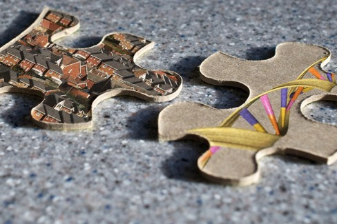

## Different types of genetic changes

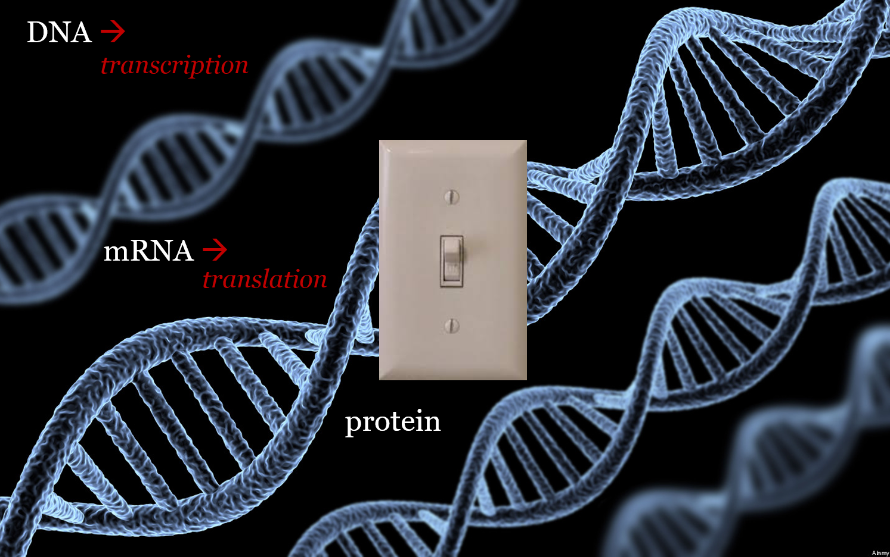

## Changes to DNA sequence underlie adaptation

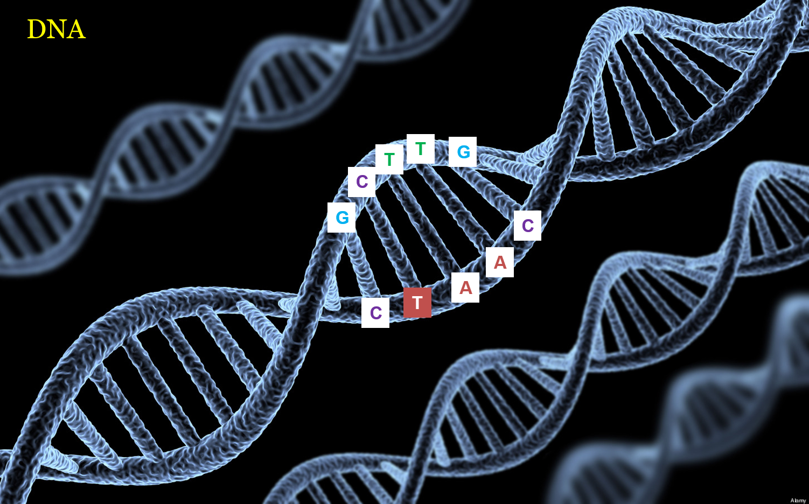

## Changes to gene expression underlie plasticity

## Changes to gene expression underlie plasticity

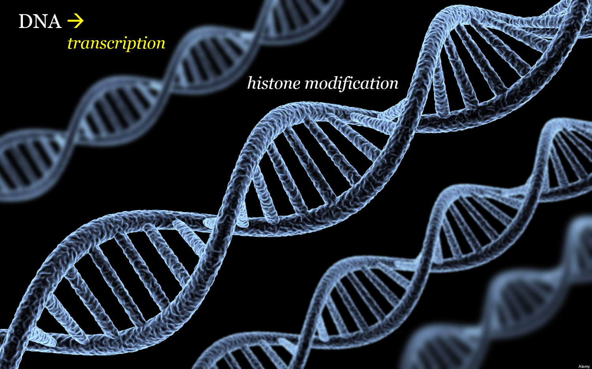

## Phenotypic plasticity: Instantaneous / instinctual response

 

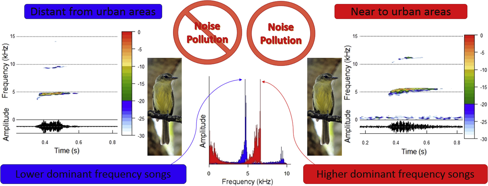

##

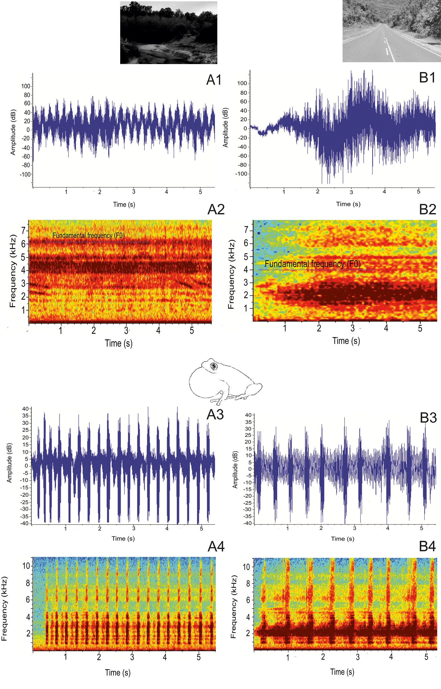

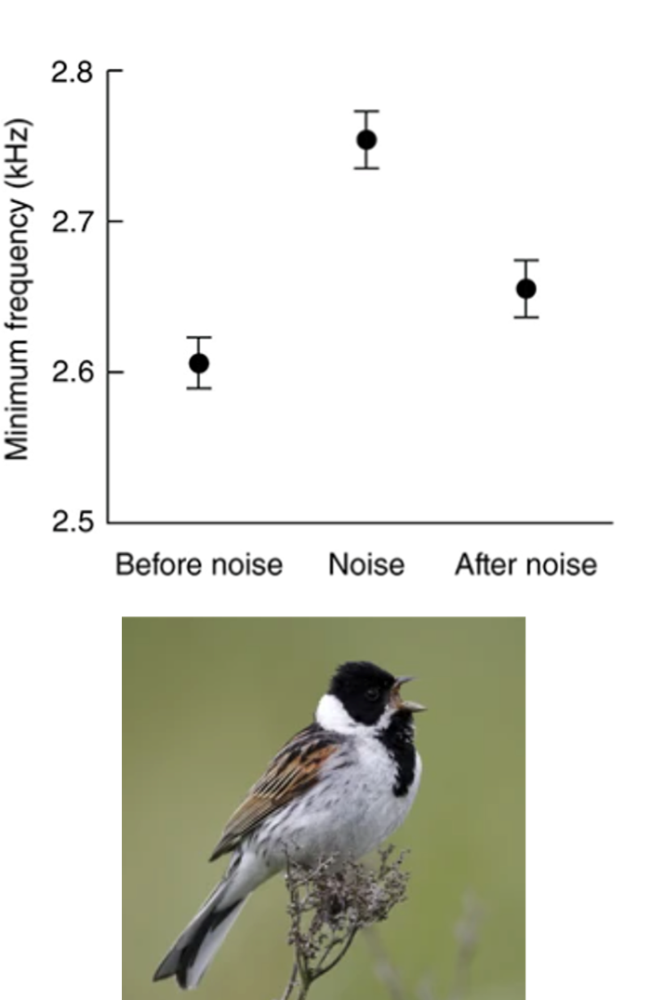

## Phenotypic plasticity: Instantaneous / instinctual response

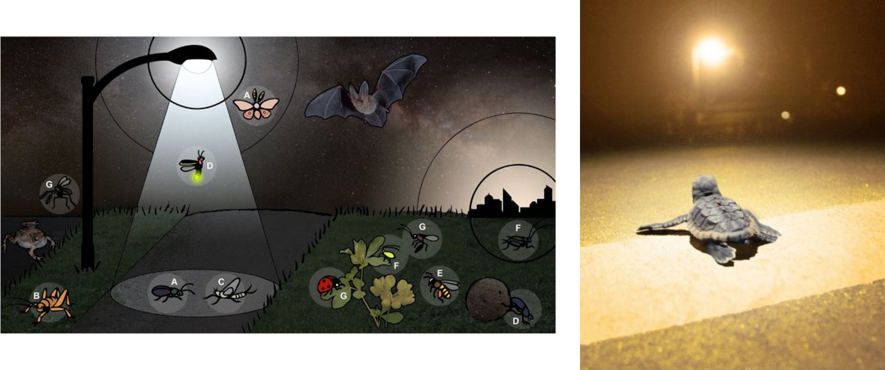

## Phenotypic plasticity: Gene expression responses

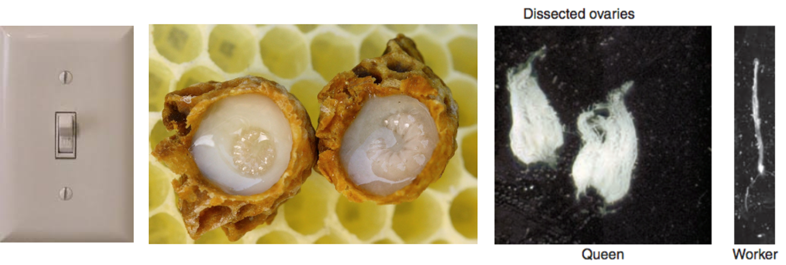

## Phenotypic plasticity: Gene expression responses

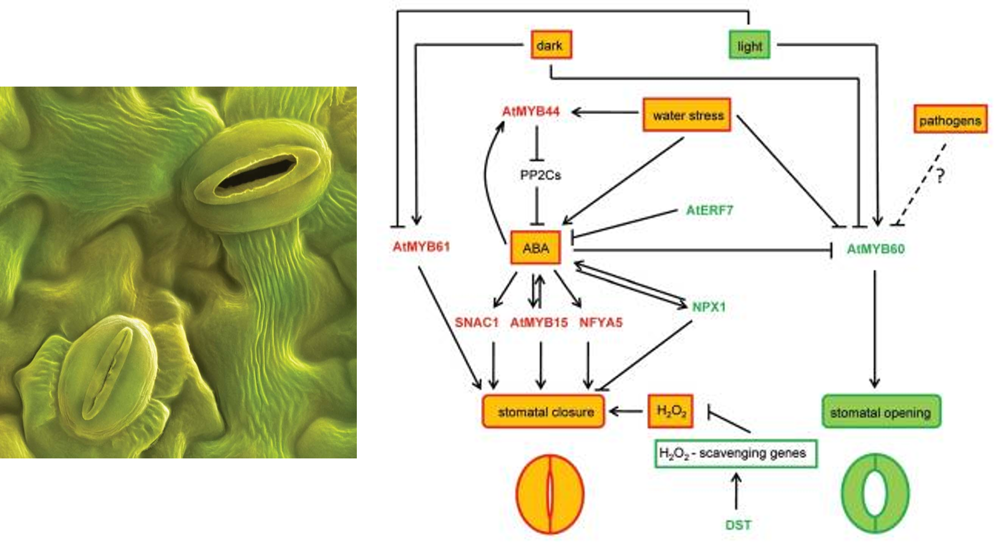

## Phenotypic plasticity: Epigenetic response

 

**Vinclozolin is a fungicide used by farmers to stop rot, mold and blight**

 

**Vinclozolin linked to great granddaughter's stress via DNA methylation**

 
 

**DDT, the first modern pesticide, has been banned in USA since 1972**

 

**Pregnant female mice fed DDT and their female offspring had a lower tolerance for cold temperature and were more obsese**

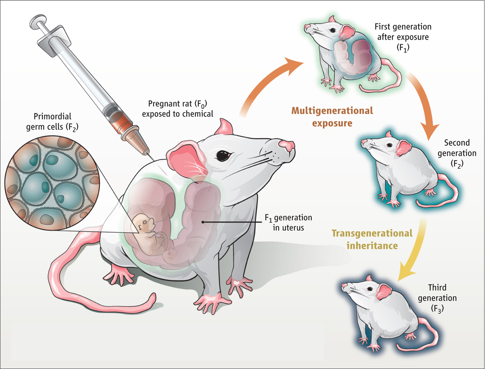

## Changes to gene expression underlie plasticity

**Traditionally, it was thought that changes to the sequence of DNA were heritable while changes to the expression patterns of DNA were not**

 

**That made it easy to define adaptation as “heritable genetic change” and plasticity as “non-genetic”**
 

**Epigenetics blurs those lines**

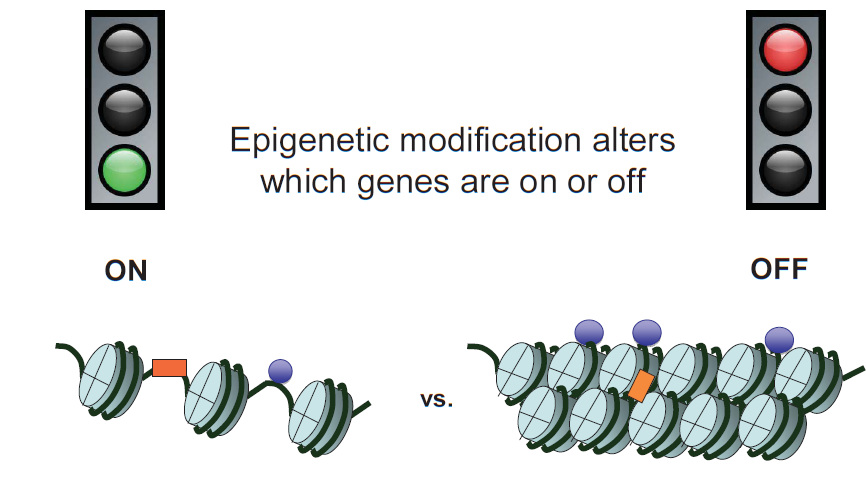

## The adjust response

**Adjust: non-genetic shifts in organismal traits in different environments (phenotypic plasticity)**

 

**The adjust response happens at the level of the individual and happens within a single generation (MOSTLY)**

 

**The adapt response (Chapter 7) happens at the level of the population and happens across generations**

 

* **Can plasticity and adaption be connected?**
    + can plasticity buy time: YES
    + can plasticity promote adaptive genetic change:?
        + phenotype produced with enhanced survival...
        + loss of plasticity after environmental change...
        + selection of more or less plasticity...

<!-- ## Meet the Data: Shifts with global warming -->
<!-- 
 -->

<!-- 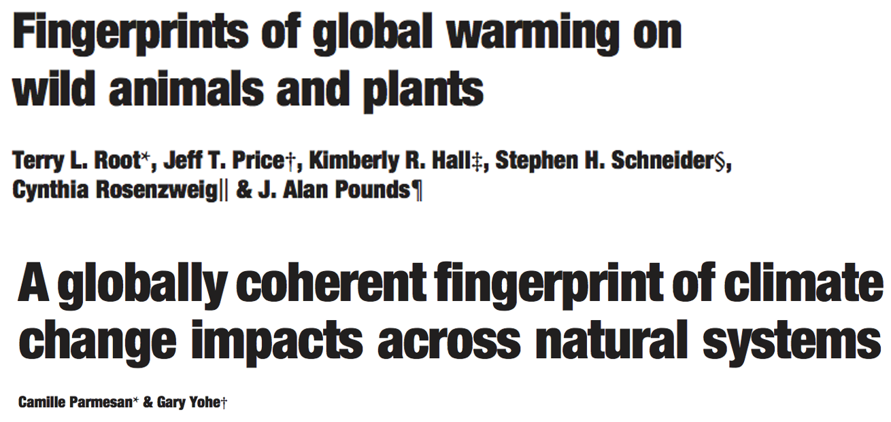 -->

## Meet the Data: Shifts with global warming

 

**What shifts (in space and time) do we see most commonly for organisms with global warming?**

 
 

* **Geographic shifts toward the poles**

 

* **Geographic shifts up in elevation**

 

* **Geographic shifts deeper in oceans**

 

* **Seasonal shifts earlier in the year**

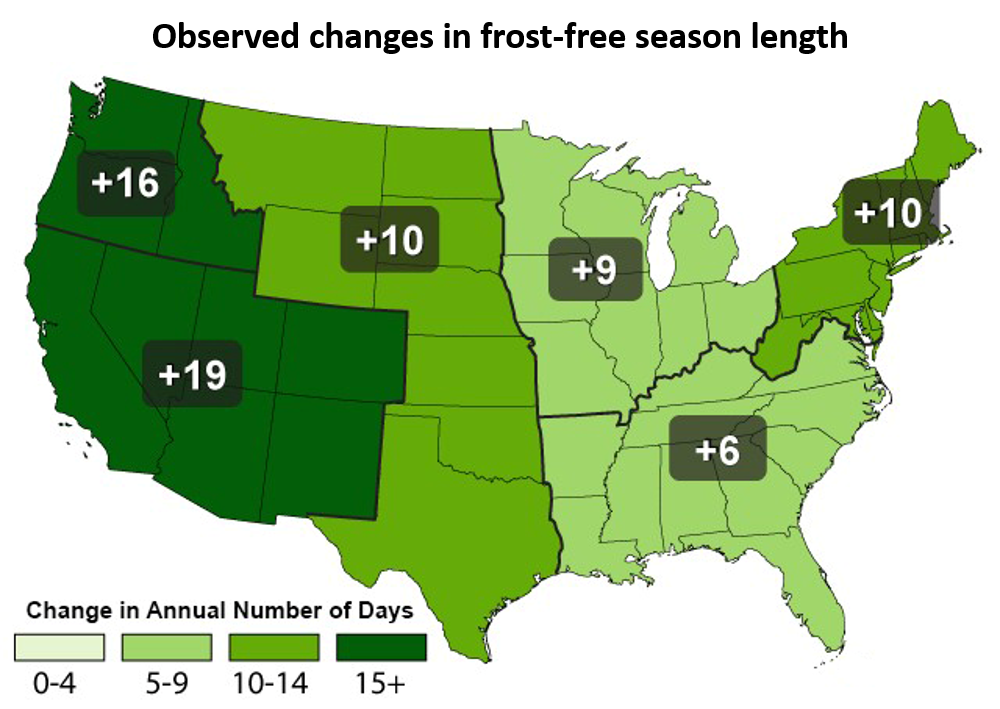

## Phenotypic plasticity in development: Examples from insects

**As ecotherms, temperature matters a lot for insect survival, development, dispersal, etc.**

 
**Insect life histories are tied to environmental factors **

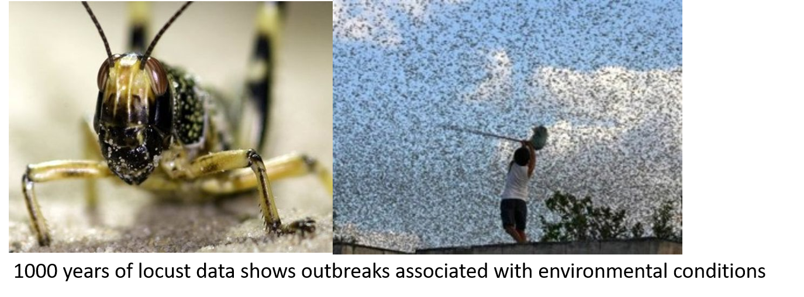

## Phenotypic plasticity in development: Examples from insects

 

* **Major effect of global warming on insects is to speed up developmental rates**
    + can lead to faster maturity

 
 

**In the UK >70% of butterfly species studies have earlier “first flight”**

 

**First flight is predicted to occur 2-10 days earlier for every 1°C**

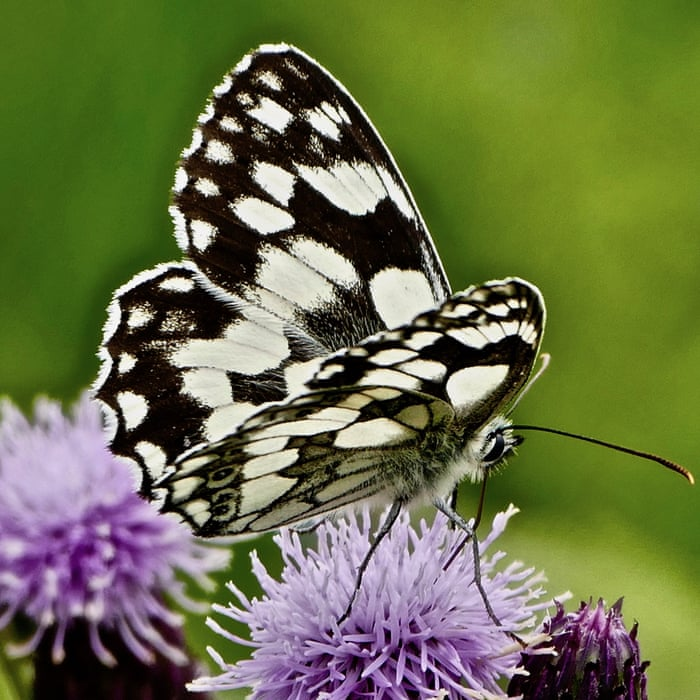

## Phenotypic plasticity in development: Examples from insects

 

* **Major effect of global warming on insects is to speed up developmental rates**
    + can lead to more generations per year

 
 

**Increase of temperatures by 2°C is predicted to allow some aphid species to produce an additional 4–5 generations per year.**

 

**Aphids are among the most destructive insect pests on cultivated plants**

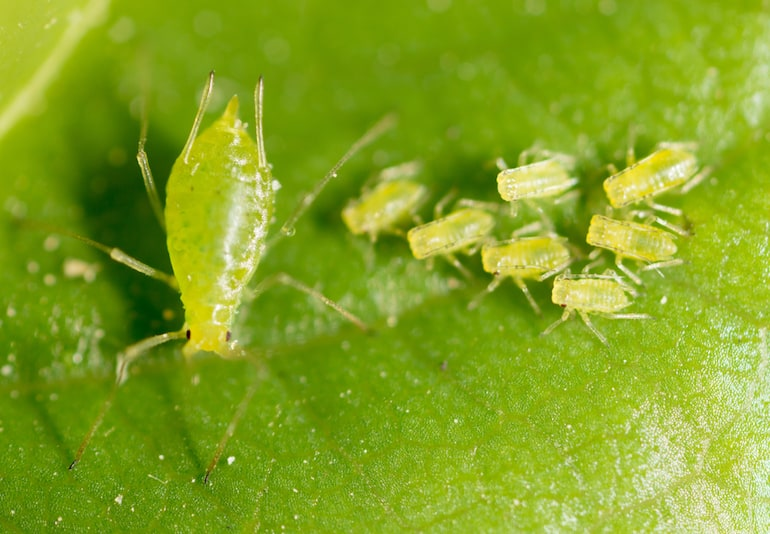

## Phenotypic plasticity in development

 

**Temperature-induced advancement in development is common and relates to a broader pattern…**

 

**Phenological changes: changes in periodic biological phenomena (like flowering, breeding, migration)**

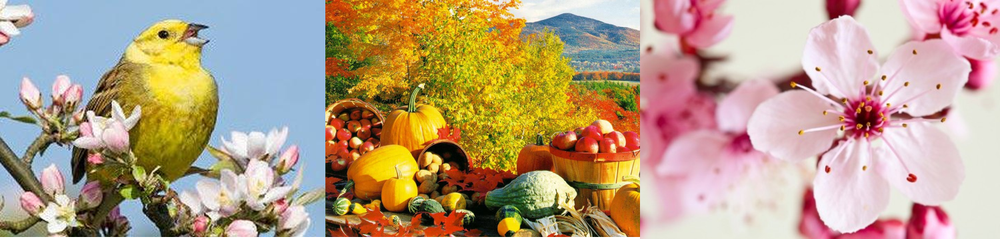

## Phenotypic plasticity in development

 

**2003 meta-analyses found an advancement of an average of 2.3 days per decade**
 

**Remarkably consistent across groups (and that was 20 years ago!!!)**

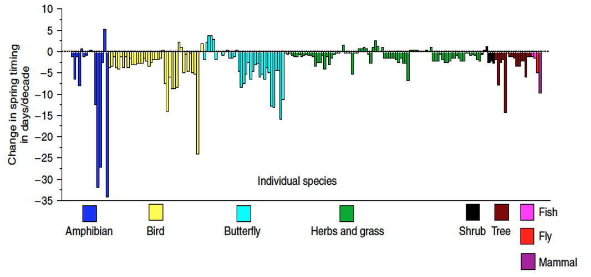

## Phenotypic plasticity in development

 

* **With global warming we expect many temperature dependent processes to occur earlier in the year**
    + Even a few days matters

 

**Phenological mismatch: When interacting species are no longer temporally or spatially aligned (Chapter 9)**

 

* **Biodiversity loss is linked with Phenological mismatches**
    + no organisms is infinitely plastic
    + mismatches impact many species in food webs

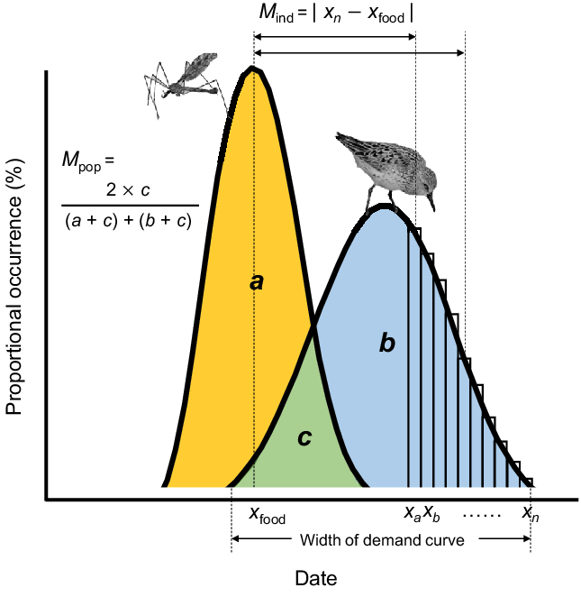

## Friday Discussion: Can Humans *Adjust* to Global Change?

 

* **Previous journal club message: Humans have high adaptive capacity..**
    + what about short-term change?

 

* **What evidence exists? Past, present and/or future**
    + can we acclimate to .....
    + what traits are plastic (or not)
    + human behaviorial shifts...

 

* **Be prepared to discuss what you found as well as your opinion on if it is possible**

 

* **Submit an article/finding on Brightspace for participation**

## Case Study: Limpopo National Park

 
 
 
 
 
 
 
 
 

**Village communities used the region before the establishment of Limpopo National Park **

 

**After the park’s establishment, village communities live within the park buffer zone**

 

**The buffer zone is an important area for wildlife **

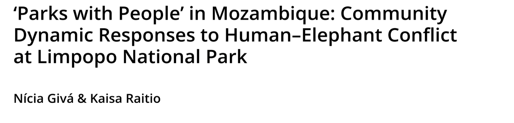

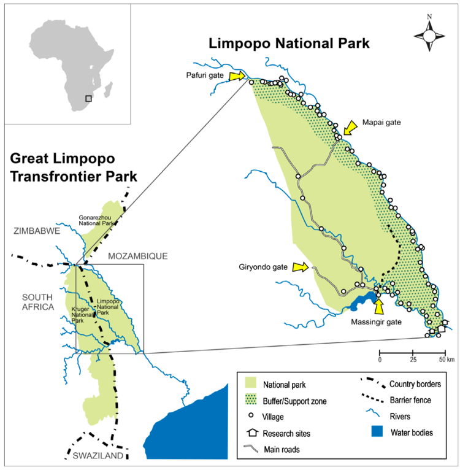

## People, Parks, and Climate Change

 

**Strategies Dealing with Drought before the National Park**

 
 

* **Small plots in multiple areas**
 
* **Sharing plots**
 
* **Seeding at every rainfall**
 
* **Temporary migration**
 
* **Crop mixing**

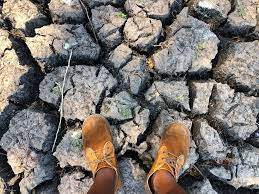

## People, Parks, and Climate Change

 

**Strategies Dealing with Drought before the National Park**

 
 

**WILDLIFE: As drought intensifies, elephants compensate by increasing usage of areas nearest the river, including crop fields**

 

**HUMAN: Village communities respond by using fencing and altering cropping practices **

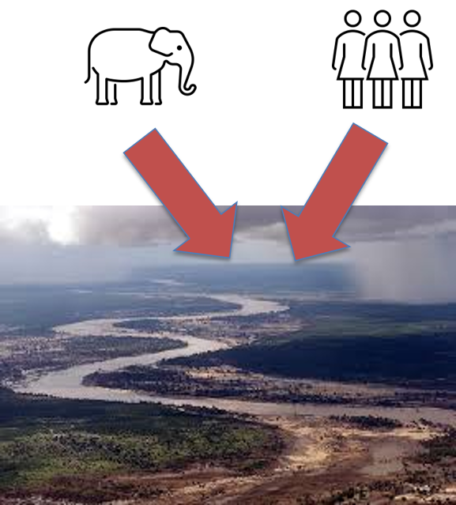

## People, Parks, and Climate Change

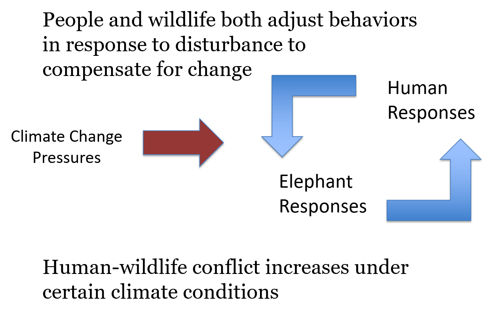

