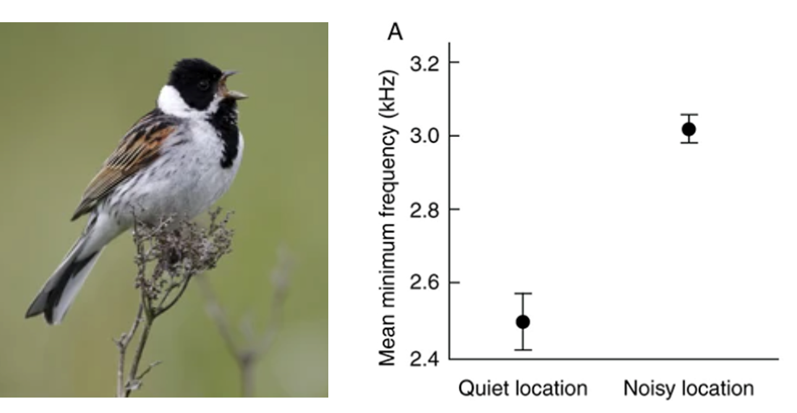
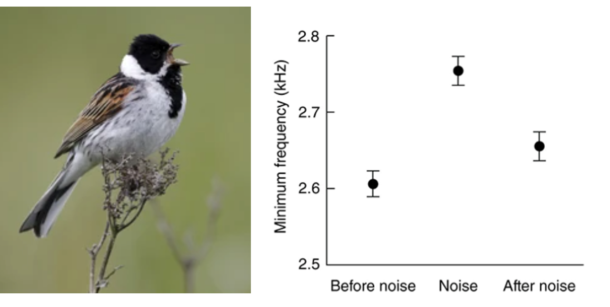
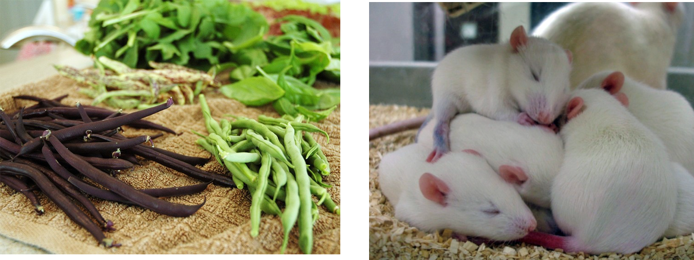
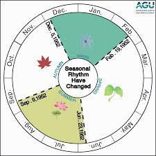
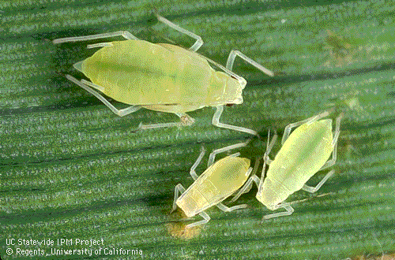
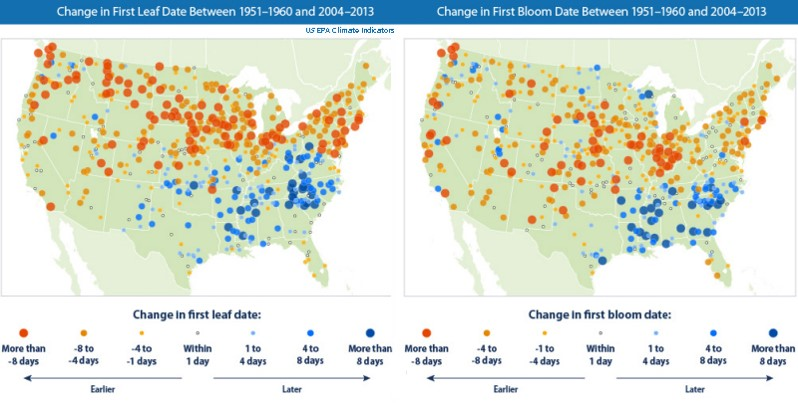

## How does phenotypic plasticity happen?

 
 

* **Instantaneous / instinctual responses**

 

* **Gene expression responses**
    + DNA -> RNA

 

* **Epigenetic responses**
    + whet
    + study of how your behaviors and environment can cause changes that affect the way your genes work

## How does phenotypic plasticity happen?

 

* **Instantaneous / instinctual responses**

## How does phenotypic plasticity happen?

 

* **Instantaneous / instinctual responses**

## How does phenotypic plasticity happen?

 

* **Gene expression responses**

## How does phenotypic plasticity happen?

 

* **Epigenetic responses**

## Different types of genetic changes

## Changes to DNA sequence underlie adaptation

## Changes to DNA sequence underlie plasticity

## Changes to DNA sequence underlie plasticity

## Changes to DNA sequence underlie plasticity

 

**Traditionally it was thought that changes to the sequence of DNA were heritable while changes to the expression patterns of DNA were not**

 

**That made it easy to define adaptation as “heritable genetic change” and plasticity as “non-genetic”**

 

**But those lines are becoming blurred as we learn about mechanisms (like histone modification) that can make gene expression changes heritable**

## The problem of concepts…

## The adjust response

 

**Adjust: non-genetic shifts in organismal traits in different environments (phenotypic plasticity)**

 

**The adjust response happens at the level of the individual and happens within a single generation**

 

**The adapt response happens at the level of the population and happens across generations**

## Case Study: Limpopo National Park

 
 
 
 
 
 
 

**Village communities used the region before the establishment of Limpopo National Park **

 

**After the park’s establishment, village communities live within the park buffer zone**

 

**The buffer zone is an important area for wildlife **

## People, Parks, and Climate Change

 

**Strategies Dealing with Drought before the National Park**

 
 

* **Small plots in multiple areas**
 
* **Sharing plots**
 
* **Seeding at every rainfall**
 
* **Temporary migration**
 
* **Crop mixing**

## People, Parks, and Climate Change

 

**Strategies Dealing with Drought before the National Park**

 

**WILDLIFE: As drought intensifies, elephants compensate by increasing usage of areas nearest the river, including crop fields**

 

**HUMAN: Village communities respond by using fencing and altering cropping practices **

## People, Parks, and Climate Change

## Meet the Data: Shifts with global warming

## Meet the Data: Shifts with global warming

 

**What shifts (in space and time) do we see most commonly for organisms with global warming?**

 
 

* **Geographic shifts toward the poles**
 

* **Geographic shifts up in elevation**
 

* **Seasonal shifts earlier in the year**

## Phenotypic plasticity in development

**Example from insects: As ecotherms, temperature matters a lot for insect survival, development, dispersal, etc.**
 
**Insect life histories are very tied to environmental factors **

## Phenotypic plasticity in development

* **For example, a major effect of global warming on insects is to speed up developmental rates**
    + can lead to faster maturity

 
 

**In the UK >70% of butterfly species studies have earlier “first flight”**

 

**First flight is predicted to occur 2-10 days earlier for every 1°C**

## Phenotypic plasticity in development

* **For example, a major effect of global warming on insects is to speed up developmental rates**
    + can lead to more generations per year

 
 
 

**increase of temperatures by 2°C is predicted to allow some aphid species to produce an additional 4–5generations per year.**

## Phenotypic plasticity in development

 

**Temperature-induced advancement in development is common and relates to a broader pattern…**

 

**Phenological changes: changes in periodic biological phenomena (like flowering, breeding, migration, etc.)**

## Phenotypic plasticity in development

 

**2003 meta-analyses found an advancement of an average of 2.3 days per decade**
 
**Remarkably consistent across groups (and that was 20 years ago!!!)**

## Phenotypic plasticity in development

**With global warming we expect many temperature dependent processes to occur earlier in the year**
    + Even a few days matters…**
    + Phenological mismatch: When interacting species are no longer temporally or spatially aligned (we will return to this in Chap 9)**

## Friday Discussion: Can Humans Adjust to Global Change?

 

* **Journal Club message: Humans have high adatptive capacity..**
    + what about short term change?

 

* **What evidence exists? Past, present and/or future**
    + can we acclimate to .....
    + what traits are plastic (or not)

 

* **Be prepared to discuss what you found as well as your opinion on if it is possible**

 

* **Submit an article/finding on Brightspace for participation**

