## Other approaches to study natural selection

 
 
 

**Museum specimens provide resource for comparisons over time, but many traits cannot be measured from specimens**

 

**What if researchers could have access live animals from a historical time point that had frozen in time?**

 

**For some species, seeds, eggs, cysts, spores can be preserved in soil or ice and revived years or even centuries later**

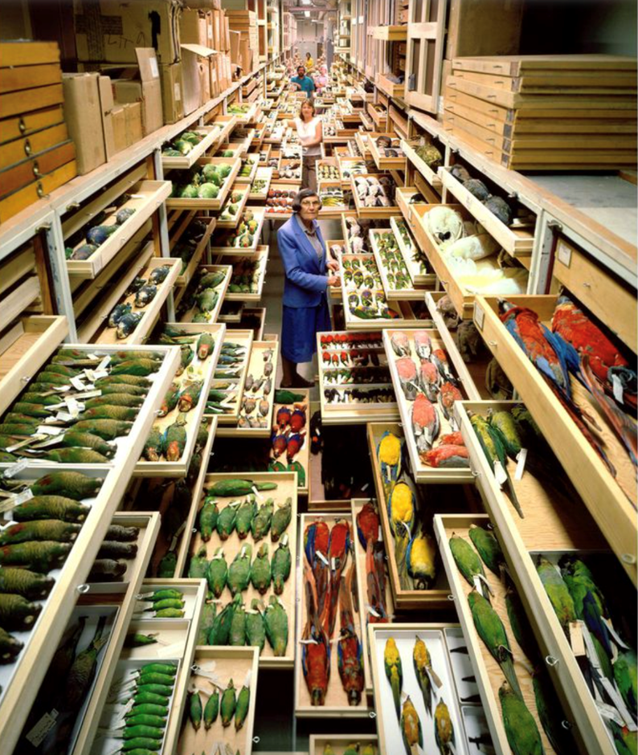

## Case study: *Daphnia*

 
 
 
 
 
 
 
 
 

**Question: Can *Daphnia* evolve to cope with global warming?**

 

**Approach 1: Experimental evolution**
 
  

**Approach 2: Resurrection ecology**

  
 
**CTmax - upper threshold of temperature that an organism can function normally**

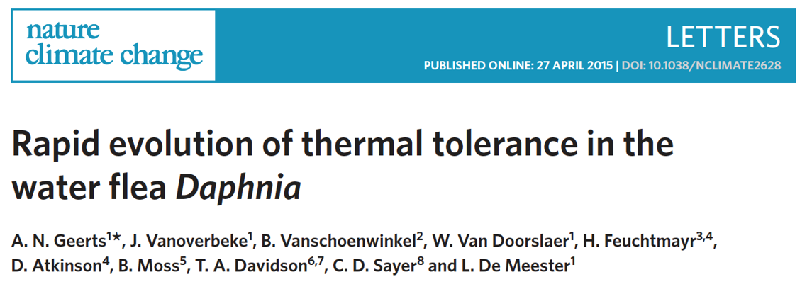

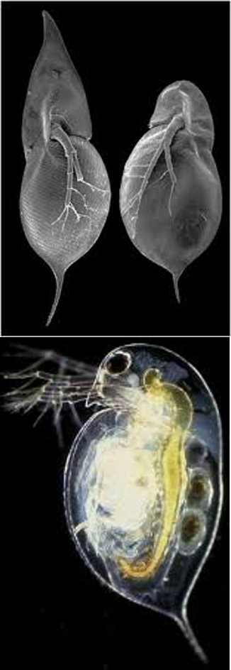

## Case study: *Daphnia*

 

**Approach 1: Experimental evolution - Evolved *Daphnia* under control and warmed conditions for 2 years**

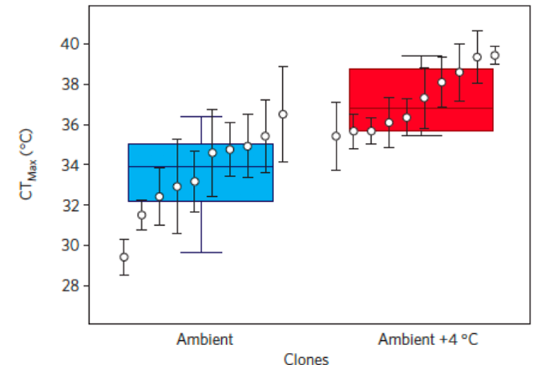

## Case study: *Daphnia*

 

**Approach 2: Resurrection ecology - Hatched *Daphnia* from historic and contemporary sediment layers**

 
 
 
 
 
 
 
 
 
 
 
 
 
 
 
 

**Conclusion: Thermal tolerance in *Daphnia* can evolve over short time scales in response to global warming**

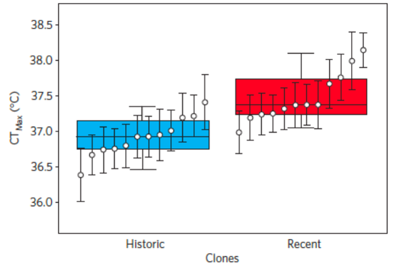

## Case study: *Daphnia* can evolve....so what?

 

**Daphnia not only interact strongly with its phytoplankton food resource, but also with other components of marine food webs**

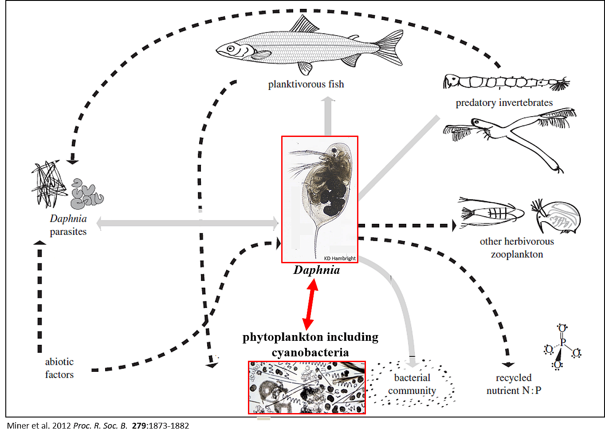

## Current climate change threaten 16% of species with extinction

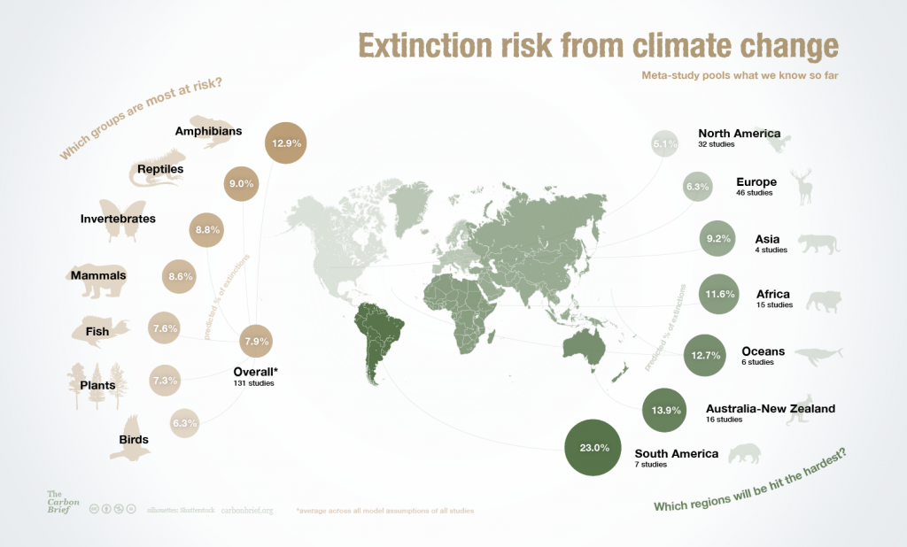

## Can adaptation prevent extinction?

 

* **Evolutionary rescue? = process by which a population—that would have gone extinct in the absence of evolution—persists due to natural selection**

 

* **So far, not been shown to be common in nature**
    + cricket versus fly parasitoid
    
 

* **Experimentally - more common**
    + yeast evolving to tolerate previously lethal salt concentrations

 

* **Can strong selection have risks?**
    + can species adapt to multiple global change stressors?
 
   
 
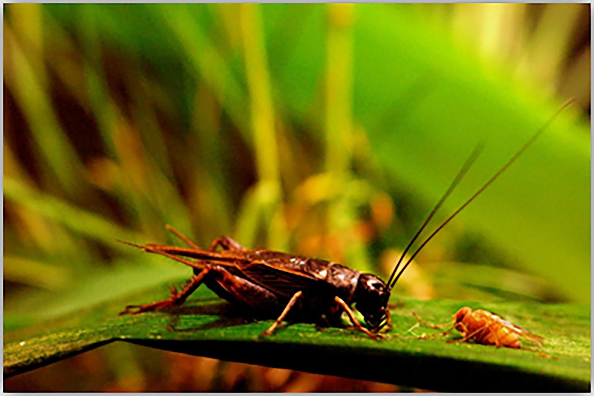

## Are there limits to adaptation?

 
 
 
 

**Some organisms can adapt rapidly, but not always rapidly enough**

 

**What happens when the rate of environmental change exceeds the ability of populations to adapt?**

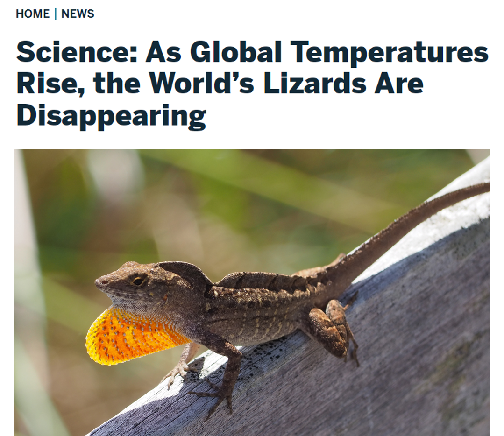

## Are there limits to adaptation?

 

**Some organisms can adapt rapidly, but not always rapidly enough**

 

**For example, some populations do not have enough genetic variation to track forecast changes in climate**

 

**A 2°C rise in the next 60 years (12 birch generations) is predicted to advance budburst by 40 days**

 

**Billington & Pelham (1991) predicted how much change would need to occur per generation versus current population variation**

 

**Predicted change would be impossible**

## Traits that facilitate adaptation

 

**Why can some species evolve quickly enough to cope with global warming while others can’t?**

 

**What traits make a species more likely to exhibit the adapt response?**

 

**BRAINSTORM: All else being equal, we expect higher likelihood of adaptation in organisms with…**

## Traits that facilitate adaptation

 
 
 
 

**Higher trait heritability (for the relevant traits)**

 

**Adaptation cannot occur if a trait is not inherited**

 

**Heritability varies by trait**

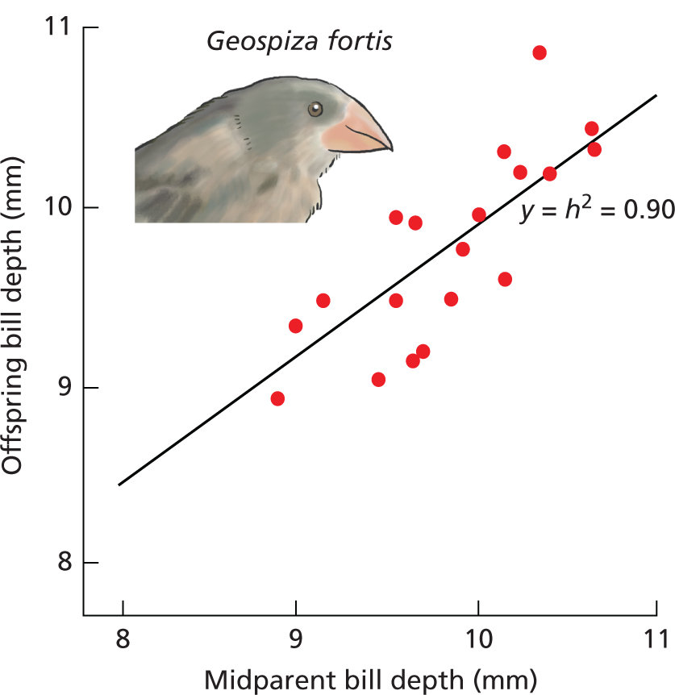

## Traits that facilitate adaptation

 

**More existing genetic variation (in relevant traits)**

 

**Adaptation from existing or “standing” genetic variation can be fast because the population does not have to “wait” for new mutations to occur.**

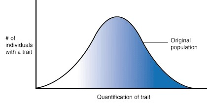

## Traits that facilitate adaptation

 

**More existing genetic variation (in relevant traits)**

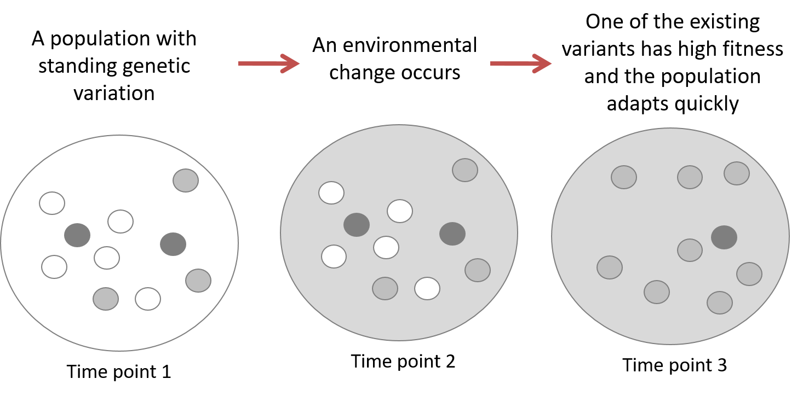

## Traits that facilitate adaptation

 

**Contrast that with waiting for a new mutation**

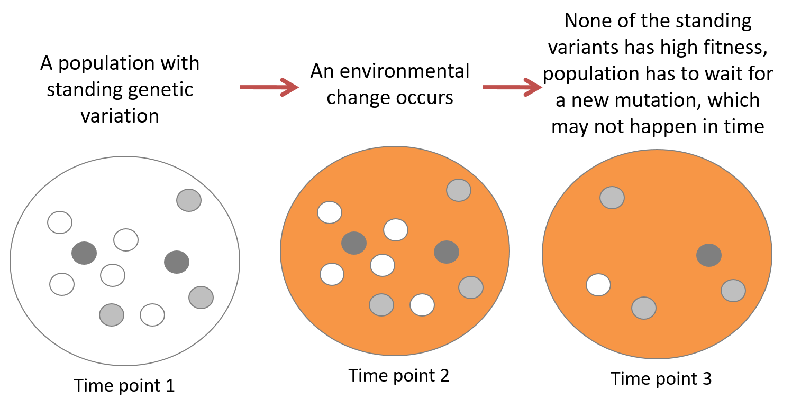

## Traits that facilitate adaptation

 

**Higher mutation rates**

 

**Faster mutation rates generate more variation on which selection can act**

## Traits that facilitate adaptation

 

**Faster generation times**

 

**The *relative* velocity of environmental change is slower for organisms that can go through many generations each year**

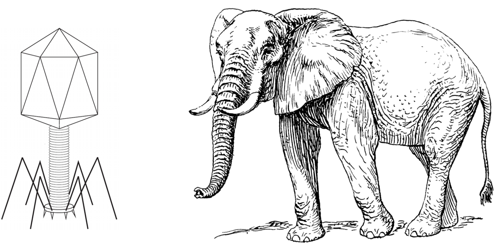

## Traits that facilitate adaptation

 

**Larger population sizes**

 

**Larger populations are more likely to have standing variation and are less likely to be decimated by chance events **

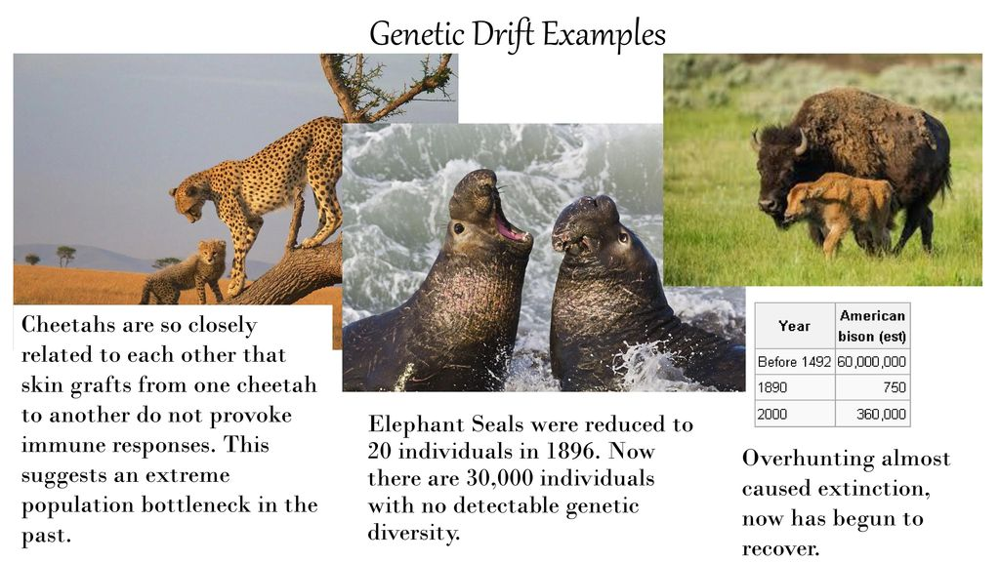

## Traits that facilitate adaptation

 

**Other factors like amount of gene flow and how traits are linked to each other in the genome also matter**

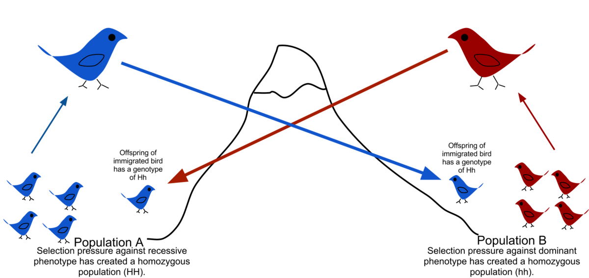

## Microevolution: Rapid selection of tuskless female elephants

 **The survival of tuskless females across this 28-year period was estimated to five times that of tusked individuals in Gorongosa National Park (Campbell-Station et al. 2021)**

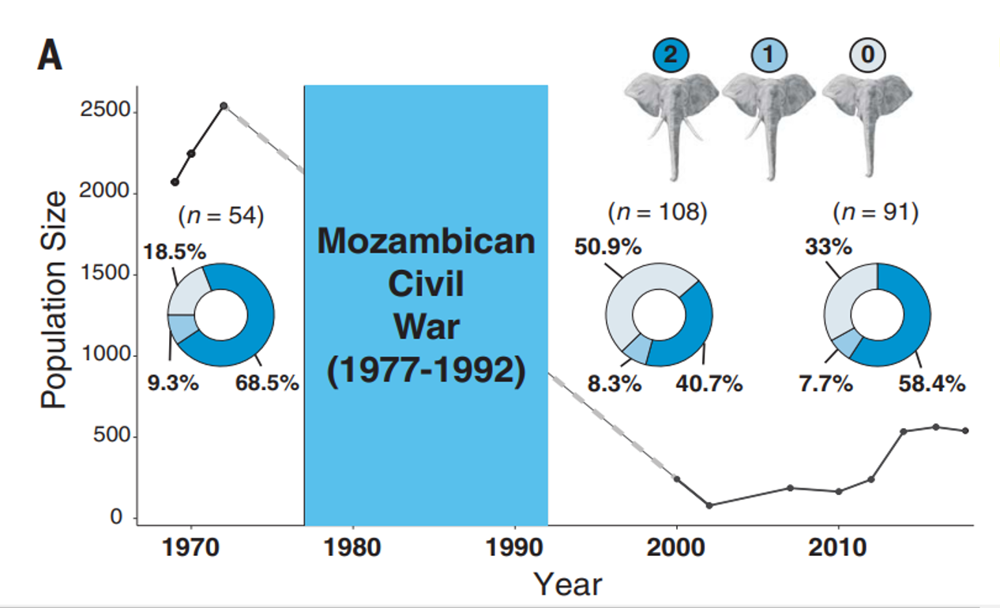

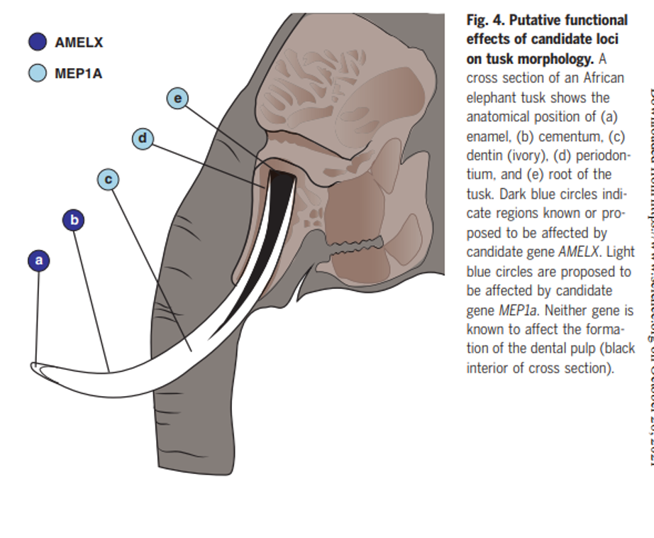

<!-- ## Microevolution: Rapid plumage colouration change in tawny owls  -->
<!-- 
 -->
<!--  **Strong selection against the brown morph occurs under snow-rich winters. As winter conditions became milder in the last decades, selection against the brown morph diminished (Karell et al. 2011).** -->

<!--  -->

<!--  -->

## Friday Discussion: Can Humans *Adaptt* to Global Change?

 

* **Do Humans have high adaptive capacity..**

 

* **What evidence exists? Past, present and/or future**
    + What adaptations have already occurred?
    + Do humans adapt easily?
    + Can/How/Will human adapt to 3-4C warming?

 

* **Be prepared to discuss what you found as well as your opinion on if it is possible**

 

* **Submit an article/link on Brightspace for participation**
    + Add a sentence or 2 about what you found
